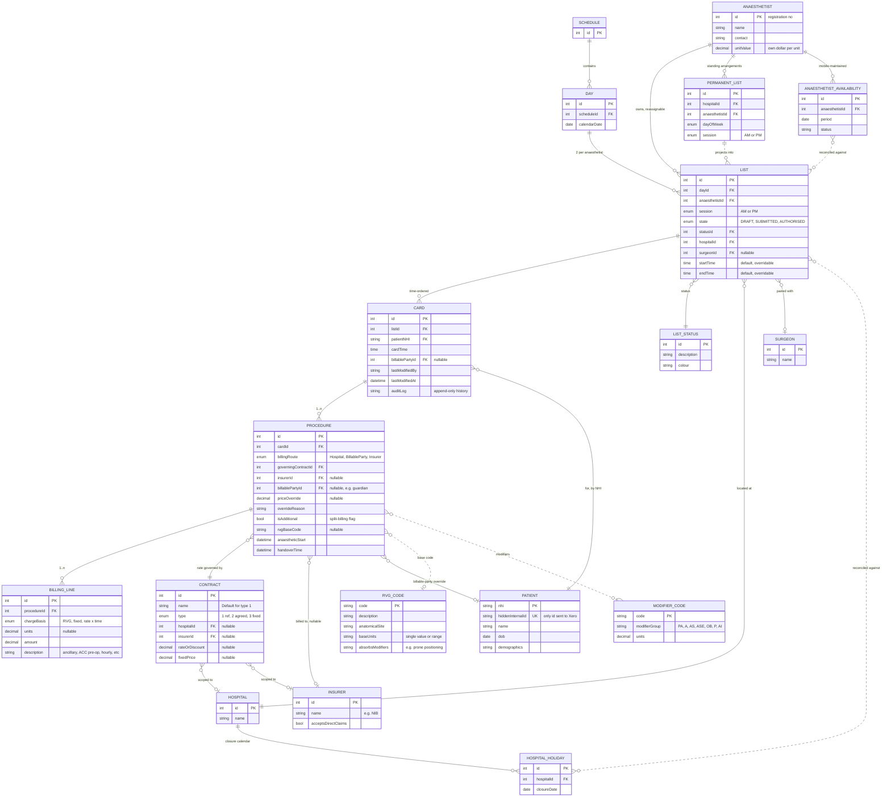
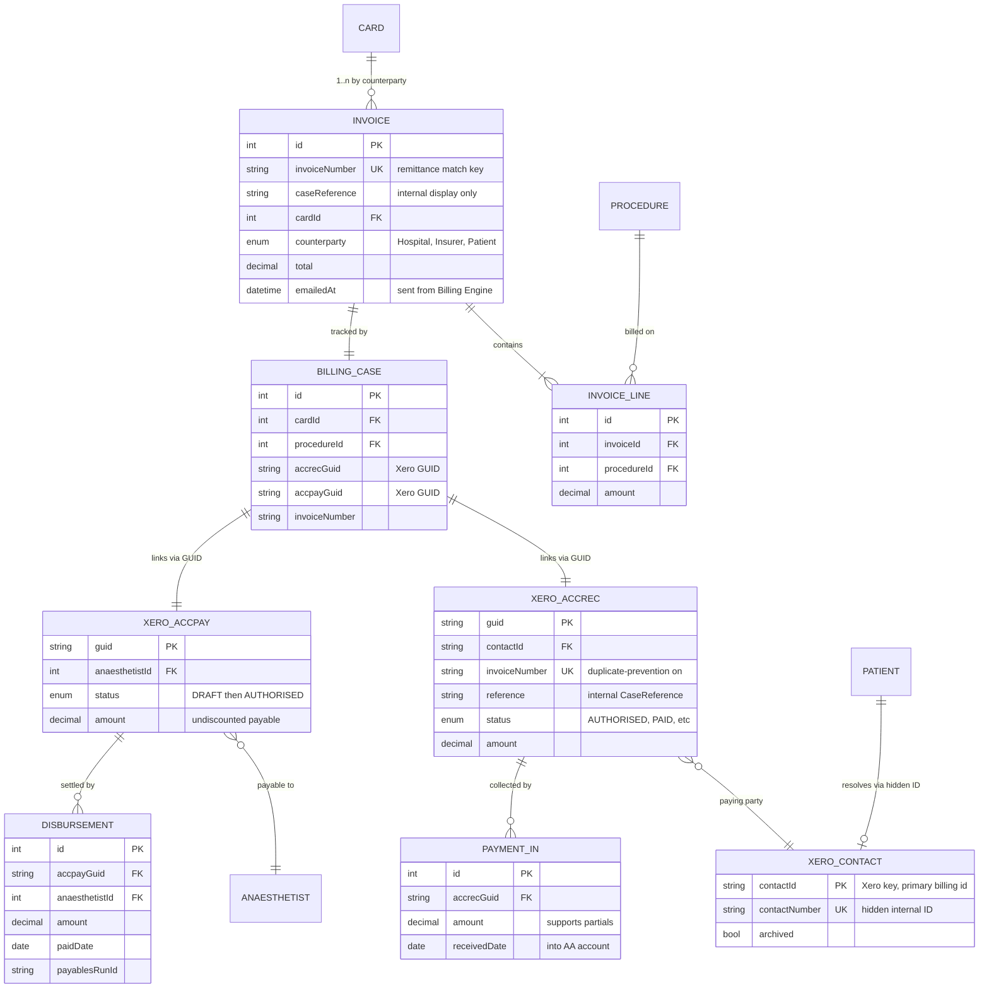
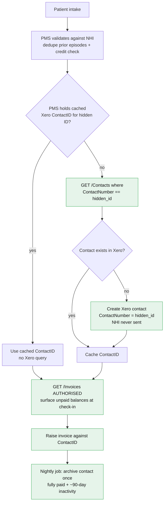
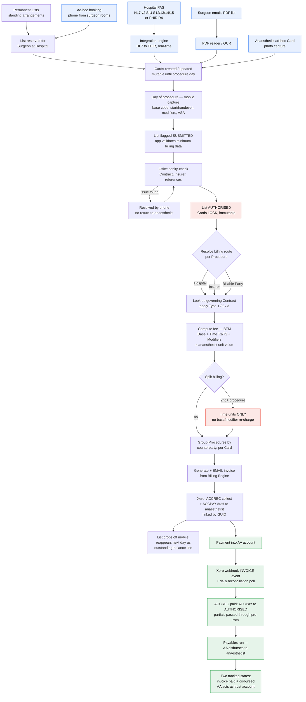

# Anaesthesia Associates — Data Model & End-to-End Flow

Derived from *Anaesthesia Associates — Booking and Billing Systems Upgrade, Request for Proposal (Final), July 2026* and its Candidate Architecture. This is a reading of the RFP's **candidate** design — per the RFP it is "a reference model... expected to be challenged, refined, and extended."

> **Viewing:** these diagrams use [Mermaid](https://mermaid.js.org/). They render natively on GitHub, in VS Code (Markdown preview / Mermaid extension), or by pasting a block into <https://mermaid.live>. A rendered companion is provided in `Data-Model-and-Flow.html` (double-click to open in a browser).

---

## Systems / actors at a glance

| System | Role |
|---|---|
| **Scheduling engine** | Owns the Schedule → Day → Anaesthetist → List → Card → Procedure tree ("the canvas"). |
| **Anaesthetist mobile / web app** | Calendar + Card views, timesheet (BTM) capture, availability/locum, outstanding balances. |
| **Admin web app (office)** | Manual change handling, List sanity-check, authorisation, billing-flow monitoring. |
| **Integration engine** | Ingests hospital bookings (HL7 v2 → FHIR R4, real-time) + manual PDF/photo pathway. |
| **Billing engine** | The hub. Consumes AUTHORISED Lists, resolves billing, calculates fees, generates invoices. |
| **Xero (separate instance)** | AR + banking only. Holds ACCREC (collect) / ACCPAY (disburse) pairs. Not general ledger. |

---

## 1 · Data Model — Scheduling & Master Data

The structural spine `Schedule → Day → Anaesthetist → List` is a **fixed canvas** (every active anaesthetist gets exactly two Lists — AM/PM — for every Day on a rolling 4-month horizon). **Status, Hospital, Surgeon and Cards are "painted onto" that canvas.** Master/reference data is decoupled and referenced by ID.



**Notes**
- **The List is the unit of availability and of billing approval** (not the Anaesthetist or Day). Availability varies independently between AM and PM.
- **Cards are mutable from multiple sources** (hospital/surgeon integration, mobile app) right up to the procedure day → hence `lastModifiedBy/At` **plus a full append-only audit log** at Card/Procedure level (invoices must be reproducible against the rules in force when raised).
- **A List can be reassigned to another anaesthetist at short notice** without disturbing its Cards, status history or audit trail.
- **`governingContract` always resolves** — every Hospital and every direct-billing Insurer holds at least a default **Type 1** Contract, so there is no "no contract found" branch.
- `PERMANENT_LIST` is the *template*; the `LIST` rows on the canvas are the *generated instances*. Availability and holiday calendars are **reconciled against** the canvas (conflicts flagged), not merged into it.

---

## 2 · Data Model — Billing Engine & Xero

The Billing Engine **references** the Card/Procedure by ID rather than absorbing them. Billing destination is resolved **per Procedure**, so **one Card can yield multiple invoices** (one per counterparty). Each invoice creates a **matched Xero pair**: an **ACCREC** (collect into the AA account) and a **draft ACCPAY** (payable to the anaesthetist) — linked in the Billing Engine's own case record via the returned Xero GUIDs.



**Notes**
- **`InvoiceNumber` is the reconciliation key** (what hospitals/insurers quote on remittances); `Reference`/CaseReference is display-only (Xero doesn't enforce its uniqueness). AA prefers ACCREC/ACCPAY numbers to be *similar* for easy human matching.
- **Two-state money model:** *invoice paid (into AA)* and *disbursed to anaesthetist* are tracked separately — AA operates like a **trust account**. Direct-to-anaesthetist hospital payments are **retired**; one path now.
- **Payment detection:** Xero **webhook** on INVOICE events (primary) + **daily reconciliation poll** (safety net), idempotent by InvoiceID. When the ACCREC is paid, the linked ACCPAY flips **DRAFT → AUTHORISED** for the next payables run. Partial payments pass through **pro-rata**.
- **Bulk remittance & bank reconciliation** stay inside Xero's own tools — out of scope for the Billing Engine beyond populating `InvoiceNumber` reliably.

### 2a · Patient identity & Xero contact lifecycle

Three identifiers, each scoped to one system, keep Xero performant (≈10k active-contact soft limit vs ≈28k invoices/yr, ~99% one-time) while the **NHI never leaves the practice system**.



> **⚠ RFP inconsistency to resolve:** the *"separating clinical and billing identifiers"* section says NHI is kept as a **cross-reference custom field on the Xero contact** (searchable), whereas **Appendix 2** says the **NHI never resides in Xero** at all. The diagram follows Appendix 2 (the stricter data-minimisation model). This needs confirmation with AA.

---

## 3 · List lifecycle (the billing trigger)

Approval state lives on the **List**, not the Card. Reaching **AUTHORISED** locks the Cards and hands the whole List to the Billing Engine as one unit. (Xero status names are reused where possible; SUBMITTED is the deliberate exception, for user continuity.)

```mermaid
stateDiagram-v2
    [*] --> DRAFT
    DRAFT: DRAFT — fully editable by anaesthetist; office + integrations may update
    SUBMITTED: SUBMITTED — editable by office only (OfficeAdmin); anaesthetist loses edit access
    AUTHORISED: AUTHORISED — Cards locked, immutable

    DRAFT --> DRAFT: anaesthetist edits Cards
    DRAFT --> SUBMITTED: taps Completed, all Cards valid
    SUBMITTED --> SUBMITTED: office corrections (issues resolved by phone)
    SUBMITTED --> AUTHORISED: office signs off after sanity check
    AUTHORISED --> [*]: handed to Billing Engine as a unit
```



- **No "Returned" state** — Cards are never sent back to the anaesthetist; office resolves issues by phone.
- The List **drops off the anaesthetist's mobile view at invoice generation** (not merely at AUTHORISED), reappearing next day as line items in the outstanding-balance view.

---

## 4 · End-to-End Flow — Booking → Payment



### Narrative walk-through

1. **Origination** — a List is reserved for a surgeon at a hospital, either automatically from **Permanent Lists** or ad-hoc (phone from the surgeon's rooms). ~80% of surgeon assignments come from the permanent arrangement.
2. **Card population** — appointment **Cards** are filled progressively over weeks, ideally via **hospital integration** (HL7 v2 SIU messages translated to FHIR R4 in real time), otherwise via **emailed PDF lists** (PDF/OCR ingest) or **ad-hoc entry** on the mobile app (incl. photographing a paper card). Cards stay mutable to the day.
3. **Data capture** — on the day, the anaesthetist records **BTM** data per Procedure (base RVG code, anaesthetic start/handover times, modifier codes; ASA seeds the modifier field).
4. **Submit → Authorise** — the anaesthetist marks the List **SUBMITTED** (app enforces minimum billing data); the **office** sanity-checks all Cards and marks it **AUTHORISED**, which **locks the Cards**.
5. **Billing Engine** — on the AUTHORISED List it iterates Cards/Procedures, **resolves the counterparty per Procedure**, looks up the **governing Contract** (Type 1/2/3), computes the fee (tiered time at the 2-hour T1/T2 breakpoint; base capped at one per anaesthetic), enforces **split-billing** (2nd+ procedure = time units only), and **groups Procedures by counterparty** into invoice boundaries.
6. **Invoicing + Xero** — invoices are **generated and emailed from the Billing Engine** (supporting the GST "agency" relationship), and a matched **ACCREC (collect) + draft ACCPAY (disburse)** pair is created in Xero, linked by GUID. The List then drops off the anaesthetist's mobile view.
7. **Payment + disbursement** — payment lands in the **AA account**; detection via **webhook + daily poll** flips the ACCPAY to **AUTHORISED**; a **payables run disburses to the anaesthetist**. "Paid" and "disbursed" are tracked as distinct states.

---

## 5 · Design tensions / open questions to resolve in discovery

Flagged by the RFP itself, or surfaced by the modelling above — useful to address in a proposal:

- **NHI in Xero — contradiction** (see §2a): cross-reference field vs. never-in-Xero. Needs a ruling.
- **Concurrency** — how to handle a Card/Procedure edited simultaneously by integration + mobile app.
- **List reassignment mechanism** — precise handling that preserves Cards, status and audit history.
- **Availability vs holiday reconciliation** — hard constraint, soft warning, or advisory?
- **Card- vs List-level billing failure** — does one failed Card block the whole List's processing?
- **Where office billing-flow monitoring lives** — Admin Web App vs a dedicated Billing Engine admin surface.
- **Exact "List disappears from mobile" trigger** — confirmed as invoice generation, to be locked down.
- **Hospital route non-payment** — is there a fallback to the Billable Party, or is the Hospital route final?
- **Insurer route scaling** — whether direct-insurer billing needs its own rate structure beyond the single Type 1 default.
- **Second-procedure pricing rules** — "various rules apply depending on the nature of the contract"; needs detailed rules capture.
- **NHI dual-format** (Appendix 1) — support both old (mod-24) and new (mod-23, alphanumeric) formats by **1 July 2027**.
```
