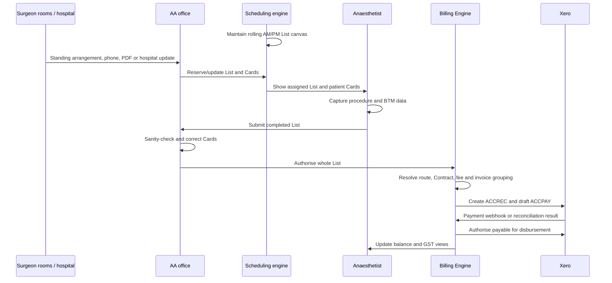

# Workflows and Handoffs

## End-to-end business flow



## The two kinds of state

Do not confuse these in the demo.

### Operational List status

Examples:

- Private
- Public
- Pre-op assessment
- Holiday
- Unavailable
- Free

These describe what the half-day List is being used for.

### Approval lifecycle

```text
DRAFT -> SUBMITTED -> AUTHORISED
```

| State | Anaesthetist | Office | Integrations | Meaning |
|---|---|---|---|---|
| `DRAFT` | View and edit | View and edit | May update | Work is still being prepared |
| `SUBMITTED` | View only | View and edit | Do not apply updates | Anaesthetist has handed the whole List to office |
| `AUTHORISED` | Locked | Locked | Do not apply updates | Office has approved it for billing |

There is no `RETURNED` state.

## Workflow 0: create and maintain the schedule canvas

**Primary actor:** Scheduling engine, configured by AA office

**Prototype readiness:** Ready

### Trigger

- The four-month schedule horizon advances.
- A new anaesthetist becomes active.
- A Permanent List or hospital holiday changes.

### Steps

1. The system ensures every active anaesthetist has exactly two Lists, AM and PM, for every day in
   the rolling horizon.
2. Permanent Lists project standing hospital, surgeon and session arrangements onto future Lists.
3. Anaesthetist availability and hospital holidays are reconciled against the canvas.
4. Free, unavailable, holiday and booked status is displayed consistently in all apps.
5. Conflicts are surfaced without deleting the List.

### Handoff

The office receives a stable schedule on which it can paint assignments and patient Cards.

### Demo point

Open the Admin Day View and show the repeated AM/PM rhythm, including one full-day booking represented
by two adjacent Lists. Explain that the office manages exceptions rather than manually inventing every
session.

### Source

- RFP: `Schedule Management - Candidate Architecture`
- RFP: `Supporting / Master Data`
- Prototype: `D1`, `D2`, `D5`

## Workflow 1: reserve a List and populate patient Cards

**Primary actors:** AA scheduling coordinator, surgeon rooms, hospital/PAS

**Prototype readiness:** Manual phone booking and mobile photo/manual Card creation are ready.
HL7/FHIR and surgeon-PDF ingestion are planned for Phase 11.

### Triggers

- A Permanent List creates the recurring pairing.
- A surgeon's room calls AA for an ad-hoc List.
- A hospital sends a new booking or update.
- A surgeon's room emails a PDF List.
- The anaesthetist finds a patient missing on the day.

### Main path

1. The office selects a suitable AM or PM List.
2. The List is assigned a hospital and surgeon.
3. Patient appointments are represented as time-ordered Cards inside the List.
4. Each Card points to a patient and contains one or more Procedures.
5. Later messages or office actions can add, reschedule, modify, move or soft-cancel a Card while the
   List remains `DRAFT`.
6. Every change writes `lastModifiedBy/At` and append-only audit history.

### Manual fallback paths

- **Phone advice:** Kirsty creates the booking in Admin.
- **Mobile/web manual Card:** Dr Souter enters the missing Card and its advised billing route.
- **Photo:** Dr Souter photographs a paper Card; simulated extraction pre-fills a draft for review.
- **PDF:** office reviews extracted rows before ingesting them. This is planned.

### Handoff

The populated List becomes visible to the assigned anaesthetist on mobile and web.

### Key distinction

A hospital or surgeon supplies booking information; they are not shown as logged-in users of the
prototype.

### Source

- RFP: `Card`
- RFP: `Manual Processing`
- RFP: `Automated Processing`
- Prototype: `D3`, `M7`, `A2`, `I1` to `I4`

## Workflow 2: plan the day and manage late changes

**Primary actor:** AA scheduling coordinator

**Prototype readiness:** Ready

### Trigger

A hospital, surgeon, patient or anaesthetist reports a change.

### Steps

1. Kirsty opens the Admin Day View.
2. She locates the relevant List by anaesthetist, time, hospital and status colour.
3. She opens the List drawer and its Cards.
4. For a routine patient reschedule, she moves one Card to a different List.
5. For an incorrect assignment, she changes hospital, surgeon or actual start/end time.
6. For a cancellation, she records a reason and soft-cancels the Card.
7. Cancelled Cards remain visible for history but do not block submission or enter billing.
8. She can add an internal day note for colleagues.

### Handoff

The updated List and Cards are immediately visible in Dr Souter's mobile and web views while the List
is `DRAFT`.

### Demo point

Show a single Card move and explain that it is different from reassigning an entire List.

### Source

- RFP: `Card`
- RFP: `Key Design Principles`
- Prototype: `A1`, `A2`, `D3`

## Workflow 3: find cover and reassign a whole List

**Primary actors:** Anaesthetist and AA scheduling coordinator

**Prototype readiness:** Ready, using the prototype's proposed reassignment mechanics

### Trigger

An anaesthetist becomes unavailable or needs cover at short notice.

### Steps

1. Dr Souter maintains her personal availability or offers a Free session for cover.
2. The system reconciles that availability against the schedule.
3. Kirsty sees the conflict or receives the phone call.
4. She views Free anaesthetists at the required AM/PM granularity.
5. She selects a Free target session.
6. She reassigns the whole List, including every Card and its history, to the replacement
   anaesthetist.
7. The target's empty Free List is absorbed.
8. A fresh List is regenerated in the vacated slot so the fixed two-Lists-per-day canvas remains
   intact.
9. The reassignment is audited.

### Handoff

The replacement anaesthetist sees the List in their schedule.

### RFP ambiguity

The RFP requires reassignment but leaves the precise mechanics open. Free-target, absorb and
regenerate is the prototype's proposed reading, not a settled business rule.

### What not to say

Do not describe this as a clinician claiming an open shift. The prototype demonstrates availability,
cover requests and an office-managed reassignment.

### Source

- RFP: `List`
- RFP: `Key Design Principles`, item 8
- RFP: `Open Questions`
- Prototype: `D7`, `M8`, `M9`, `A3`

## Workflow 4: capture BTM and complete a Card

**Primary actor:** Anaesthetist

**Prototype readiness:** Ready

### Trigger

The procedure has occurred and the anaesthetist needs to record the clinical billing inputs.

### Steps

1. Dr Souter opens her List and selects the patient Card.
2. She confirms patient, operation, hospital and surgeon context.
3. For each Procedure she selects the RVG base code.
4. She records the start and handover times.
5. The system calculates tiered Time units:
   - 1 unit per 15 minutes for the first two hours;
   - 1 unit per 10 minutes after two hours.
6. She records ASA and any other applicable modifiers.
7. The system prevents a positioning modifier if the base code already includes it.
8. The fee updates using Dr Souter's own dollar value per unit.
9. She may record an allowed fixed or rate-by-time line, or an override with a reason.
10. She reviews validation messages and marks the Card complete.

### Multiple Procedures

- One Card can have several Procedures.
- An additional Procedure in the same episode is time-only under the hard split-billing rule.
- Base and Modifier units must not be charged a second time.

### Handoff

When every active Card in the List is complete, the List becomes eligible for submission.

### Demo point

Use Margaret Ellison. She is the one incomplete Card on Dr Souter's Southern Cross PM List.

### Source

- RFP: `The Big Picture: What Are We Actually Calculating?`
- RFP: `How Anaesthesia Associates Calculates Invoices`
- RFP: `Split Billing`
- Prototype: `M3` to `M6`, `B3` to `B5`

## Workflow 5: submit the whole List and perform office review

**Primary actors:** Anaesthetist, then billing review officer

**Prototype readiness:** Ready

### Trigger

Every active Card in the List has been marked complete.

### Steps

1. Dr Souter chooses **Mark list completed**.
2. The app confirms that every Card is complete and valid.
3. She selects **Submit to office**.
4. The List becomes `SUBMITTED`.
5. Dr Souter can still see it as completed/unbilled but cannot edit it.
6. Kirsty opens the Review queue.
7. She checks the full set of Cards, including:
   - billing route;
   - governing Contract;
   - Insurer;
   - billing reference;
   - calculated BTM and fee;
   - manual adjustment or ACC advisory flags.
8. If something is wrong, Kirsty phones for clarification and corrects it in the office.
9. She may log a phone note.
10. She selects **Authorise for billing**.
11. The List becomes `AUTHORISED`; every Card is immutable.

### Handoff

One List-authorised event hands the whole List to the Billing Engine.

### Key rule

Review is a human sanity check, not a system gate that automatically rejects every advisory. There is
no send-back workflow.

### Source

- RFP: `Card Immutability and the List Approval Process`
- RFP: `Proposed Design decisions`
- Prototype: `D6`, `M5`, `M10`, `A4`

## Workflow 6: calculate and issue invoices

**Primary actor:** Billing Engine automation, monitored by office

**Prototype readiness:** Ready; Phase 08 is recorded complete

### Trigger

The List reaches `AUTHORISED`.

### Steps

1. The Billing Engine iterates each active Card and its Procedures.
2. It resolves the explicit billing route per Procedure:
   - Hospital/contract holder;
   - Billable Party, usually the patient;
   - direct-claim Insurer.
3. It selects the governing Contract and rating method.
4. It calculates the fee from the captured snapshot.
5. It enforces time-only additional Procedures and conserved two-funder allocations.
6. It groups lines by counterparty per Card.
7. It creates one or more invoice documents.
8. It displays the contract-holder or patient layout as appropriate.
9. Office can simulate email or print. A direct-claim insurer uses the upload-portal state.
10. Completion of the billing run stamps `billedAt` and removes the List from the anaesthetist's List
    views.

### Handoff

The Billing Engine sends the invoice values to Xero and expects a matched collection/payable pair.

### RFP ambiguity

The RFP contains tension between same-counterparty grouping and a statement that split billing creates
two invoices. The prototype groups by counterparty: two invoices arise where funders differ.

### Source

- RFP: `Billing Engine Integration Point`
- RFP: `The Card as the Billing Anchor`
- RFP: `Xero Integration - Candidate Design`
- Prototype: `B1` to `B6`

## Workflow 7: collect money and disburse it to the anaesthetist

**Primary actors:** Xero, Billing Engine, finance/reconciliation officer

**Prototype readiness:** Planned for Phase 10

### Trigger

An invoice has been generated.

### Steps

1. The Billing Engine creates a matched Xero pair:
   - `ACCREC`: what the hospital, insurer or patient owes AA;
   - `ACCPAY`: what AA owes the anaesthetist.
2. `ACCPAY` begins in `DRAFT`.
3. Payment lands in the AA account.
4. A Xero webhook notifies the Billing Engine; a daily poll is the safety net.
5. The matching payable becomes `AUTHORISED`, proportionally for a partial payment.
6. AA runs payables and disburses the authorised amount to the anaesthetist.
7. The system tracks **paid into AA** and **disbursed to anaesthetist** separately.
8. The anaesthetist's flat balance view and GST activity update from the Billing Engine's mirror, not
   from direct Xero queries.
9. Eligible individual Xero contacts may later be archived to manage active-contact volume.

### Handoff

The financial episode closes when the receipt and disbursement states are both complete.

### Demo point

Use one payment, then show the payable changing state. For a technical audience, use a partial
payment followed by two payables runs to prove no double payment.

### Source

- RFP: `Payments - Where the Money Lands`
- RFP: `Xero Integration - Candidate Design`
- RFP: `Mobile App Consumption Model`
- Appendix 2
- Prototype: `X1` to `X5`

## Workflow 8: handle failures, late additions and compliance

**Primary actors:** Office exception operator, Billing Engine and integration automation

**Prototype readiness:** Audit, NHI validation and master controls partly ready; full workflows planned
for Phases 09 to 11

### Cases

#### Pre-payment

- A patient-funded Procedure may require full or split pre-payment.
- Payment is required before the procedure.
- The prototype plans a visible completion block until the pre-invoice is paid or an office-only,
  reasoned override is recorded.
- Exact timing relative to the normal `AUTHORISED` billing trigger is a prototype reading.

#### Post-operative addition

- A later pain consult or ward review can create another charge.
- The original authorised Card stays immutable.
- The prototype plans a linked addendum Card that follows its own submit, authorise and bill cycle.

#### Billing failure

- A Card may fail rating after the List is authorised.
- The prototype plans to isolate that Card, let the others invoice, correct the cause and retry.
- Card-level isolation is an explicit prototype choice; the RFP leaves it open.

#### Integration failure

- A malformed message retries, then moves to manual intervention without being lost.
- A duplicate message is an idempotent no-op.
- A message for a submitted or authorised target is not applied automatically.

#### Compliance

- All changes, including automated ones, are audited.
- Both old and new NHI formats are validated.
- The prototype follows the stricter reading that NHI never enters Xero.
- RFP Appendix 1 and Appendix 2 contradict each other on that last point; it must be confirmed.

## Workflow-to-prototype readiness

| Workflow | Ready now | In flight | Planned |
|---|---:|---:|---:|
| Fixed canvas and Permanent Lists | Yes |  |  |
| Manual phone booking and office changes | Yes |  |  |
| Mobile/web manual and photo Card creation | Yes |  |  |
| Cover request and office List reassignment | Yes |  |  |
| BTM capture, completion and submit | Yes |  |  |
| Office review and authorisation | Yes |  |  |
| Invoice calculation and documents | Yes (Phase 08) |  |  |
| Pre-payment, addendum, billing monitor/retry |  |  | Phase 09 |
| Xero pairs, payment, balances and disbursement |  |  | Phase 10 |
| HL7/FHIR/PDF ingestion and monitoring |  |  | Phase 11 |
| Scenario jump controls and final rehearsal script |  |  | Phase 12 |
