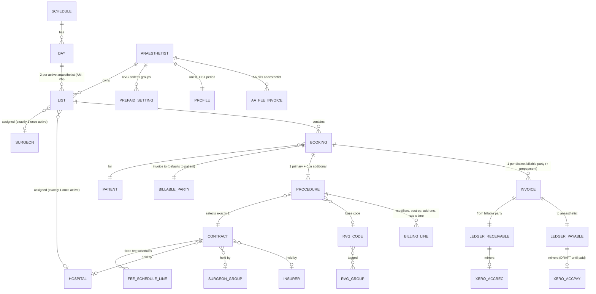

# AA Future-State Domain Model

Companion to the requirements `catalogue/`. This is the narrative and structural reading of the future state
as understood on 2026-09-24, built from the RFP, the six future-state diagrams, the meeting notes
with AA's lead administrator, the Q&A of 2026-09-24, and the real fee schedules in
`../Data files/`. Where this document and the RFP disagree, this document wins.

## 1. What changed since the RFP

| RFP said | Future state says | Why |
| --- | --- | --- |
| Card | **Booking**. "Card" now only means the physical hospital or surgeon card. | Notes; Q&A #11 |
| Billing Engine | **Billing/Invoice Engine** | Q&A #11 |
| Each Procedure has a *billing route* (Hospital / Billable Party / Insurer), set explicitly, plus a separately looked-up *governing Contract* of type 1, 2 or 3 | Each Procedure selects exactly **one Contract**. The Contract defines rules, pricing **and** who is invoiced. There is no separate route step. | Diagrams 3 and 7; Q&A #2, #3 |
| Counterparty resolved by the engine when the List is AUTHORISED | Contract applied at **booking setup** by admin (anaesthetist may change; office approves at review). Engine reads the locked Contract. | Diagram 7; Q&A #4 |
| Secondary procedures in a split-billing episode charge **time units only** | Base units only on the **primary**; time on **every** procedure; modifiers on the primary **unless total modifier units exceed 4**, then split equally across all procedures with the remainder to the primary. | Notes; Q&A #1 |
| `priceOverride` on the Procedure | **Anaesthetist adjustment** (percent discount or fixed final price), only when the Contract permits, applied after BTM is recorded in full. Office override remains. | Diagram 7; Q&A #3, #6 |
| Xero as accounts receivable with the engine's database as a mirror for the app | The engine's **internal ledger is the system of record**. Xero is an AR and banking service mirroring ledger pairs. Patient history survives Xero contact archiving. | Q&A #9 |
| Payment to anaesthetist implied a fee deducted | **AA's fee is a separate invoice from AA to the anaesthetist**, managed by the system, distinct from any procedure's receivable and payable. | Q&A #8 |
| "Self-funded, pre-payment required" as a patient category | **Prepayment is a first-class flow**: anaesthetist-level prepaid RVG settings, prepayment invoice at setup, tracking, alerts, settlement against the final amount. Prepaid amounts are estimates or deposits. | Diagram 7; Notes; Q&A #5 |
| Hospital HL7 integrations exist but are unreliable | **No hospital integration exists today.** The real pathway is a manual download from the hospital into a matching screen. HL7/FHIR is retained as future scope. | Q&A #4 |
| Patient master implied | **Patient record keyed on NHI**, with per-Booking billable party and invoice email that may differ from the patient (guardian). Admins see patient outstanding bills and are alerted when a patient with unpaid invoices is booked again. | Notes; Q&A #9, #13 |
| Office monitoring of the billing flow | Retained, plus **ledger balance tools** (whole ledger, per anaesthetist, per patient) in the Admin App. | Q&A #12 |

Everything else in the RFP (canvas, List lifecycle, Xero pairing, NHI change, archiving, time tiers,
per-anaesthetist unit value, roles, audit) carries forward unchanged.

## 2. Entities



**Hierarchy:** Day → List → Booking → Procedure → Contract.

### List

- Fixed canvas: two Lists per active anaesthetist per day, four months forward, whether or not
  anything is booked.
- **Availability status** (available, available for emergency, unavailable, on leave; final set
  TBC) is set by the anaesthetist per half-day and is independent of bookings. The RFP also keeps
  a separate Anaesthetist Availability calendar reconciled against Lists as conflicts; whether that
  is the same concept is OQ-27. Theatre is not recorded.
- **Unassigned** List: no surgeon, no hospital. **Assigned** List: exactly one anaesthetist, one
  surgeon, one hospital, one day, one session. AM and PM may differ.
- **Approval state** (DRAFT → SUBMITTED → AUTHORISED) is separate from availability status.
- Lists move between anaesthetists with their Bookings intact.

### Booking

- Replaces Card. Belongs to one List. References a Patient (NHI).
- Has exactly **one primary Procedure** and zero or more additional Procedures in the same
  anaesthetic episode. Anyone with edit rights can set which is primary.
- Carries the **billable party** and **invoice email** (default patient; override e.g. guardian).
- Carries prepayment state: required, amount, prepayment invoice.
- Mutable from all sources until the List is SUBMITTED; office-only until AUTHORISED; then
  immutable. Append-only change history.
- Sources: hospital download via matching screen, surgeon PDF (the RFP says this is currently the
  main pathway by volume; confirm, OQ-34), admin entry, anaesthetist ad hoc (optionally from a
  photo of the physical card), copy of another Booking.
- Billing lines dated after the List is invoiced (post-op reviews, nerve catheter days) need a
  supplementary invoice path (OQ-24); corrections after invoicing need a credit note and re-issue
  path (OQ-28). Both are Proposed in the catalogue.

### Procedure

- Holds the billing context: RVG code (or Contract fee schedule line), base units (with range
  override), start and handover times, ASA, itemised modifiers, other billing lines, the selected
  **Contract**, and any anaesthetist adjustment.
- Exactly one Contract. Snapshot of the Contract version taken at AUTHORISED.
- `isPrimary` flag drives the multi-procedure rule.

### Contract (recommended structure)

The Contract is the one object that answers: *how is this priced, what rules apply, who gets the
invoice, and what extra information do we need to collect?*

Recommendation: separate the reusable **Contract** (master data) from the per-Booking **billing
context** captured on the Procedure. The bullets under "RVG Default Contract Post-paid / Pre-paid"
in the Q&A (invoice email, prepaid amount, price override) are per-Booking values, not Contract
values. The Contract *declares that they are required*; the Booking *holds them*.

**Contract (master data)**

| Field | Notes |
| --- | --- |
| id, name, version, effectiveFrom, effectiveTo, reviewDate | Fee schedules change on fixed dates (1 April, 1 June, 1 October). Versions are kept so old invoices reproduce. |
| category | RVG Default Post-paid · RVG Default Pre-paid · RVG Default Hospital · Hospital · Surgeon Solo · Surgeon Group · Insurance. ACC is a Hospital or holder Contract with ACC pricing, not its own category. |
| holder | Who is invoiced: Hospital · Surgeon or Surgeon Group entity · Insurer · **Booking's billable party** (for patient-direct categories). |
| scope | Filters the Contract list at selection time: hospitals[], surgeons[], insurers[], rvgCodes[] or rvgGroups[], fundingSource (private, SXAP, HNZ, ACC), anaesthetists[] (empty = organisational). |
| pricingBasis | `RVG_UNITS_ANAESTHETIST_RATE` (default) · `RVG_UNITS_CONTRACT_RATE` ($/unit or % discount) · `FIXED_SCHEDULE` (see fee schedule lines) · `RATE_TIME` (hourly, individually arranged). |
| baseUnitOverrides | Optional per RVG code or group, where the Contract departs from NZSA. Recommendation: base units otherwise live on the RVG code, not the Contract (see OQ-06). |
| contractRate / discountPercent | For `RVG_UNITS_CONTRACT_RATE`. |
| multiProcedureRule | `RVG_DEFAULT` (base once, time each, modifier split > 4) · `SECOND_CODE_PERCENT` (e.g. 50%) · `ADD_ON_FEE` · `NOT_BILLABLE`. |
| allowsAnaesthetistAdjustment | Shows the % discount / fixed final price field in the app. |
| allowsOfficeOverride | Office may apply a discretionary override with reason at review. Whether this is Contract-gated at all is OQ-16. |
| coveredAmount / coveredPercent | Optional. For partial cover (gap billing): the holder pays this portion, the patient pays the rest as a second invoice. Mechanism is OQ-23. |
| requiredBookingInputs | Any of: invoiceEmail, billableParty, prepaidAmount, insurerMemberNumber, claimReference, purchaseOrder. Blocks Booking completion until present. |
| prepayment | Prepayment is driven by the anaesthetist's prepaid RVG settings (Q&A #5). Whether a Pre-paid Contract category is also a trigger is OQ-25. |
| invoiceLayout | Contract holder layout vs patient layout. |
| deliveryMethod | Email · portal upload (NIB) · none. |
| gstTreatment | Prices stored GST exclusive; inclusive derived. |

**Fee schedule line** (children of a `FIXED_SCHEDULE` Contract)

| Field | Real examples from `Data files/` |
| --- | --- |
| holderCode, description | SXAP `AP0126 Blepharoplasty unilateral LA`; CES `HNZCATall`; ACC `OPT101`; Merivale `Abdominoplasty simple` |
| priceExGst, priceIncGst | Every schedule publishes one or both |
| mappedRvgCodes[] | Optional, so BTM is still recorded against an RVG code |
| timeBand (from, to) | CES vitrectomy: up to 60 / 61-90 / 90-120 min, then $100 per extra 15 min |
| isAddOn | GA add-on $370 / $385; anterior vitrectomy add-on; MIGS "add on to cataract" |
| quantityRule | Merivale liposuction $345 per area |
| tier | CES HNZ "commitment" vs "panel" price columns |

**Procedure billing context** (instance values, on the Procedure / Booking)

| Field | Notes |
| --- | --- |
| contractId + contractVersion | Locked at AUTHORISED |
| feeScheduleLineId | When the Contract is `FIXED_SCHEDULE` |
| billableParty, invoiceEmail | On the Booking; default patient |
| prepaymentRequired, prepaidAmount, prepaymentInvoiceId | On the Booking |
| anaesthetistAdjustment { type: PERCENT, AMOUNT or FIXED_FINAL, value, reason } | Only if Contract allows |
| officeOverride { type: PERCENT, AMOUNT or FIXED_FINAL, value, reason } | RFP says independent of Contract; Diagram 7 puts the permission on the Contract. OQ-16. |
| insurerMemberNumber, claimReference, purchaseOrder | As required by the Contract |

**Selection.** At booking setup the admin (or later the anaesthetist) picks from Contracts whose
scope matches the List's hospital, the surgeon, the patient's insurer or funding source and the RVG
code. Where nothing more specific applies, the **RVG Default Hospital** Contract for the List's
hospital is the default. Every hospital and direct insurer must hold one, so there is never a
"no contract" branch.

### RVG code and modifier master

- NZSA RVG 2021: code, description, section (anatomical site), base units (fixed or range),
  absorbed loadings (spine and neuro include prone positioning). AA adds codes the guide does
  not cover and marks them AA-sourced.
- Groups: the guide's sections plus AA groups (cosmetic, plastics, dental, ...) used for search
  and for the anaesthetist's prepaid selection.
- Modifier master: PA1-PA5, A1-A2, AS1/AS3/AS4, ASE, OB1-OB4, AI1, P1, VM1, TTE1-2, PACU1, EAA1,
  POC1-POC3, NC1-NC2, with unit values. ACC pre-op: CS250, CS260, CS70 (TBC).

### Patient and billable party

- Patient: one record per NHI (both formats validated, modulus 24 and 23), demographics,
  ethnicity (NZHIS Level 4), contact. Supplied by hospital, surgeon or AA. NHI is the clinical
  identifier and dedupe key; billing and ledger records key on a hidden internal patient ID with
  NHI as a cross-reference (RFP Appendix 1 policy). NHI never goes to Xero (Appendix 2; the RFP's
  Appendix 1 says otherwise, OQ-30).
- Billable party: per Booking, defaults to the patient, overridable (guardian). Invoice email lives
  here.
- Admin can see a patient's outstanding invoices across all anaesthetists and is alerted when
  that patient is booked again.

### Internal ledger

- For every invoice: a **receivable** from the billable party and a linked **payable** to the
  anaesthetist. Prepayment invoices create the same pair.
- Tracks $ in (receipts) and $ out (disbursements) so the whole ledger, each anaesthetist and each
  patient can be shown in or out of balance.
- Mirrored to Xero as ACCREC + DRAFT ACCPAY. Full receipt authorises the payable; partial receipt
  authorises a payable for exactly the amount received. Payment of the ACCPAY in Xero's payables
  run is detected the same way and recorded as the disbursement.
- Invoices are issued in the anaesthetist's name with AA as agent; the ACCPAY is a buyer-created
  tax invoice. Exact GST presentation to be confirmed with AA's accountant (OQ-29).
- **AA fee invoices** from AA to each anaesthetist are separate ledger items (basis TBC, OQ-02).
- Xero contacts use a hidden internal ID and are archived after inactivity; the ledger keeps the
  history.

## 3. Calculation rules

```
fee(procedure) =
  if contract.pricingBasis == FIXED_SCHEDULE:  scheduleLine.price (+ time band, add-ons, quantity)
  if contract.pricingBasis == RATE_TIME:       rate x duration
  else:                                        units(procedure) x unitValue
       where unitValue = contract rate (RVG_UNITS_CONTRACT_RATE) or anaesthetist's own $ per unit
  then apply anaesthetist adjustment (if allowed), then office override (if allowed)
```

**Units within a Booking** (RVG default multi-procedure rule):

| Component | Primary procedure | Additional procedures |
| --- | --- | --- |
| Base units | Yes (one base code per anaesthetic) | Never. Field not editable. |
| Time units | From its own times: 1 per 15 min for the first 2 h, then 1 per 10 min | Same, from its own times |
| Modifier units | All of them if total ≤ 4. If total > 4: equal share + remainder | Equal share when total > 4 |

Worked example: three Procedures, modifiers AS3 (2) + OB3 (2) + ASE (2) + A1 (1) = 7 units.
7 > 4, so 7 ÷ 3 = 2 each with remainder 1 → primary 3, second 2, third 2. Base units on the
primary only. Each Procedure's time units from its own times. Each Procedure is then priced by
its own Contract, so a cosmetic add-on on a patient-direct Contract and a primary on a hospital
Contract each carry their correct share.

A Contract may replace this rule (`SECOND_CODE_PERCENT` 50%, `ADD_ON_FEE`), as the SXAP and CES
schedules do.

**Prepayment.** Required when any Procedure's RVG code on the Booking is in the anaesthetist's
prepaid set (the RFP's typical case is an additional elective cosmetic procedure). Amount is an estimate of the full fee (default) or a deposit. After
AUTHORISED: remaining = final − prepaid; invoice if positive, credit/refund if negative (OQ-03).

## 4. Glossary

| Term | Meaning |
| --- | --- |
| Booking | An appointment slot within a List for one patient. Formerly Card. |
| Card | The physical hospital or surgeon booking card only. |
| List | A half-day session for one anaesthetist. Unassigned until a surgeon and hospital are set. |
| Primary Procedure | The one Procedure in a Booking that carries base units and anchors modifiers. |
| Contract | A billing rules object in the system, not a legal contract. Defines pricing, rules and invoice recipient. |
| Contract holder | The organisation invoiced under a Contract: hospital, surgeon entity, insurer. |
| Billable party | Whoever receives the invoice for a Procedure. For patient-direct Contracts, the patient or their override (guardian). |
| Invoice email | Where the invoice is sent; belongs to the billable party, not necessarily the patient. |
| BTM / BTT | Base, Time, Modifier units (RVG). |
| RVG / RVU | NZSA Relative Value Guide / Relative Value Units. Units, not dollars. |
| Internal ledger | The Billing/Invoice Engine's own receivable and payable records; system of record. |
| ACCREC / ACCPAY | Xero receivable / payable invoice types mirroring ledger pairs. |
| Prepayment | Estimate or deposit invoiced before the procedure for prepaid RVG codes. |
| AA fee | AA's charge to an anaesthetist, invoiced separately. |
| Matching screen | Admin screen where downloaded hospital bookings are matched to Lists and Bookings. |
