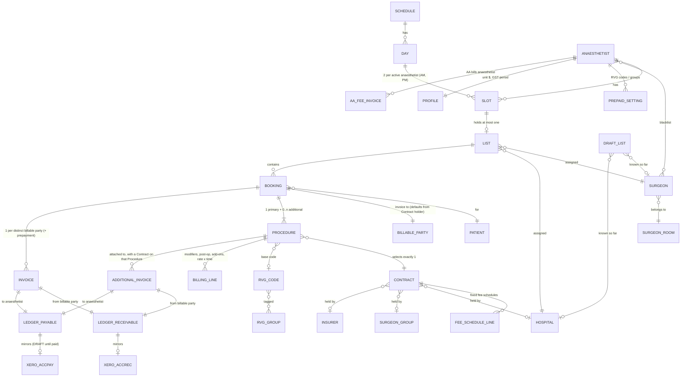

# AA Future-State Domain Model

Companion to the requirements `catalogue/`. This is the narrative and structural reading of the future state
as understood on 2026-09-24, updated 2026-09-29, built from the RFP, the six future-state diagrams, the meeting notes
with AA's lead administrator, the Q&A of 2026-09-24, and the real fee schedules in
`../Data files/`. Where this document and the RFP disagree, this document wins.

## 1. What changed since the RFP

| RFP said | Future state says | Why |
| --- | --- | --- |
| Card | **Booking**. "Card" now only means the physical hospital or surgeon card. | Notes; Q&A #11 |
| Billing Engine | **Billing/Invoice Engine** | Q&A #11 |
| Each Procedure has a *billing route* (Hospital / Billable Party / Insurer), set explicitly, plus a separately looked-up *governing Contract* of type 1, 2 or 3 | Each Procedure selects exactly **one Contract**. The Contract defines rules and pricing, and by default who is invoiced (the billable party can differ, see below). There is no separate route step. | Diagrams 3 and 7; Q&A #2, #3; Notes 2026-09-29 #24 |
| Counterparty resolved by the engine when the List is AUTHORISED | Contract applied at **booking setup** by admin (anaesthetist may change; office approves at review). Engine reads the locked Contract. | Diagram 7; Q&A #4 |
| Secondary procedures in a split-billing episode charge **time units only** | Base units only on the **primary**; time on **every** procedure; modifiers on the primary **unless total modifier units exceed 4**, then split equally across all procedures with the remainder to the primary. | Notes; Q&A #1 |
| `priceOverride` on the Procedure | **Anaesthetist adjustment** (percent discount or fixed final price), only when the Contract permits, applied after BTM is recorded in full. Office override remains. | Diagram 7; Q&A #3, #6 |
| Xero as accounts receivable with the engine's database as a mirror for the app | The engine's **internal ledger is the system of record**. Xero is an AR and banking service mirroring ledger pairs. Patient history survives Xero contact archiving. | Q&A #9 |
| Payment to anaesthetist implied a fee deducted | **AA's fee is a separate invoice from AA to the anaesthetist**, managed by the system, distinct from any procedure's receivable and payable. | Q&A #8 |
| "Self-funded, pre-payment required" as a patient category | **Prepayment is a first-class flow**: anaesthetist-level prepaid RVG settings, prepayment invoice at setup, tracking, alerts, settlement against the final amount. Prepaid amounts are estimates or deposits. | Diagram 7; Notes; Q&A #5 |
| Hospital HL7 integrations exist but are unreliable | **St George's and Southern Cross are integrated with the current system; everything else is manual.** The first release keeps a manual matching review and adds an automatic sync (on a schedule, when the matching screen opens, and by a sync button, with a last-synced time) for those two hospitals only. More hospital feeds, automatic matching and HL7/FHIR are Future Work. NHI lookup is in scope. | Q&A #4; Notes 2026-09-29 #14 |
| Patient master implied | **Patient record keyed on NHI**, with per-Booking billable party and invoice email that may differ from the patient (guardian). Admins see patient outstanding bills and are alerted when a patient with an invoice unpaid past the threshold (90 days, configurable) is booked again. NHI is required. A missing NHI is a visible exception on a problem list to resolve, the office emails the surgeon's rooms, and the anaesthetist sees the NHI for Health Connect lookup. Whether a Booking may exist provisionally or is blocked is open (OQ-49). | Notes; Q&A #9, #13; Notes 2026-09-29 #10, #26, #35 |
| Office monitoring of the billing flow | Retained, plus **ledger balance tools** (whole ledger, per anaesthetist, per patient) in the Admin App. | Q&A #12 |
| Two Lists per active anaesthetist per day, unassigned until a surgeon and hospital are set | Three distinct things: a **Slot** (the AM or PM session generated per anaesthetist per day, four months ahead; can be empty), a **List** (assigned to an anaesthetist, sits in a Slot, holds Bookings, follows the one-surgeon, one-hospital rule) and a **Draft List** (being prepared, not yet assigned to anybody; visible and flagged in the Admin App; ultimately assigned by an admin). | Notes 2026-09-29 #17, #36 |
| No surgeon master data beyond a name | Surgeons' rooms and surgeons are master data; surgeons belong to rooms; each surgeon has a profile (NZ medical registration number, HPI number, CPN number). A **blacklist** of anaesthetist and surgeon pairings, kept by admin staff, lives there; assigning a blacklisted pairing shows a soft warning, never a block. The anaesthetist profile also holds the HPI number. | Notes 2026-09-29 #15, #16 |
| No cancellation fee mentioned | AA charges no cancellation fees; a cancelled Booking's loss is taken. | Notes 2026-09-29 #1 |
| Prepaid amount worked out by the office from a local table, six or seven time units chosen by the anaesthetist's rate | The prepayment estimate is calculated automatically: (base + time + 2 contingency modifier units) x the anaesthetist's own unit value, time from the surgeon's rooms' estimated duration by the standard RVG rule; always worded as an estimate, from standard letter templates (OQ-38, OQ-50). | Notes 2026-09-29 #2 |
| Availability conflicts undecided (hard block or warning) | Soft warning: the Booking stays, a conflict is flagged and coloured. | Notes 2026-09-29 #3 |
| Anaesthetist bank details location open | Held in the system, on the anaesthetist's profile. | Notes 2026-09-29 #4 |
| Office price override gated by the Contract | The office can always override, including a fixed fee (authorised, not hard-coded). | Notes 2026-09-29 #5 |
| Prepayment refund handled ad hoc between anaesthetists | A cancelled prepayment returns to the trust account and is refunded to the patient from it; the next anaesthetist starts a new prepayment (proposal, to confirm with AA's financial authority). | Notes 2026-09-29 #6 |
| Unpaid-patient alert on any unpaid invoice | Alert when an invoice is unpaid past a configurable threshold, 90 days to start (to confirm). | Notes 2026-09-29 #10 |
| Late billing lines added by the anaesthetist as supplementary invoices; adhoc billing after invoicing was open (OQ-24) | **Additional invoices** are created by admin staff with no extra approval, attached to a Procedure and to a Contract on it, traceable to the original; used for post-op charges and for splitting a combined fixed-price Procedure. The balance after a prepayment is invoiced as the remaining balance, not as an additional invoice. Each has its own ledger pair, Xero pair and anaesthetist payable. | Notes 2026-09-29 #8, #18, #23, #29 |
| Correction after invoicing by credit note and re-issue, policy open (OQ-28) | A wrong invoice is **credited in full, then rebilled**; never retracted, edited or partly adjusted. Additional invoice is reserved for supplementary charges and splits. How the money is recovered once the anaesthetist has been paid is open (OQ-42). | Notes 2026-09-29 #9, #12, #34 |
| No path for telling hospitals about Booking changes | Saving a Booking change lets the admin **draft an update email** via a mailto link (plain text, about 2,000 characters), prefilled with a subject, boilerplate, the list of changes and, where known, the To address. Contact emails are held for hospitals and surgeons' rooms. The system sends nothing. | Notes 2026-09-29 #19 |
| The Contract decides who is invoiced | The **billable party is independent of pricing**. It defaults to the Contract's holder but can be set separately, for example default RVG pricing with the invoice going to Christchurch Eye instead of the patient. | Notes 2026-09-29 #24 |
| The default Contract | The default Contract is the "no special contract" Contract: normal RVG base, time and modifiers, no agreed fixed price or modifier rules. | Notes 2026-09-29 #24 |
| Contract prices have one Contract-level effective date | Every price line carries an effective-from date; one procedure can have different prices under different funding arrangements, each its own Contract. | Notes 2026-09-29 #25 |
| Base units come from the RVG code | Base units are held per procedure on a **Procedure master** mapped to an RVG code or category, because a code alone can carry different values; Contracts may override; position loadings are modifiers (OQ-06). | Notes 2026-09-29 #30 |
| Billable party defaults to the patient | A patient under 18 is never the billable party; an adult is set, checked at booking setup and at office review. | Notes 2026-09-29 #20 |
| RFP response: master and reference data migrated at cutover | Clean cut. Reference data loaded from controlled spreadsheets; Solutions Plus used for operation names only (its unit values are not canonical and it holds junk entries). | Notes 2026-09-29 #27, #28 |

Everything else in the RFP (List lifecycle, Xero pairing, NHI change, archiving, time tiers,
per-anaesthetist unit value, roles, audit) carries forward unchanged.

## 2. Entities


```mermaid
erDiagram
  SCHEDULE ||--o{ DAY : has
  DAY ||--o{ SLOT : "2 per active anaesthetist (AM, PM)"
  ANAESTHETIST ||--o{ SLOT : has
  SLOT ||--o| LIST : "holds at most one"
  LIST }o--|| SURGEON : assigned
  LIST }o--|| HOSPITAL : assigned
  LIST ||--o{ BOOKING : contains
  DRAFT_LIST }o--o| SURGEON : "known so far"
  DRAFT_LIST }o--o| HOSPITAL : "known so far"
  SURGEON }o--|| SURGEON_ROOM : "belongs to"
  ANAESTHETIST }o--o{ SURGEON : blacklist
  BOOKING }o--|| PATIENT : for
  BOOKING ||--|| BILLABLE_PARTY : "invoice to (defaults from Contract holder)"
  BOOKING ||--|{ PROCEDURE : "1 primary + 0..n additional"
  PROCEDURE }o--|| CONTRACT : "selects exactly 1"
  PROCEDURE }o--o| RVG_CODE : "base code"
  PROCEDURE ||--o{ BILLING_LINE : "modifiers, post-op, add-ons, rate x time"
  CONTRACT ||--o{ FEE_SCHEDULE_LINE : "fixed fee schedules"
  CONTRACT }o--o| HOSPITAL : "held by"
  CONTRACT }o--o| SURGEON_GROUP : "held by"
  CONTRACT }o--o| INSURER : "held by"
  ANAESTHETIST ||--o{ PREPAID_SETTING : "RVG codes / groups"
  ANAESTHETIST ||--|| PROFILE : "unit $, GST period"
  RVG_CODE }o--o{ RVG_GROUP : tagged
  BOOKING ||--o{ INVOICE : "1 per distinct billable party (+ prepayment)"
  INVOICE ||--|| LEDGER_RECEIVABLE : "from billable party"
  INVOICE ||--|| LEDGER_PAYABLE : "to anaesthetist"
  PROCEDURE ||--o{ ADDITIONAL_INVOICE : "attached to, with a Contract on that Procedure"
  ADDITIONAL_INVOICE ||--|| LEDGER_RECEIVABLE : "from billable party"
  ADDITIONAL_INVOICE ||--|| LEDGER_PAYABLE : "to anaesthetist"
  LEDGER_RECEIVABLE ||--o| XERO_ACCREC : mirrors
  LEDGER_PAYABLE ||--o| XERO_ACCPAY : "mirrors (DRAFT until paid)"
  ANAESTHETIST ||--o{ AA_FEE_INVOICE : "AA bills anaesthetist"
```

**Hierarchy:** Day → Slot → List → Booking → Procedure → Contract (a Draft List sits outside the Slots until assigned).

### Slot, List and Draft List

- Fixed canvas: two **Slots** per active anaesthetist per day, four months forward, whether or not
  a List or Booking is attached.
- **Availability status** (available, available for emergency, unavailable, on leave; final set
  TBC) is set by the anaesthetist per Slot (half-day) and is independent of bookings. The RFP also keeps
  a separate Anaesthetist Availability calendar reconciled against Lists as conflicts; whether that
  is the same concept is OQ-27. Theatre is not recorded.
- **List**: assigned to an anaesthetist, sits in one Slot, exactly one surgeon and one hospital,
  one day, one session; AM and PM may differ. A Slot with no List has no surgeon and no hospital.
  **Draft List**: a List being prepared and not yet assigned to anybody; flagged in the Admin App;
  an admin assigns it to an anaesthetist and it becomes a List in a Slot.
- **Approval state** (DRAFT → SUBMITTED → AUTHORISED) is separate from availability status. It
  belongs to assigned Lists and is unrelated to a Draft List.
- Lists move between anaesthetists with their Bookings intact.

### Booking

- Replaces Card. Belongs to one List. References a Patient (NHI).
- Has exactly **one primary Procedure** and zero or more additional Procedures in the same
  anaesthetic episode. Anyone with edit rights can set which is primary.
- Carries the **billable party** and **invoice email** (defaults from the Contract holder, or the patient for patient-direct Contracts; override e.g. guardian).
- Carries prepayment state: required, amount, prepayment invoice.
- Mutable from all sources until the List is SUBMITTED; office-only until AUTHORISED; then
  immutable. Append-only change history.
- Sources: hospital download via matching screen, surgeon PDF (the RFP says this is currently the
  main pathway by volume; confirm, OQ-34), admin entry, anaesthetist ad hoc (optionally from a
  photo of the physical card), copy of another Booking. The hospital download is matched on the
  matching screen, with an automatic sync from St George's and Southern Cross.
- Billing lines dated after the List is invoiced are billed as additional invoices created by
  admin staff, attached to the Procedure (OQ-24); a wrong invoice is credited in full, then
  rebilled (OQ-28).

### Procedure

- Holds the billing context: RVG code (or Contract fee schedule line), base units (with range
  override), start and handover times, ASA, itemised modifiers, other billing lines, the selected
  **Contract**, and any anaesthetist adjustment.
- Exactly one Contract. Snapshot of the Contract version taken at AUTHORISED.
- `isPrimary` flag drives the multi-procedure rule.

### Contract (recommended structure)

The Contract is the one object that answers: *how is this priced, what rules apply, who gets the
invoice by default, and what extra information do we need to collect?*

Recommendation: separate the reusable **Contract** (master data) from the per-Booking **billing
context** captured on the Procedure. The bullets under "RVG Default Contract Post-paid / Pre-paid"
in the Q&A (invoice email, prepaid amount, price override) are per-Booking values, not Contract
values. The Contract *declares that they are required*; the Booking *holds them*.

**Contract (master data)**

| Field | Notes |
| --- | --- |
| id, name, version, effectiveFrom, effectiveTo, reviewDate | Fee schedules change on fixed dates (1 April, 1 June, 1 October). Versions are kept so old invoices reproduce. |
| category | RVG Default Post-paid · RVG Default Pre-paid · RVG Default Hospital · Hospital · Surgeon Solo · Surgeon Group · Insurance. ACC is a Hospital or holder Contract with ACC pricing, not its own category. |
| holder | Who is invoiced by default: Hospital · Surgeon or Surgeon Group entity · Insurer · **Booking's billable party** (for patient-direct categories). The Procedure's billable party can differ from the holder. |
| scope | Filters the Contract list at selection time: hospitals[], surgeons[], insurers[], rvgCodes[] or rvgGroups[], fundingSource (private, SXAP, HNZ, ACC), anaesthetists[] (empty = organisational). |
| pricingBasis | `RVG_UNITS_ANAESTHETIST_RATE` (default) · `RVG_UNITS_CONTRACT_RATE` ($/unit or % discount) · `FIXED_SCHEDULE` (see fee schedule lines) · `RATE_TIME` (hourly, individually arranged). |
| baseUnitOverrides | Optional per RVG code or group, where the Contract departs from NZSA. Recommendation: base units otherwise live per procedure on the Procedure master, and the RVG code master keeps the guide's values (see OQ-06). |
| contractRate / discountPercent | For `RVG_UNITS_CONTRACT_RATE`. |
| multiProcedureRule | `RVG_DEFAULT` (base once, time each, modifier split > 4) · `SECOND_CODE_PERCENT` (e.g. 50%) · `ADD_ON_FEE` · `NOT_BILLABLE`. |
| allowsAnaesthetistAdjustment | Shows the % discount / fixed final price field in the app. |
| coveredAmount / coveredPercent | Optional. For partial cover (gap billing): the holder pays this portion, the patient pays the rest as a second invoice. Mechanism is OQ-23. |
| requiredBookingInputs | Any of: invoiceEmail, billableParty, prepaidAmount, insurerMemberNumber, claimReference, purchaseOrder. Blocks Booking completion until present. |
| prepayment | Prepayment is driven by the anaesthetist's prepaid RVG settings (Q&A #5). Whether a Pre-paid Contract category is also a trigger is OQ-25. |
| invoiceLayout | Contract holder layout vs patient layout. |
| deliveryMethod | Email · portal upload (NIB) · none. |
| gstTreatment | Prices stored GST exclusive; inclusive derived. |

**Fee schedule line** (children of a `FIXED_SCHEDULE` Contract)

| Field | Real examples from `Data files/` |
| --- | --- |
| holderCode, description | SXAP `AP0126 Blepharoplasty unilateral LA`; CES `HNZCATall`; ACC `OPT101`; Merivale `Abdominoplasty simple` |
| priceExGst, priceIncGst | Every schedule publishes one or both |
| mappedRvgCodes[] | Optional, so BTM is still recorded against an RVG code |
| timeBand (from, to) | CES vitrectomy: up to 60 / 61-90 / 90-120 min, then $100 per extra 15 min |
| isAddOn | GA add-on $370 / $385; anterior vitrectomy add-on; MIGS "add on to cataract" |
| quantityRule | Merivale liposuction $345 per area |
| tier | CES HNZ "commitment" vs "panel" price columns |
| effectiveFrom | Date the price takes effect; upcoming prices can be entered ahead |

**Procedure billing context** (instance values, on the Procedure / Booking)

| Field | Notes |
| --- | --- |
| contractId + contractVersion | Locked at AUTHORISED |
| feeScheduleLineId | When the Contract is `FIXED_SCHEDULE` |
| billableParty, invoiceEmail | On the Booking or Procedure; defaults from the Contract holder or the patient, overridable |
| prepaymentRequired, prepaidAmount, prepaymentInvoiceId | On the Booking |
| anaesthetistAdjustment { type: PERCENT, AMOUNT or FIXED_FINAL, value, reason } | Only if Contract allows |
| officeOverride { type: PERCENT, AMOUNT or FIXED_FINAL, value, reason } | The office can always override, including a fixed fee (OQ-16). |
| insurerMemberNumber, claimReference, purchaseOrder | As required by the Contract |

**Selection.** At booking setup the admin (or later the anaesthetist) picks from Contracts whose
scope matches the List's hospital, the surgeon, the patient's insurer or funding source and the RVG
code. Where nothing more specific applies, the **RVG Default Hospital** Contract for the List's
hospital is the default. Every hospital and direct insurer must hold one, so there is never a
"no contract" branch. The default Contract means normal RVG pricing with no special rules; it
does not decide who is invoiced.

### RVG code and modifier master

- NZSA RVG 2021: code, description, section (anatomical site), base units (fixed or range),
  absorbed loadings (spine and neuro include prone positioning). AA adds codes the guide does
  not cover and marks them AA-sourced.
- Groups: the guide's sections plus AA groups (cosmetic, plastics, dental, ...) used for search
  and for the anaesthetist's prepaid selection.
- Procedure master: operation names mapped to an RVG code or category, each with authoritative
  base units; a Contract may override them.
- Modifier master: PA1-PA5, A1-A2, AS1/AS3/AS4, ASE, OB1-OB4, AI1, P1, VM1, TTE1-2, PACU1, EAA1,
  POC1-POC3, NC1-NC2, with unit values. ACC pre-op: CS250, CS260, CS70 (TBC). The list will be extended from AA's fuller
  modifier source.

### Patient and billable party

- Patient: one record per NHI (both formats validated, modulus 24 and 23), demographics,
  ethnicity (NZHIS Level 4), contact. Supplied by hospital, surgeon or AA. NHI is the clinical
  identifier and dedupe key; billing and ledger records key on a hidden internal patient ID with
  NHI as a cross-reference (RFP Appendix 1 policy). NHI never goes to Xero (Appendix 2; the RFP's
  Appendix 1 says otherwise, OQ-30).
- Billable party: per Booking, defaults from the Contract holder, or the patient for patient-direct Contracts, overridable (guardian). Invoice email lives
  here.
- NHI is required; a Booking without one appears on a problem list until it is added.
- A patient under 18 cannot be the billable party; an adult is required.
- Admin can see a patient's outstanding invoices across all anaesthetists and is alerted when a
  patient with an invoice unpaid past the threshold (90 days, configurable) is booked again.

### Surgeon, surgeons' room and blacklist

- Surgeons belong to rooms; a room holds a contact email.
- A surgeon profile holds the NZ medical registration number, HPI number and CPN number. HPI
  (Health Provider Index) identifies practitioners and facilities and is not the patient's
  NHI. What CPN stands for is open (OQ-52).
- The **blacklist** is anaesthetist and surgeon pairings, seen and maintained by admin staff. It
  warns (a soft warning, both when assigning a List or Draft List and when an anaesthetist
  hands their own List to a colleague (swap request)) but never blocks.

### Internal ledger

- For every invoice: a **receivable** from the billable party and a linked **payable** to the
  anaesthetist. Prepayment invoices create the same pair.
- Tracks $ in (receipts) and $ out (disbursements) so the whole ledger, each anaesthetist and each
  patient can be shown in or out of balance.
- Mirrored to Xero as ACCREC + DRAFT ACCPAY. Full receipt authorises the payable; partial receipt
  authorises a payable for exactly the amount received. Payment of the ACCPAY in Xero's payables
  run is detected the same way and recorded as the disbursement.
- Invoices are issued in the anaesthetist's name with AA as agent; the ACCPAY is a buyer-created
  tax invoice. Exact GST presentation to be confirmed with AA's accountant (OQ-29).
- **AA fee invoices** from AA to each anaesthetist are separate ledger items (basis TBC, OQ-02).
- Xero contacts use a hidden internal ID and are archived after inactivity; the ledger keeps the
  history.

### Reference data and go-live

- Clean cut, not a full migration: decide what is useful rather than migrating everything.
- Reference data is loaded from controlled spreadsheets: hospitals, surgeons and
  rooms, procedures with their RVG mapping and base units, modifiers, fixed fee schedules and
  Contract overrides.
- The Solutions Plus operation list is used for names only. Its unit values are not canonical and
  it holds junk entries (for example a "10% discount" saved as an operation).

## 3. Calculation rules

```
fee(procedure) =
  if contract.pricingBasis == FIXED_SCHEDULE:  scheduleLine.price (+ time band, add-ons, quantity)
  if contract.pricingBasis == RATE_TIME:       rate x duration
  else:                                        units(procedure) x unitValue
       where unitValue = contract rate (RVG_UNITS_CONTRACT_RATE) or anaesthetist's own $ per unit
  then apply anaesthetist adjustment (if allowed), then office override (the office can always override, OQ-16)
```

**Units within a Booking** (RVG default multi-procedure rule):

| Component | Primary procedure | Additional procedures |
| --- | --- | --- |
| Base units | Yes (one base code per anaesthetic) | Never. Field not editable. |
| Time units | From its own times: 1 per 15 min for the first 2 h, then 1 per 10 min | Same, from its own times |
| Modifier units | All of them if total ≤ 4. If total > 4: equal share + remainder | Equal share when total > 4 |

Worked example: three Procedures, modifiers AS3 (2) + OB3 (2) + ASE (2) + A1 (1) = 7 units.
7 > 4, so 7 ÷ 3 = 2 each with remainder 1 → primary 3, second 2, third 2. Base units on the
primary only. Each Procedure's time units from its own times. Each Procedure is then priced by
its own Contract, so a cosmetic add-on on a patient-direct Contract and a primary on a hospital
Contract each carry their correct share.

A Contract may replace this rule (`SECOND_CODE_PERCENT` 50%, `ADD_ON_FEE`), as the SXAP and CES
schedules do.

**Prepayment.** Required when any Procedure's RVG code on the Booking is in the anaesthetist's
prepaid set (the RFP's typical case is an additional elective cosmetic procedure). Amount is an estimate of the full fee (default) or a deposit. The default estimate is (base units + time units + 2 contingency modifier units) x the anaesthetist's own unit value, time units from the estimated duration given by the surgeon's rooms by the standard tiered rule (OQ-38, OQ-50). After
AUTHORISED: remaining = final − prepaid; invoice if positive, credit/refund if negative (OQ-03). A prepaid Booking that is cancelled returns to the trust account and is refunded from it; the next anaesthetist starts a new prepayment at their own rate (OQ-40).

## 4. Glossary

| Term | Meaning |
| --- | --- |
| Booking | An appointment within a List for one patient. Formerly Card. |
| Card | The physical hospital or surgeon booking card only. |
| List | A List assigned to an anaesthetist, sitting in a Slot and holding Bookings. One surgeon, one hospital. |
| Primary Procedure | The one Procedure in a Booking that carries base units and anchors modifiers. |
| Contract | A billing rules object in the system, not a legal contract. Defines pricing, rules and the default invoice recipient. |
| Contract holder | The organisation that holds a Contract: hospital, surgeon entity, insurer. It is invoiced by default, but the billable party can differ. |
| Billable party | Whoever receives the invoice for a Procedure. Independent of how the Procedure is priced; defaults to the Contract holder, or for patient-direct Contracts the patient, or their override (guardian). |
| Invoice email | Where the invoice is sent; belongs to the billable party, not necessarily the patient. |
| BTM / BTT | Base, Time, Modifier units (RVG). |
| RVG / RVU | NZSA Relative Value Guide / Relative Value Units. Units, not dollars. |
| Internal ledger | The Billing/Invoice Engine's own receivable and payable records; system of record. |
| ACCREC / ACCPAY | Xero receivable / payable invoice types mirroring ledger pairs. |
| Prepayment | Estimate or deposit invoiced before the procedure for prepaid RVG codes; always worded as an estimate. |
| AA fee | AA's charge to an anaesthetist, invoiced separately. |
| Matching screen | Admin screen where hospital bookings, downloaded or synced (St George's, Southern Cross), are matched to Lists and Bookings. |
| Slot | The AM or PM session the Scheduling Engine generates per anaesthetist per day, four months ahead. Can be empty. |
| Draft List | A List being prepared and not yet assigned to anybody. Visible in the Admin App, flagged, and ultimately assigned by an admin. |
| Surgeons' room | Master record of a room, with contact email and the surgeons who belong to it. |
| Blacklist | Anaesthetist and surgeon pairings that should not be matched. Kept by admin staff; assigning one shows a soft warning. |
| HPI | Health Provider Index number: identifies a practitioner or facility. Not the patient's NHI. |
| Trust account | AA's account for prepayment money that has to be refunded; refunds and trust payments are made from the system. |
| Additional invoice | An invoice created by admin staff, attached to a Procedure and a Contract on it, for supplementary charges or a split. Not a correction. |
| Default Contract | The "no special contract" Contract: normal RVG base, time and modifier pricing, no agreed fixed price or modifier rules. |
| Procedure master | Operation names mapped to an RVG code or category, each holding its own base units. |
