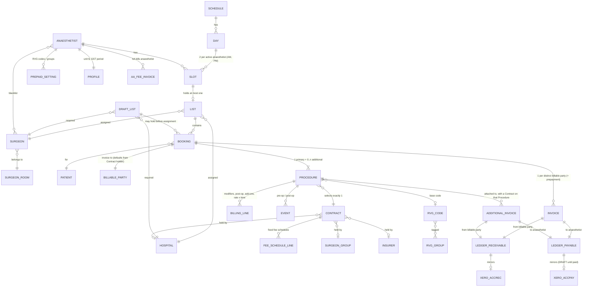

# AA Future-State Domain Model

Companion to the requirements `catalogue/`. This is the narrative and structural reading of the future state
as understood on 2026-09-24, updated 2026-10-01, built from the RFP, the six future-state diagrams, the meeting notes
with AA's lead administrator, the Q&A of 2026-09-24, the meeting with Greg (RFP author) and the Requirements Board
answers of 2026-10-01, and the real fee schedules in `../Data files/`. Where this document and the RFP disagree, this document wins.

## 1. What changed since the RFP

| RFP said | Future state says | Why |
| --- | --- | --- |
| Card | **Booking**. "Card" now only means the physical hospital or surgeon card. | Notes; Q&A #11 |
| Billing Engine | **Billing/Invoice Engine** | Q&A #11 |
| Each Procedure has a *billing route* (Hospital / Billable Party / Insurer), set explicitly, plus a separately looked-up *governing Contract* of type 1, 2 or 3 | Each Procedure selects exactly **one Contract**. The Contract defines rules and pricing, and by default who is invoiced (the billable party can differ, see below). There is no separate route step. | Diagrams 3 and 7; Q&A #2, #3; Notes 2026-09-29 #24 |
| Counterparty resolved by the engine when the List is AUTHORISED | Contract applied at **booking setup** by admin (anaesthetist may change; office approves at review). Engine reads the locked Contract. | Diagram 7; Q&A #4 |
| Secondary procedures in a split-billing episode charge **time units only** | Base units only on the **primary**; time on **every** procedure; modifiers on the primary **unless total modifier units exceed 4**, then split equally across all procedures with the remainder to the primary. | Notes; Q&A #1 |
| `priceOverride` on the Procedure | **Anaesthetist adjustment** (percent discount or fixed final price), only when the Contract permits, applied after BTM is recorded in full. Office override remains. | Diagram 7; Q&A #3, #6 |
| Xero as accounts receivable with the engine's database as a mirror for the app | The engine's **internal ledger is the system of record**. Xero is an AR and banking service mirroring ledger pairs. Patient history survives Xero contact archiving. | Q&A #9 |
| Payment to anaesthetist implied a fee deducted | **AA's fee is a separate invoice from AA to the anaesthetist**, managed by the system, distinct from any procedure's receivable and payable. A monthly fee invoice run raises one per anaesthetist: fixed charges (possibly several items) plus a charge per BCTI issued to them, set on a settings page; not a percentage cut of the payable. The fixed schedule, whether only paid invoices count and whether the fee nets against payables are open (OQ-60). | Q&A #8; Notes 2026-10-01 #1 |
| "Self-funded, pre-payment required" as a patient category | **Prepayment is a first-class flow**: anaesthetist-level prepaid RVG settings, prepayment invoice at setup, tracking, alerts, settlement against the final amount. The prepaid amount is the full estimate, all or nothing, never a deposit. The invoice is generated automatically at setup, only where the patient (or the person paying for them) is the billable party (OQ-73), and held for an admin to approve before it is sent with the letter. | Diagram 7; Notes; Q&A #5; Notes 2026-10-01 #32, #50 |
| Hospital HL7 integrations exist but are unreliable | **St George's and Southern Cross are integrated with the current system; everything else is manual.** The first release keeps a manual matching review and adds an automatic sync (on a schedule, when the matching screen opens, and by a sync button, with a last-synced time) for those two hospitals only. More hospital feeds, automatic matching and HL7/FHIR are Future Work. NHI lookup is in scope. | Q&A #4; Notes 2026-09-29 #14 |
| Patient master implied | **Patient record keyed on NHI**, with per-Booking billable party and invoice email that may differ from the patient (guardian). Proposed instead: the system's own patient ID, with the NHI as a second unique index added when known (OQ-49). Admins see patient outstanding bills and are alerted to patients with outstanding balances: a mild alert under the threshold (90 days, may move), a strong one above it, and staff can always wave it through (OQ-41, OQ-74). NHI is required. A missing NHI is a visible exception on a problem list to resolve, the office emails the surgeon's rooms, and the anaesthetist sees the NHI for Health Connect lookup. Whether a Booking may exist provisionally or is blocked is open (OQ-49); the lean is to let it proceed flagged and block authorising the List until the NHI is added. | Notes; Q&A #9, #13; Notes 2026-09-29 #10, #26, #35; Notes 2026-10-01 #17, #23, #62 |
| Office monitoring of the billing flow | Retained, plus **ledger balance tools** (whole ledger, per anaesthetist, per patient) in the Admin App. | Q&A #12 |
| Two Lists per active anaesthetist per day, unassigned until a surgeon and hospital are set | Three distinct things: a **Slot** (the AM or PM session generated per anaesthetist per day, four months ahead; defaults to free and holds an availability status, which belongs to the Slot, until a List is put in it, and the List then shows in place of the status), a **List** (assigned to an anaesthetist, sits in a Slot, holds Bookings, follows the one-surgeon, one-hospital rule) and a **Draft List** (a List created with no anaesthetist: its surgeon, hospital, day and session are required; it also arises when an anaesthetist moves a List to the office or withdraws, and, per the OQ-27 answer, when an anaesthetist with Lists marks themselves unavailable (or a conflict flag instead, OQ-64); shown prominently in the Admin App; only ever assigned by an admin). This is the working model; the logical model of days, Slots and Lists is still to be made clear (OQ-64). | Notes 2026-09-29 #17, #36; Notes 2026-10-01 #9, #13, #15, #20, #42 |
| Permanent Lists and List templates | **Recurring bookings**: the standing intersection of a hospital, an anaesthetist and a surgeon (day of week, AM or PM), painted onto Lists. The term replaces "template", "permanent booking" and "Permanent List". | Notes 2026-10-01 #44 |
| An anaesthetist hands a List to a colleague by a swap request the office confirms | An anaesthetist **moves their own List** without office confirmation: to the AA office, where it becomes a Draft List, or pushed into a colleague's free Slot, with no acceptance needed (a high-trust system). Who is told is open (OQ-65). | Notes 2026-10-01 #15 |
| Who did a List's procedures not stated | **Whoever submits a List did its procedures.** If another anaesthetist does a Booking, it is moved to a List of theirs, even a one-Booking List; the payable follows the Booking and prepayments are re-checked. | Notes 2026-10-01 #16, #38 |
| No surgeon master data beyond a name | Surgeons' rooms and surgeons are master data; surgeons belong to rooms; each surgeon has a profile (NZ medical registration number and one HPI CPN identifier). A **blacklist** of anaesthetist and surgeon pairings, kept by admin staff, lives there; assigning a blacklisted pairing shows a soft warning, never a block. Whether anaesthetists also keep their own (one blacklist or two) is open (OQ-43). The anaesthetist profile also holds the HPI CPN. | Notes 2026-09-29 #15, #16; Notes 2026-10-01 #19, #26 |
| No cancellation fee mentioned | AA charges no cancellation fees; a cancelled Booking's loss is taken. | Notes 2026-09-29 #1 |
| Prepaid amount worked out by the office from a local table, six or seven time units chosen by the anaesthetist's rate | The prepayment estimate is calculated automatically: (base + time + 2 contingency modifier units) x the anaesthetist's own unit value, time from the surgeon's rooms' estimated duration by the standard RVG rule; always worded as an estimate, from standard letter templates (OQ-38, OQ-50). | Notes 2026-09-29 #2 |
| Availability conflicts undecided (hard block or warning) | Soft warning: the Booking stays, a conflict is flagged and coloured. | Notes 2026-09-29 #3 |
| Anaesthetist bank details location open | Held in the system, on the anaesthetist's profile. | Notes 2026-09-29 #4 |
| Office price override gated by the Contract | The office can always override, including a fixed fee (authorised, not hard-coded). | Notes 2026-09-29 #5 |
| Prepayment refund handled ad hoc between anaesthetists | Prepaid money is held in the trust account and not paid to the anaesthetist until the procedure is done. A cancelled prepayment is refunded to the patient in full from the trust account. A Booking moved to another anaesthetist keeps the agreed prepaid amount and the anaesthetist who does it is paid, wearing or benefiting from any difference (to confirm with Ben, OQ-70). | Notes 2026-09-29 #6; Notes 2026-10-01 #2, #16, #57 |
| Unpaid-patient alert on any unpaid invoice | Alert on patients with outstanding balances: mild under a threshold, strong above it (90 days to start, may move); the threshold applies only to amounts owing. What the days count from, and how a credit balance shows, are open (OQ-74). | Notes 2026-09-29 #10; Notes 2026-10-01 #17 |
| Late billing lines added by the anaesthetist as supplementary invoices; adhoc billing after invoicing was open (OQ-24) | **Additional invoices** are a free-form admin function (description, quantity, amount; no pricing rules), created by admin staff with no extra approval, attached to a Procedure, traceable to the original; no Contract or pricing rules; used for supplementary charges and for splitting a combined fixed-price Procedure. The balance after a prepayment is invoiced as the remaining balance, not as an additional invoice. Each has its own ledger pair, Xero pair and anaesthetist payable. Open details: OQ-72. | Notes 2026-09-29 #8, #18, #23, #29; Notes 2026-10-01 #21 |
| No self-service for late lines (today the anaesthetist rings or emails the office) | **Pre-op and post-op events**: the anaesthetist adds them to a Procedure themselves (self-service), each a time recording or a fixed fee with its own date and time, no other modifiers, attached to the original Procedure so it stays traceable; a billable event produces a new invoice, provisionally approved by the office first. Covers pain management after the procedure and ACC pre-op assessments. How an event is modelled, named, shown on an invoice and approved is open (OQ-63). | Notes 2026-10-01 #6, #34, #61 |
| Correction after invoicing by credit note and re-issue, policy open (OQ-28) | A wrong invoice is **credited in full, then rebilled**; never retracted, edited or partly adjusted. Additional invoice is reserved for supplementary charges and splits. A refund after the anaesthetist has been paid is a credit note to the billable party and a **negative invoice** to the anaesthetist, netted in their next payment run and shown on the remittance advice (OQ-42). Recovery when there is no later payment to net against is open (OQ-71). | Notes 2026-09-29 #9, #12, #34; Notes 2026-10-01 #18 |
| No path for telling hospitals about Booking changes | Saving a Booking change lets the admin **draft an update email** via a mailto link (plain text, about 2,000 characters), prefilled with a subject, boilerplate, the list of changes and, where known, the To address. Contact emails are held for hospitals and surgeons' rooms. The system sends nothing. It is offered after any saved Booking change and after a List reassignment, addressed to the hospital contact for a cover change and to the surgeon's room for a Booking change (OQ-46); a prompt after saving or an on-demand button is OQ-69. | Notes 2026-09-29 #19; Notes 2026-10-01 #22 |
| The Contract decides who is invoiced | The **billable party is independent of pricing**. It defaults to the Contract's holder but can be set separately, for example default RVG pricing with the invoice going to Christchurch Eye instead of the patient. The 2026-10-01 answer has the Contract define the billable party, with as many Contracts as needed; whether a Contract belongs to the hospital or the funding source, and the fall-through order for who pays, are open (OQ-67). | Notes 2026-09-29 #24; Notes 2026-10-01 #29 |
| Contracts filtered by the patient's insurer or funding source | Insurer and funding source are held on **neither the Patient nor the Booking**; each Procedure's Contract says who pays (OQ-55). The user picks the procedure first, then a Contract from those set against it, filtered by the List's hospital. A **combination** of procedures is a Contract set against each of its parent procedures, not a procedure. Holder codes are kept as searchable references, and every Contract carries AA's own identifier (scheme open, OQ-66). | Notes 2026-10-01 #10, #27, #29 |
| The default Contract | The default Contract is the "no special contract" Contract: normal RVG base, time and modifiers, no agreed fixed price or modifier rules. | Notes 2026-09-29 #24 |
| Contract prices have one Contract-level effective date | Every price line carries an effective-from date; one procedure can have different prices under different funding arrangements, each its own Contract. | Notes 2026-09-29 #25 |
| Base units come from the RVG code | Base units are held per procedure on a **Procedure master** mapped to an RVG code or category, because a code alone can carry different values; Contracts may override; position loadings are modifiers (OQ-06). **Disputed:** the OQ-06 board answer puts them on the RVG code master, the 2026-10-01 meeting on the master procedure list (Donald proposes dropping "RVG" from its name); both agree a Contract may override, and a base unit overridden consistently means AA changes its own data (OQ-62). | Notes 2026-09-29 #30; Notes 2026-10-01 #4, #59 |
| Billable party defaults to the patient | A patient under 18 as the billable party is a **mild warning** to AA staff, clearable from the dashboard, not a block (no warning when the billable party is, say, a hospital); the office checks the guardian's invoice email. A guardian's details are a Contract-level matter, kept for the life of the debt and then archived. | Notes 2026-09-29 #20; Notes 2026-10-01 #28 |
| Billing failure scope open (OQ-05) | Failure is **per Booking**: other Bookings on the List still invoice. If any Procedure's billable party fails, the whole Booking is held back for AA admin staff to fix manually. | Notes 2026-10-01 #3 |
| No common warning model | **One warning routine** checks conditions and raises warnings, several per Booking if need be, of a before-procedure or after-procedure kind, mild or strong. They show on the admin dashboard as a to-do list, where they can be cleared, and as a small warning flag on the Booking in both apps; submitting a Booking with a warning asks for a short confirm. Warnings are soft, never blocks. A settings page for thresholds, active warnings and switching off check steps is built only when AA asks. | Notes 2026-10-01 #28, #30, #31, #32, #47, #65 |
| No GST schedule mentioned | A **GST schedule** for each anaesthetist's GST return: AA's sales on their behalf, the GST component and a check against payments, on a cash basis (the payables actually paid in the period). Wanted early; release slot unconfirmed. | Notes 2026-10-01 #40 |
| RFP response: master and reference data migrated at cutover | Clean cut. Reference data loaded from controlled spreadsheets; Solutions Plus used for operation names only (its unit values are not canonical and it holds junk entries). | Notes 2026-09-29 #27, #28 |

Everything else in the RFP (List lifecycle, Xero pairing, NHI change, archiving, time tiers,
per-anaesthetist unit value, roles, audit) carries forward unchanged.

## 2. Entities


```mermaid
erDiagram
  SCHEDULE ||--o{ DAY : has
  DAY ||--o{ SLOT : "2 per active anaesthetist (AM, PM)"
  ANAESTHETIST ||--o{ SLOT : has
  SLOT ||--o| LIST : "holds at most one"
  LIST }o--|| SURGEON : assigned
  LIST }o--|| HOSPITAL : assigned
  LIST ||--o{ BOOKING : contains
  DRAFT_LIST }o--|| SURGEON : required
  DRAFT_LIST }o--|| HOSPITAL : required
  DRAFT_LIST ||--o{ BOOKING : "may hold before assignment"
  SURGEON }o--|| SURGEON_ROOM : "belongs to"
  ANAESTHETIST }o--o{ SURGEON : blacklist
  BOOKING }o--|| PATIENT : for
  BOOKING ||--|| BILLABLE_PARTY : "invoice to (defaults from Contract holder)"
  BOOKING ||--|{ PROCEDURE : "1 primary + 0..n additional"
  PROCEDURE }o--|| CONTRACT : "selects exactly 1"
  PROCEDURE }o--o| RVG_CODE : "base code"
  PROCEDURE ||--o{ BILLING_LINE : "modifiers, post-op, add-ons, rate x time"
  PROCEDURE ||--o{ EVENT : "pre-op / post-op"
  CONTRACT ||--o{ FEE_SCHEDULE_LINE : "fixed fee schedules"
  CONTRACT }o--o| HOSPITAL : "held by"
  CONTRACT }o--o| SURGEON_GROUP : "held by"
  CONTRACT }o--o| INSURER : "held by"
  ANAESTHETIST ||--o{ PREPAID_SETTING : "RVG codes / groups"
  ANAESTHETIST ||--|| PROFILE : "unit $, GST period"
  RVG_CODE }o--o{ RVG_GROUP : tagged
  BOOKING ||--o{ INVOICE : "1 per distinct billable party (+ prepayment)"
  INVOICE ||--|| LEDGER_RECEIVABLE : "from billable party"
  INVOICE ||--|| LEDGER_PAYABLE : "to anaesthetist"
  PROCEDURE ||--o{ ADDITIONAL_INVOICE : "attached to, with a Contract on that Procedure"
  ADDITIONAL_INVOICE ||--|| LEDGER_RECEIVABLE : "from billable party"
  ADDITIONAL_INVOICE ||--|| LEDGER_PAYABLE : "to anaesthetist"
  LEDGER_RECEIVABLE ||--o| XERO_ACCREC : mirrors
  LEDGER_PAYABLE ||--o| XERO_ACCPAY : "mirrors (DRAFT until paid)"
  ANAESTHETIST ||--o{ AA_FEE_INVOICE : "AA bills anaesthetist"
```

**Hierarchy:** Day → Slot or List → Booking → Procedure → Contract (which may be split). A Draft List sits outside the Slots until assigned (Notes 2026-10-01 #27, #42).

### Slot, List and Draft List

- Fixed canvas: two **Slots** per active anaesthetist per day, four months forward, whether or not
  a List or Booking is attached. Every new Slot defaults to free. A new anaesthetist gets Slots from
  their start date, and Slots can then be edited freely. Whether every Slot is stored or empty ones
  are inferred is left to implementation, provided every known anaesthetist's Slot status shows.
- **Availability status** (for example free, on holiday, unavailable; final values and colours not
  named yet) belongs to the Slot, not the List, and is set by the anaesthetist per Slot (half-day),
  independent of bookings. The anaesthetist keeps it up from a calendar in their app (mark days off
  ahead, create a series, edit or delete one instance). Working reading: the Slot status and that
  calendar are one mechanism, not two to reconcile; once a List is put in the Slot, the List shows
  in place of the status (OQ-27). Theatre is not recorded.
- **List**: assigned to an anaesthetist, sits in one Slot, exactly one surgeon and one hospital,
  one day, one session; AM and PM may differ. A Slot with no List has no surgeon and no hospital.
  A List's status is its anaesthetist's. Lists are projected from **recurring bookings** (a hospital,
  an anaesthetist and a surgeon on a day of week and session) or made ad hoc: an admin turns a free Slot into an
  ad hoc List.
- **Draft List**: a List created with no anaesthetist. Its surgeon, hospital, day and session are
  always known when it is created and all four are required. Bookings can be added before an
  anaesthetist is assigned. It arises when a surgeon's room needs an anaesthetist and none is
  assigned, when an anaesthetist moves a List to the office or withdraws, and (OQ-27 answer) when
  an anaesthetist with Lists marks themselves unavailable. It shows prominently in the Admin App,
  is never offered to anaesthetists, and only an admin assigns it, when it becomes a List in a
  Slot. A cancelled or unfilled one is removed or re-dated. The name is kept for now.
- **Approval state** (DRAFT → SUBMITTED → AUTHORISED) is separate from availability status. It
  belongs to assigned Lists and is unrelated to a Draft List.
- Lists move between anaesthetists with their Bookings intact. An anaesthetist moves their own
  List without office confirmation: to the office (it becomes a Draft List) or into a colleague's
  free Slot, with no acceptance needed. Who is told is OQ-65.
- **Whoever submits a List did its procedures.** A Booking done by another anaesthetist is moved
  to a List of theirs, even a one-Booking List; its payable follows it and prepayments are
  re-checked. Say a completed or submitted Booking, not a "timesheet" (Notes 2026-10-01 #38, #39).
- Open: the logical model (is the day the real parent with Lists as its children and Slots only a
  view; is an unavailable half-day a status or a List; do a newly unavailable anaesthetist's Lists
  become Draft Lists or keep a conflict flag) and the user-facing names (OQ-64).

### Booking

- Replaces Card. Belongs to one List. References a Patient (NHI).
- Has exactly **one primary Procedure** and zero or more additional Procedures in the same
  anaesthetic episode. Anyone with edit rights can set which is primary.
- Carries the **billable party** and **invoice email** (defaults from the Contract holder, or the patient for patient-direct Contracts; override e.g. guardian). It holds no insurer or funding source: each Procedure's Contract says who pays (OQ-55).
- Carries prepayment state: required, amount, prepayment invoice.
- Carries any open **warnings** (shown as a small flag in both apps; see Warnings below).
- Mutable from all sources until the List is SUBMITTED; office-only until AUTHORISED; then
  immutable. Append-only change history.
- Sources: hospital download via matching screen, surgeon PDF (the RFP says this is currently the
  main pathway by volume; confirm, OQ-34), admin entry, anaesthetist ad hoc (optionally from a
  photo of the physical card), copy of another Booking. The hospital download is matched on the
  matching screen, with an automatic sync from St George's and Southern Cross.
- Billing lines dated after the List is invoiced are billed as additional invoices created by
  admin staff, attached to the Procedure (OQ-24), or as pre-op and post-op events the anaesthetist
  adds to the Procedure (OQ-63); a wrong invoice is credited in full, then rebilled (OQ-28).
- Billing fails per Booking, not per List: if any Procedure's billable party fails, the whole
  Booking is held back for AA admin staff to fix manually (OQ-05).

### Procedure

- Holds the billing context: RVG code (or Contract fee schedule line), base units (with range
  override), start and handover times, ASA, itemised modifiers, other billing lines, the selected
  **Contract**, and any anaesthetist adjustment.
- Exactly one Contract. Snapshot of the Contract version taken at AUTHORISED.
- `isPrimary` flag drives the multi-procedure rule.
- May hold **pre-op and post-op events** (an ACC pre-op assessment, pain management after the
  procedure): each has its own date and time and records either a time or a fixed fee, takes no
  other modifiers, and may or may not be billable. A billable event produces a new invoice,
  traceable to the original Procedure, provisionally approved by the office before it is issued; the Contract
  can replace a recorded time with a fixed fee. Whether an event is its own element or a Procedure
  added to the Booking, its name, how it shows on an invoice and whether it needs approval are OQ-63.

### Contract (recommended structure)

The Contract is the one object that answers: *how is this priced, what rules apply, who gets the
invoice by default, and what extra information do we need to collect?*

Recommendation: separate the reusable **Contract** (master data) from the per-Booking **billing
context** captured on the Procedure. The bullets under "RVG Default Contract Post-paid / Pre-paid"
in the Q&A (invoice email, prepaid amount, price override) are per-Booking values, not Contract
values. The Contract *declares that they are required*; the Booking *holds them*.

**Contract (master data)**

| Field | Notes |
| --- | --- |
| id, aaCode, name, version, effectiveFrom, effectiveTo, reviewDate | Fee schedules change on fixed dates (1 April, 1 June, 1 October). Versions are kept so old invoices reproduce. Every Contract carries AA's own unique identifier (`aaCode`); holder codes are kept as references and do not replace it. Coding scheme open (OQ-66). |
| category | RVG Default Post-paid · RVG Default Pre-paid · RVG Default Hospital · Hospital · Surgeon Solo · Surgeon Group · Insurance. ACC is a Hospital or holder Contract with ACC pricing, not its own category. |
| holder | Who is invoiced by default: Hospital · Surgeon or Surgeon Group entity · Insurer · **Booking's billable party** (for patient-direct categories). The Procedure's billable party can differ from the holder. Whether a Contract belongs to the hospital or to the funding source, and the fall-through order for who pays, are OQ-67. |
| scope | Filters the Contract list at selection time: procedures[] (from the master procedure list; a combination Contract lists each of its parent procedures), hospitals[], surgeons[], insurers[], rvgCodes[] or rvgGroups[], fundingSource (private, SXAP, HNZ, ACC), anaesthetists[] (empty = organisational). The funding source describes the Contract; it is not looked up from the Patient or Booking (OQ-55). |
| pricingBasis | `RVG_UNITS_ANAESTHETIST_RATE` (default) · `RVG_UNITS_CONTRACT_RATE` ($/unit or % discount) · `FIXED_SCHEDULE` (see fee schedule lines) · `RATE_TIME` (hourly, individually arranged). |
| baseUnitOverrides | Optional per procedure, RVG code or group, where the Contract departs from the default. Where base units otherwise live is disputed: the RVG code master (OQ-06 board answer) or the master procedure list (2026-10-01 meeting); see OQ-62. |
| contractRate / discountPercent | For `RVG_UNITS_CONTRACT_RATE`. |
| multiProcedureRule | `RVG_DEFAULT` (base once, time each, modifier split > 4) · `SECOND_CODE_PERCENT` (e.g. 50%) · `ADD_ON_FEE` · `NOT_BILLABLE`. |
| allowsAnaesthetistAdjustment | Shows the % discount / fixed final price field in the app. |
| paymentSetting | `FULL` (the assigned billable party pays the whole line item) · `SPLIT` (the line item is divided between parties, for example an insurer and the patient's gap, with an invoice to each). The split basis (percentage only, percentage or free field, or a typed $ or % value), whether it is set on the Contract or the Booking, and whether it is a per-Contract default are OQ-68. |
| requiredBookingInputs | Any of: invoiceEmail, billableParty, prepaidAmount, insurerMemberNumber, claimReference, purchaseOrder. Blocks Booking completion until present. |
| prepayment | Prepayment is driven by the anaesthetist's prepaid RVG settings (Q&A #5). Whether a Pre-paid Contract category is also a trigger is OQ-25. A Contract never carries a fixed partial prepaid amount: prepayment is all or nothing. |
| invoiceLayout | Contract holder layout vs patient layout. |
| deliveryMethod | Email · portal upload (NIB) · none. |
| gstTreatment | Prices stored GST exclusive; inclusive derived. |

**Fee schedule line** (children of a `FIXED_SCHEDULE` Contract)

| Field | Real examples from `Data files/` |
| --- | --- |
| holderCode, description | SXAP `AP0126 Blepharoplasty unilateral LA`; CES `HNZCATall`; ACC `OPT101`; Merivale `Abdominoplasty simple`. Kept for reference and searchable when picking a Contract (type `8942` to filter to it). |
| priceExGst, priceIncGst | Every schedule publishes one or both |
| mappedRvgCodes[] | Optional, so BTM is still recorded against an RVG code |
| timeBand (from, to) | CES vitrectomy: up to 60 / 61-90 / 90-120 min, then $100 per extra 15 min |
| isAddOn | GA add-on $370 / $385; anterior vitrectomy add-on; MIGS "add on to cataract" |
| quantityRule | Merivale liposuction $345 per area |
| tier | CES HNZ "commitment" vs "panel" price columns |
| effectiveFrom | Date the price takes effect; upcoming prices can be entered ahead |

**Procedure billing context** (instance values, on the Procedure / Booking)

| Field | Notes |
| --- | --- |
| contractId + contractVersion | Locked at AUTHORISED |
| feeScheduleLineId | When the Contract is `FIXED_SCHEDULE` |
| billableParty, invoiceEmail | On the Booking or Procedure; defaults from the Contract holder or the patient, overridable |
| prepaymentRequired, prepaidAmount, prepaymentInvoiceId | On the Booking. prepaidAmount is the full estimate. |
| anaesthetistAdjustment { type: PERCENT, AMOUNT or FIXED_FINAL, value, reason } | Only if Contract allows |
| officeOverride { type: PERCENT, AMOUNT or FIXED_FINAL, value, reason } | The office can always override, including a fixed fee (OQ-16). |
| insurerMemberNumber, claimReference, purchaseOrder | As required by the Contract |

**Selection.** At booking setup the admin (or later the anaesthetist) picks the procedure first,
from the procedure list grouped and filtered by RVG body headings, then a Contract from those set
against that procedure, narrowed by the List's hospital (always known) and the surgeon; a holder's
own code can be typed to find its Contract. The patient's insurer or funding source is not a
filter, since neither the Patient nor the Booking holds it (OQ-55). A **combination** of
procedures (for example an abdominoplasty, breast lift and liposuction) is a Contract set against
each of its parent procedures, so picking any of them offers it; once it is chosen, history shows
only the Contract. Keeping thousands of Contracts navigable is OQ-66. Whether the list is picked by
operation name or RVG code is OQ-62. Where nothing more specific applies, the **RVG Default Hospital** Contract for the List's
hospital is the default. Every hospital and direct insurer must hold one, so there is never a
"no contract" branch. The default Contract means normal RVG pricing with no special rules; it
does not decide who is invoiced. RVG variants with different base units are their own Contracts,
and many insurance jobs are plain RVG paid by the insurer (Notes 2026-10-01 #29, #64).

### RVG code and modifier master

- NZSA RVG 2021: code, description, section (anatomical site), base units (fixed or range),
  absorbed loadings (spine and neuro include prone positioning). AA adds codes the guide does
  not cover and marks them AA-sourced.
- Groups: the guide's sections plus AA groups (cosmetic, plastics, dental, ...) used for search
  and for the anaesthetist's prepaid selection.
- Procedure master (Donald proposes calling it the master procedure list, without "RVG"):
  standard single procedures mapped to an RVG code or category, each with defined base units,
  ideally derived from an RVG code; the default Contract and hospital Contracts that use default
  base units take them from it, and a Contract may override them. The OQ-06 board answer instead
  puts base units on the RVG code master; this is not settled (OQ-62). The RVG guide is only a
  guide (the same code appears with different base units), and AA can set any base units
  regardless of it; a base unit overridden consistently means AA changes its own data. An
  anaesthetist may enter base units outside a code's range, which raises an after-procedure
  warning for the office (OQ-56). Vanessa is filling a standard procedure list with RVG codes and
  base units.
- Modifier master: PA1-PA5, A1-A2, AS1/AS3/AS4, ASE, OB1-OB4, AI1, P1, VM1, TTE1-2, PACU1, EAA1,
  POC1-POC3, NC1-NC2, with unit values. ACC pre-op: CS250, CS260, CS70 (TBC). The list will be extended from AA's fuller
  modifier source.

### Patient and billable party

- Patient: one record per NHI (both formats validated, modulus 24 and 23), demographics,
  ethnicity (NZHIS Level 4), contact. Supplied by hospital, surgeon or AA. NHI is the clinical
  identifier and dedupe key; billing and ledger records key on a hidden internal patient ID with
  NHI as a cross-reference (RFP Appendix 1 policy). Proposed: the system's own patient ID is the
  key, with the NHI attached later under a second unique index, against "keyed on NHI"; how
  duplicates found later are resolved is part of OQ-49. NHI and other PII never go to Xero, which
  holds only a unique ID linking back to the system's invoices (OQ-30).
- Billable party: per Booking, defaults from the Contract holder, or the patient for patient-direct Contracts, overridable (guardian). Invoice email lives
  here.
- NHI is required; a Booking without one appears on a problem list until it is added. Lean (OQ-49):
  the Booking, Procedures and Contracts proceed flagged, and authorising the List is blocked until
  the NHI is added. The NHI can be refreshed from the central register.
- A patient under 18 as the billable party raises a mild warning, clearable, not a block; no
  warning when the billable party is not the patient. A guardian's details are a Contract-level
  matter, kept for the life of the debt and then archived, not a master record.
- Admin can see a patient's outstanding invoices across all anaesthetists and is alerted to
  patients with outstanding balances: a mild alert under the threshold (90 days, may move), a
  strong one above it, and staff can always wave it through. The threshold applies only to amounts
  owing (OQ-41); what it counts from and how a credit balance shows are OQ-74.

### Surgeon, surgeons' room and blacklist

- Surgeons belong to rooms; a room holds a contact email.
- A surgeon profile holds the NZ medical registration number and the **HPI CPN** (Common Person
  Number): for an individual practitioner the CPN and the HPI practitioner number are one
  identifier, the surgeon's unique index. HPI (Health Provider Index) identifies practitioners and
  facilities and is not the patient's NHI (OQ-52).
- The **blacklist** is anaesthetist and surgeon pairings, seen and maintained by admin staff. It
  warns (a soft warning, both when assigning a List or Draft List and when an anaesthetist
  moves their own List into a colleague's free Slot) but never blocks. Whether anaesthetists also
  keep their own, so one list or two, and whether each side learns of the other's, are open
  (OQ-43); the name may change ("block list").

### Internal ledger

- For every invoice: a **receivable** from the billable party and a linked **payable** to the
  anaesthetist. Prepayment invoices create the same pair.
- Tracks $ in (receipts) and $ out (disbursements) so the whole ledger, each anaesthetist and each
  patient can be shown in or out of balance.
- Mirrored to Xero as ACCREC + DRAFT ACCPAY. Full receipt authorises the payable; partial receipt
  authorises a payable for exactly the amount received. Payment of the ACCPAY in Xero's payables
  run is detected the same way and recorded as the disbursement.
- Invoices are issued in the anaesthetist's name with AA as agent; the ACCPAY is a buyer-created
  tax invoice (BCTI), one per procedure, which IRD has since renamed (new name to confirm). Exact
  GST presentation to be confirmed with AA's accountant (OQ-29). Once generated for a period, the
  BCTIs are approved for payment before they are paid.
- A refund after the anaesthetist has been paid is a credit note to the billable party offset by a
  **negative invoice** to the anaesthetist, netted in their next payment run and shown on the
  remittance advice (OQ-42). With no later payment to net against, only the anaesthetist can fund
  it; how it is recovered is OQ-71.
- **AA fee invoices** from AA to each anaesthetist are separate ledger items, raised by a monthly
  fee invoice run: fixed charges (several items may make it up) plus a charge per BCTI issued to
  the anaesthetist, set on a settings page (OQ-02). The fixed schedule, whether only paid invoices
  count and whether the fee nets against payables are OQ-60.
- A **GST schedule** for each anaesthetist, on a cash basis: AA's sales on their behalf, the GST
  component and a check against payments, listing the payables actually paid in the period;
  anything outstanding falls into a later period (Notes 2026-10-01 #40).
- Xero contacts use a hidden internal ID and are archived after inactivity; the ledger keeps the
  history.

### Warnings

- One routine checks conditions and raises warnings, possibly several per Booking, of a
  before-procedure or after-procedure kind, mild or strong (for example out-of-range base units,
  an unpaid prepayment, a child as billable party, a patient's outstanding balance).
- Warnings are soft: they never block. They show on the admin dashboard as a to-do list, where an
  admin clears them, and as a small warning flag on the Booking in both apps, tapped to read the
  text; submitting a Booking with a warning asks for a short confirm.
- A settings page for thresholds, which warnings are active and switching off check steps (such as
  approving a prepayment invoice) is built only when AA asks (Notes 2026-10-01 #28, #31, #32, #47,
  #65).

### Reference data and go-live

- Clean cut, not a full migration: decide what is useful rather than migrating everything.
- Reference data is loaded from controlled spreadsheets: hospitals, surgeons and
  rooms, procedures with their RVG mapping and base units, modifiers, fixed fee schedules and
  Contract overrides.
- The Solutions Plus operation list is used for names only. Its unit values are not canonical and
  it holds junk entries (for example a "10% discount" saved as an operation).

## 3. Calculation rules

```
fee(procedure) =
  if contract.pricingBasis == FIXED_SCHEDULE:  scheduleLine.price (+ time band, add-ons, quantity)
  if contract.pricingBasis == RATE_TIME:       rate x duration
  else:                                        units(procedure) x unitValue
       where unitValue = contract rate (RVG_UNITS_CONTRACT_RATE) or anaesthetist's own $ per unit
  then apply anaesthetist adjustment (if allowed), then office override (the office can always override, OQ-16)
```

**Units within a Booking** (RVG default multi-procedure rule):

| Component | Primary procedure | Additional procedures |
| --- | --- | --- |
| Base units | Yes (one base code per anaesthetic) | Never. Field not editable. |
| Time units | From its own times: 1 per 15 min for the first 2 h, then 1 per 10 min | Same, from its own times |
| Modifier units | All of them if total ≤ 4. If total > 4: equal share + remainder | Equal share when total > 4 |

Worked example: three Procedures, modifiers AS3 (2) + OB3 (2) + ASE (2) + A1 (1) = 7 units.
7 > 4, so 7 ÷ 3 = 2 each with remainder 1 → primary 3, second 2, third 2. Base units on the
primary only. Each Procedure's time units from its own times. Each Procedure is then priced by
its own Contract, so a cosmetic add-on on a patient-direct Contract and a primary on a hospital
Contract each carry their correct share.

A Contract may replace this rule (`SECOND_CODE_PERCENT` 50%, `ADD_ON_FEE`), as the SXAP and CES
schedules do.

**Prepayment.** Required when any Procedure's RVG code on the Booking is in the anaesthetist's
prepaid set (the RFP's typical case is an additional elective cosmetic procedure). Amount is an estimate of the full fee, all or nothing; never a deposit or a fixed partial amount. The estimate is (base units + time units + 2 contingency modifier units) x the anaesthetist's own unit value, time units from the estimated duration given by the surgeon's rooms by the standard tiered rule (OQ-38, OQ-50; the check against the RVG 2021 text is OQ-75). After
AUTHORISED: remaining = final − prepaid; invoice if positive (whether a small shortfall is let go below a threshold is OQ-61); if negative, nothing is refunded (OQ-03). The prepayment invoice is generated automatically at setup, only where the patient (most likely meaning the person paying for them) is the billable party (OQ-73), and held for an admin to approve before it is sent with the letter (OQ-58). The money is held in the trust account and not paid to the anaesthetist until the procedure is done. A prepaid Booking that is cancelled is refunded in full from the trust account. A prepaid Booking moved to another anaesthetist keeps the agreed amount, and the anaesthetist who does it is paid, wearing or benefiting from the difference (OQ-03, OQ-40; to confirm with Ben, OQ-70). Prepayments are re-checked whenever a List or Booking moves.

## 4. Glossary

| Term | Meaning |
| --- | --- |
| Booking | An appointment within a List for one patient. Formerly Card. |
| Card | The physical hospital or surgeon booking card only. |
| List | A List assigned to an anaesthetist, sitting in a Slot and holding Bookings. One surgeon, one hospital. |
| Primary Procedure | The one Procedure in a Booking that carries base units and anchors modifiers. |
| Contract | A billing rules object in the system, not a legal contract. Defines pricing, rules and the default invoice recipient. |
| Contract holder | The organisation that holds a Contract: hospital, surgeon entity, insurer. It is invoiced by default, but the billable party can differ. |
| Billable party | Whoever receives the invoice for a Procedure. Independent of how the Procedure is priced; defaults to the Contract holder, or for patient-direct Contracts the patient, or their override (guardian). |
| Invoice email | Where the invoice is sent; belongs to the billable party, not necessarily the patient. |
| BTM / BTT | Base, Time, Modifier units (RVG). |
| RVG / RVU | NZSA Relative Value Guide / Relative Value Units. Units, not dollars. |
| Internal ledger | The Billing/Invoice Engine's own receivable and payable records; system of record. |
| ACCREC / ACCPAY | Xero receivable / payable invoice types mirroring ledger pairs. |
| Prepayment | The full estimate invoiced before the procedure for prepaid RVG codes; all or nothing, always worded as an estimate. |
| AA fee | AA's charge to an anaesthetist, invoiced separately in a monthly run: fixed charges plus a charge per BCTI. |
| Matching screen | Admin screen where hospital bookings, downloaded or synced (St George's, Southern Cross), are matched to Lists and Bookings. |
| Slot | The AM or PM session the Scheduling Engine generates per anaesthetist per day, four months ahead. Defaults to free and holds an availability status until a List is put in it. |
| Draft List | A List created with no anaesthetist; its surgeon, hospital, day and session are known. Shown prominently in the Admin App and only ever assigned by an admin. Name kept for now ("unassigned list" also heard). |
| Recurring booking | The standing intersection of a hospital, an anaesthetist and a surgeon on a day of week and session, painted onto Lists. Replaces "template", "permanent booking" and "Permanent List". Not a Booking for one patient. |
| Surgeons' room | Master record of a room, with contact email and the surgeons who belong to it. |
| Blacklist | Anaesthetist and surgeon pairings that should not be matched. Kept by admin staff; assigning one shows a soft warning. |
| HPI | Health Provider Index: identifies a practitioner or facility. Not the patient's NHI. |
| HPI CPN | HPI CPN (Common Person Number): the one identifier for an individual practitioner, used for surgeons and anaesthetists. |
| Trust account | AA's account holding prepayment money until the procedure is done, and from which a refund is made; refunds and trust payments are made from the system. |
| Additional invoice | A free-form invoice (description, quantity, amount; no pricing rules) created by admin staff, attached to a Procedure, traceable to the original; no Contract or pricing rules; for supplementary charges or a split. Not a correction. |
| Pre-op / post-op event | A time recording or fixed fee the anaesthetist adds to a Procedure, with its own date and time, for a future invoice; may or may not be billable. Name and model open (OQ-63). |
| Negative invoice | The anaesthetist-side offset of a credit note issued after they have been paid; netted in their next payment run. |
| Remittance advice | What the anaesthetist receives with a payment run, showing the invoices paid and any negative invoices netted against them. |
| Warning | A soft flag raised by the warning routine on a Booking, before or after the procedure, mild or strong; listed on the admin dashboard to-do list and cleared there. Never a block. |
| Default Contract | The "no special contract" Contract: normal RVG base, time and modifier pricing, no agreed fixed price or modifier rules. |
| Procedure master | Standard single procedures mapped to an RVG code or category, each holding its own base units; proposed name "master procedure list". Where base units live is OQ-62. |
| Timesheet | Not used. Say a completed or submitted Booking. |
