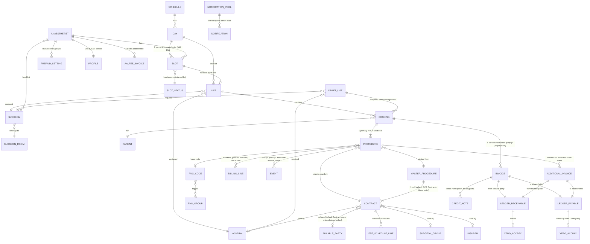

# AA Future-State Domain Model

Companion to the requirements `catalogue/`. This is the narrative and structural reading of the future state
as understood on 2026-09-24, updated 2026-10-02, built from the RFP, the six future-state diagrams, the meeting notes
with AA's lead administrator, the Q&A of 2026-09-24, the meeting with Greg (RFP author) and the Requirements Board
answers of 2026-10-01, the AA meeting with Greg of 2026-10-02 and its question answers (OQ-62 to OQ-75), the afternoon AA requirements review with Greg of 2026-10-02 (Notes 2026-10-02 · AA requirements review with Greg), and the real fee schedules in `../Data files/`. Where this document and the RFP disagree, this document wins.

## 1. What changed since the RFP

| RFP said | Future state says | Why |
| --- | --- | --- |
| Card | **Booking**. "Card" now only means the physical hospital or surgeon card. | Notes; Q&A #11 |
| Billing Engine | **Billing/Invoice Engine** | Q&A #11 |
| Each Procedure has a *billing route* (Hospital / Billable Party / Insurer), set explicitly, plus a separately looked-up *governing Contract* of type 1, 2 or 3 | Each Procedure selects exactly **one Contract**. The Contract defines rules, pricing and who is invoiced (the billable party, OQ-67). There is no separate route step. | Diagrams 3 and 7; Q&A #2, #3; Notes 2026-09-29 #24; Notes 2026-10-02 #8 |
| Counterparty resolved by the engine when the List is AUTHORISED | Contract applied at **booking setup** by admin (anaesthetist may change; office approves at review). Engine reads the locked Contract. | Diagram 7; Q&A #4 |
| Secondary procedures in a split-billing episode charge **time units only** | Base units only on the **primary**; time on **every** procedure; modifiers on the primary **unless total modifier units exceed 4**, then split equally across all procedures with the remainder to the primary. | Notes; Q&A #1 |
| `priceOverride` on the Procedure | **Anaesthetist adjustment** (percent discount or fixed final price), only when the Contract permits, applied after BTM is recorded in full. Office override remains. | Diagram 7; Q&A #3, #6 |
| Xero as accounts receivable with the engine's database as a mirror for the app | The engine's **internal ledger is the system of record**. Xero is an AR and banking service mirroring ledger pairs. Patient history survives Xero contact archiving. | Q&A #9 |
| Payment to anaesthetist implied a fee deducted | **AA's fee is a separate invoice from AA to the anaesthetist**, managed by the system, distinct from any procedure's receivable and payable. A monthly fee invoice run raises one per anaesthetist: fixed charges (possibly several items) plus a charge per BCTI issued to them, set on a settings page; not a percentage cut of the payable. The fixed schedule, whether only paid invoices count and whether the fee nets against payables are open (OQ-60); Greg's view, to confirm with AA's accountant, is that only paid invoices count and the fee is always a separate invoice paid into a separate bank account, never netted. | Q&A #8; Notes 2026-10-01 #1; Notes 2026-10-02 #1 |
| "Self-funded, pre-payment required" as a patient category | **Prepayment is a first-class flow**: anaesthetist-level prepaid RVG settings, prepayment invoice at setup, tracking, alerts, settlement against the final amount. The prepaid amount is the full estimate, all or nothing, never a deposit (whether a prepayment can be partial, and what a run over or under the estimate does, are open, OQ-76). The invoice is generated automatically at setup, only where the billable party is a person paying for the patient, never an organisation (OQ-73), and held for an admin to approve before it is sent with the letter. | Diagram 7; Notes; Q&A #5; Notes 2026-10-01 #32, #50; Notes 2026-10-02 #14, #17 |
| Hospital HL7 integrations exist but are unreliable | **St George's and Southern Cross are integrated with the current system; everything else is manual.** The first release keeps a manual matching review and adds an automatic sync (on a schedule, when the matching screen opens, and by a sync button, with a last-synced time) for those two hospitals only. More hospital feeds, automatic matching and HL7/FHIR are Future Work. NHI lookup is in scope. | Q&A #4; Notes 2026-09-29 #14 |
| Patient master implied | **Patient record keyed on NHI**, with a billable party and invoice email, set through the Contract, that may differ from the patient (guardian). Proposed instead: the system's own patient ID, with the NHI as a second unique index added when known (OQ-49). Admins see patient outstanding bills and are alerted to patients with outstanding balances: a mild alert under the threshold (90 days from the invoice date, may move), a strong one above it, a mild one for a credit balance, and staff can always wave it through (OQ-41, OQ-74). NHI is required. A missing NHI is a visible exception on a problem list to resolve, the office emails the surgeon's rooms, and the anaesthetist sees the NHI for Health Connect lookup. Whether a Booking may exist provisionally or is blocked is open (OQ-49); the lean is to let it proceed flagged and block authorising the List until the NHI is added. | Notes; Q&A #9, #13; Notes 2026-09-29 #10, #26, #35; Notes 2026-10-01 #17, #23, #62; Notes 2026-10-02 #15 |
| Office monitoring of the billing flow | Retained, plus **ledger balance tools** (whole ledger, per anaesthetist, per patient) in the Admin App. | Q&A #12 |
| Two Lists per active anaesthetist per day, unassigned until a surgeon and hospital are set | Three distinct things: a **Slot** (a box for the AM or PM session, created and stored per active anaesthetist per day across a rolling schedule, four months ahead in current practice, its length a rarely changed setting; defaults to free and has a status from a user-maintained list until a List is put in it, and the List then shows in place of the status), a **List** (assigned to an anaesthetist, put into a Slot, holds Bookings, follows the one-surgeon, one-hospital rule) and a **Draft List** (a List created with no anaesthetist: its surgeon, hospital, day and session are required; it also arises when an anaesthetist moves a List to the office (including marking its Slot unavailable), and when a recurring booking lands on an unavailable Slot; shown prominently in the Admin App, a major feature for AA staff; only ever assigned by an admin). Slots and Lists are both children of the day. This is the logical model; how it is stored is for the developers, and the word "slot" never appears in the UI (OQ-64). | Notes 2026-09-29 #17, #36; Notes 2026-10-01 #9, #13, #15, #20, #42; Notes 2026-10-02 #5, #23, #29, #30; Notes 2026-10-02 · AA requirements review with Greg #1, #20, #61 |
| Permanent Lists and List templates | **Recurring bookings**: the standing intersection of a hospital, an anaesthetist and a surgeon (day of week, AM or PM), painted onto Lists. The term replaces "template", "permanent booking" and "Permanent List". | Notes 2026-10-01 #44 |
| An anaesthetist hands a List to a colleague by a swap request the office confirms | An anaesthetist **moves their own List** without office confirmation: to the AA office, where it becomes a Draft List, or pushed into a colleague's free Slot, with no acceptance needed (a high-trust system). The office is told through a **shared notification pool** in the Admin App and offered the cover-change update email; the colleague sees the List appear with a notice (OQ-65). An anaesthetist can also move a **single Booking** to a colleague; a receiver marked unavailable sets themselves available first (experience OQ-85, the vacated Slot's status OQ-84). | Notes 2026-10-01 #15; Notes 2026-10-02 #6, #18; Notes 2026-10-02 · AA requirements review with Greg #3 |
| Who did a List's procedures not stated | **Whoever submits a List did its procedures.** If another anaesthetist does a Booking, it is moved to a List of theirs, even a one-Booking List; the payable follows the Booking and prepayments are re-checked. | Notes 2026-10-01 #16, #38 |
| No surgeon master data beyond a name | Surgeons' rooms and surgeons are master data; surgeons belong to rooms; each surgeon has a profile (NZ medical registration number and one HPI CPN identifier). A **blacklist** of anaesthetist and surgeon pairings, kept by admin staff, lives there; assigning a blacklisted pairing shows a soft warning, never a block. Whether anaesthetists also keep their own (one blacklist or two) is open (OQ-43). The anaesthetist profile also holds the HPI CPN. | Notes 2026-09-29 #15, #16; Notes 2026-10-01 #19, #26 |
| No cancellation fee mentioned | AA charges no cancellation fees; a cancelled Booking's loss is taken. | Notes 2026-09-29 #1 |
| Prepaid amount worked out by the office from a local table, six or seven time units chosen by the anaesthetist's rate | The prepayment estimate is calculated automatically: (base + time + 2 contingency modifier units) x the anaesthetist's own unit value, time from the surgeon's rooms' estimated duration by the standard RVG rule; always worded as an estimate, from standard letter templates (OQ-38, OQ-50). | Notes 2026-09-29 #2 |
| Availability conflicts undecided (hard block or warning) | Soft warning: the Booking stays, a conflict is flagged and coloured (a hospital closure, or a Booking landing on a Slot already marked unavailable). A recurring booking landing on an unavailable Slot becomes a Draft List instead. An anaesthetist who marks a Slot unavailable while it holds a List is not left with a conflict: they return the List to the office (it becomes a Draft List) or assign it to a colleague (OQ-64). Generation paints the anaesthetist's calendar first, then recurring bookings; only short-notice sickness is open (OQ-81). | Notes 2026-09-29 #3; Notes 2026-10-02 #5, #27, #45; Notes 2026-10-02 · AA requirements review with Greg #1 |
| Anaesthetist bank details location open | Held in the system, on the anaesthetist's profile. | Notes 2026-09-29 #4 |
| Office price override gated by the Contract | The office can always override, including a fixed fee (authorised, not hard-coded). | Notes 2026-09-29 #5 |
| Prepayment refund handled ad hoc between anaesthetists | Prepaid money is held in the trust account and not paid to the anaesthetist until the procedure is done. A cancelled prepayment is refunded to the patient in full from the trust account. A Booking moved to another anaesthetist keeps the agreed prepaid amount and the anaesthetist who does it is paid, wearing or benefiting from any difference; only the payable half of the prepayment's draft pair is updated to the new anaesthetist (OQ-70). When in the lifecycle the pair is created and amended is open. | Notes 2026-09-29 #6; Notes 2026-10-01 #2, #16, #57; Notes 2026-10-02 #11 |
| Unpaid-patient alert on any unpaid invoice | Alert on patients with outstanding balances: mild under a threshold, strong above it (90 days to start, may move); the threshold applies only to amounts owing. The days count from the invoice date, and a credit balance raises a mild warning (OQ-74). | Notes 2026-09-29 #10; Notes 2026-10-01 #17; Notes 2026-10-02 #15 |
| Late billing lines added by the anaesthetist as supplementary invoices; adhoc billing after invoicing was open (OQ-24) | **Additional invoices** are a free-form admin function (description, quantity, amount; no pricing rules), created by admin staff to any billable party, recorded as an **event** on a Procedure and traceable to the original; no Contract or pricing rules; used for supplementary charges and for splitting a combined fixed-price Procedure. Like every event they go through the one standard review step (OQ-63). The function has a **credit note option**: the original is credited to any party, the original billable party included, then new additional invoices are raised (OQ-72; reversal of the payable and the rebill total open, OQ-77). The balance after a prepayment is invoiced as the remaining balance, not as an additional invoice. Each has its own ledger pair, Xero pair and anaesthetist payable. | Notes 2026-09-29 #8, #18, #23, #29; Notes 2026-10-01 #21; Notes 2026-10-02 #4, #13, #32, #33 |
| No self-service for late lines (today the anaesthetist rings or emails the office) | **Events**: everything recorded against a Procedure after it is set up (pre-op, post-op, additional invoices, credits) is an event, its own element attached to the original Procedure and visible on it in both apps. The anaesthetist mostly adds pre-op and post-op events themselves (self-service), and the admin team can too; each is a time recording or a fixed fee with its own date and time, no other modifiers, and a tick box for whether it will be invoiced. A billable event is its own line item: on the Procedure's invoice if that is not yet approved, otherwise a separate invoice in the next run, all through the one standard review step (OQ-63). Covers pain management after the procedure and ACC pre-op assessments. The name "events" is kept for now. | Notes 2026-10-01 #6, #34, #61; Notes 2026-10-02 #4, #24, #25, #44 |
| Correction after invoicing by credit note and re-issue, policy open (OQ-28) | A wrong invoice is **credited in full, then rebilled**; never retracted, edited or partly adjusted. Additional invoice is reserved for supplementary charges and splits. A refund after the anaesthetist has been paid is a credit note to the billable party and a **negative invoice** to the anaesthetist, netted in their next payment run and shown on the remittance advice (OQ-42). With no later payment to net against, it is handled outside the system (OQ-71). A credit note is not a refund: a refund of a resulting credit happens outside the system. | Notes 2026-09-29 #9, #12, #34; Notes 2026-10-01 #18; Notes 2026-10-02 #12, #33 |
| No path for telling hospitals about Booking changes | An on-demand button on any Booking in the Admin App lets the admin **draft an update email** via a mailto link (plain text, about 2,000 characters), prefilled with a subject, boilerplate, the changes the admin picks (one or many) from the Booking's change history and, where known, the To address (OQ-69). Contact emails are held for hospitals and surgeons' rooms. The system sends nothing. It is addressed to the hospital contact for a cover change and to the surgeon's room for a Booking change (OQ-46). Proposed: user-configurable templates, one per kind of change. | Notes 2026-09-29 #19; Notes 2026-10-01 #22; Notes 2026-10-02 #10, #31 |
| The Contract decides who is invoiced | The Contract **always defines the billable party**, with as many Contracts as AA needs (OQ-67); there is no per-Booking override. Picking a default Contract asks for the payer's name and email (for example a guardian), so even a base Contract has a billable party; default RVG pricing with the invoice going to Christchurch Eye is a Contract with that hospital as billable party. Whether a Contract belongs to the hospital or the funding source is not settled, and Greg's alternative (no default Contract, the hospital holding every Contract) is an open question. | Notes 2026-09-29 #24; Notes 2026-10-01 #29; Notes 2026-10-02 #4, #8, #41 |
| Contracts filtered by the patient's insurer or funding source | Insurer and funding source are held on **neither the Patient nor the Booking**; each Procedure's Contract says who pays (OQ-55). The user picks the procedure first, then a Contract from those set against it, filtered by the List's hospital. A **combination** of procedures is a Contract set against each of its parent procedures, not a procedure. Holder codes are kept as searchable references, and every Contract carries a short structured AA code (format still to be designed); the picker is filtered by procedure, then hospital, with code search (OQ-66). | Notes 2026-10-01 #10, #27, #29; Notes 2026-10-02 #7 |
| The default Contract | The default Contract is the "no special contract" Contract: normal RVG base, time and modifiers, no agreed fixed price or modifier rules. Every procedure on the master procedure list has one or two **default RVG Contracts**, the standard RVG recommendation, holding its base units (OQ-62; the meeting described one base Contract per procedure). How these relate to each hospital's RVG Default Hospital Contract is not settled. | Notes 2026-09-29 #24; Notes 2026-10-02 #3, #40 |
| Contract prices have one Contract-level effective date | Every price line carries an effective-from date; one procedure can have different prices under different funding arrangements, each its own Contract. | Notes 2026-09-29 #25 |
| Base units come from the RVG code | Base units live in each procedure's **default RVG Contracts** (one or two per procedure, or one, still in tension), not on the RVG code master or the procedure list (OQ-62); any other Contract may override them for a procedure, RVG code or group; position loadings are modifiers (OQ-06). The **master procedure list** holds procedures grouped by body part, each holding or referencing its RVG code (which of the two is still in tension). Default Contracts are imported from spreadsheets, then maintained by hand, so a rare RVG change is applied by hand. A base unit overridden consistently means AA changes its own data. | Notes 2026-09-29 #30; Notes 2026-10-01 #4, #59; Notes 2026-10-02 #3, #40 |
| Billable party defaults to the patient | A patient under 18 as the billable party is a **mild warning** to AA staff, clearable from the dashboard, not a block (no warning when the billable party is, say, a hospital); the office checks the guardian's invoice email. A guardian's details are a Contract-level matter, kept for the life of the debt and then archived. | Notes 2026-09-29 #20; Notes 2026-10-01 #28 |
| Billing failure scope open (OQ-05) | Failure is **per Booking**: other Bookings on the List still invoice. If any Procedure's billable party fails, the whole Booking is held back for AA admin staff to fix manually. | Notes 2026-10-01 #3 |
| No common warning model | **One warning routine** checks conditions and raises warnings, several per Booking if need be, of a before-procedure or after-procedure kind, mild or strong. They show on the admin dashboard as a to-do list, where they can be cleared, and as a small warning flag on the Booking in both apps, visually clear when the anaesthetist opens the Booking, much like the prototype; no confirm step on submit. Warnings are soft, never blocks. A settings page for thresholds, active warnings and switching off check steps is built only when AA asks. | Notes 2026-10-01 #28, #30, #31, #32, #47, #65; Notes 2026-10-02 · AA requirements review with Greg #15, #16 |
| No shared notices for the office | A **shared notification pool** in the Admin App: one pool for the whole admin team, separate from the to-do list, for things that happened and need no action, newest first. The first source is an anaesthetist moving their own List. What else posts to it, and expiry, are open (OQ-79). | Notes 2026-10-02 #6, #18, #43 |
| No GST schedule mentioned | A **GST schedule** for each anaesthetist's GST return: AA's sales on their behalf, the GST component and a check against payments, on a cash basis (the payables actually paid in the period). Wanted early; release slot unconfirmed. | Notes 2026-10-01 #40 |
| RFP response: master and reference data migrated at cutover | Clean cut. Reference data loaded from controlled spreadsheets; Solutions Plus used for operation names only (its unit values are not canonical and it holds junk entries). | Notes 2026-09-29 #27, #28 |

Everything else in the RFP (List lifecycle, Xero pairing, NHI change, archiving, time tiers,
per-anaesthetist unit value, roles, audit) carries forward unchanged, except that the audit trail
covers invoices and credit notes but not disbursements, payments or receipts (Greg: those are done
in Xero), with its depth
for the developers to settle, and sign-in is an account login for the anaesthetist PWA (Auth0 is
Stratos' default; platform, biometrics, MFA, single sign-on and identity provider are open, as is the
experience, OQ-83) (Notes 2026-10-02 · AA requirements review with Greg #2, #12, #42, #78, #84).

## 2. Entities


```mermaid
erDiagram
  SCHEDULE ||--o{ DAY : has
  DAY ||--o{ SLOT : "2 per active anaesthetist (AM, PM)"
  DAY ||--o{ LIST : "child of"
  SLOT }o--|| SLOT_STATUS : "has (user-maintained list)"
  ANAESTHETIST ||--o{ SLOT : has
  SLOT ||--o| LIST : "holds at most one"
  LIST }o--|| SURGEON : assigned
  LIST }o--|| HOSPITAL : assigned
  LIST ||--o{ BOOKING : contains
  DRAFT_LIST }o--|| SURGEON : required
  DRAFT_LIST }o--|| HOSPITAL : required
  DRAFT_LIST ||--o{ BOOKING : "may hold before assignment"
  SURGEON }o--|| SURGEON_ROOM : "belongs to"
  ANAESTHETIST }o--o{ SURGEON : blacklist
  BOOKING }o--|| PATIENT : for
  BOOKING ||--|{ PROCEDURE : "1 primary + 0..n additional"
  PROCEDURE }o--|| CONTRACT : "selects exactly 1"
  CONTRACT }o--o| BILLABLE_PARTY : "defines (default Contract: payer entered when picked)"
  PROCEDURE }o--|| MASTER_PROCEDURE : "picked from"
  MASTER_PROCEDURE ||--|{ CONTRACT : "1 or 2 default RVG Contracts (base units)"
  PROCEDURE }o--o| RVG_CODE : "base code"
  PROCEDURE ||--o{ BILLING_LINE : "modifiers, post-op, add-ons, rate x time"
  PROCEDURE ||--o{ EVENT : "pre-op, post-op, additional invoice, credit"
  CONTRACT ||--o{ FEE_SCHEDULE_LINE : "fixed fee schedules"
  CONTRACT }o--o| HOSPITAL : "held by"
  CONTRACT }o--o| SURGEON_GROUP : "held by"
  CONTRACT }o--o| INSURER : "held by"
  ANAESTHETIST ||--o{ PREPAID_SETTING : "RVG codes / groups"
  ANAESTHETIST ||--|| PROFILE : "unit $, GST period"
  RVG_CODE }o--o{ RVG_GROUP : tagged
  BOOKING ||--o{ INVOICE : "1 per distinct billable party (+ prepayment)"
  INVOICE ||--|| LEDGER_RECEIVABLE : "from billable party"
  INVOICE ||--|| LEDGER_PAYABLE : "to anaesthetist"
  PROCEDURE ||--o{ ADDITIONAL_INVOICE : "attached to, recorded as an event"
  INVOICE ||--o{ CREDIT_NOTE : "credit note option, to any party"
  ADDITIONAL_INVOICE ||--|| LEDGER_RECEIVABLE : "from billable party"
  ADDITIONAL_INVOICE ||--|| LEDGER_PAYABLE : "to anaesthetist"
  LEDGER_RECEIVABLE ||--o| XERO_ACCREC : mirrors
  LEDGER_PAYABLE ||--o| XERO_ACCPAY : "mirrors (DRAFT until paid)"
  ANAESTHETIST ||--o{ AA_FEE_INVOICE : "AA bills anaesthetist"
  NOTIFICATION_POOL ||--o{ NOTIFICATION : "shared by the admin team"
```

**Hierarchy:** Day → Slot → List → Booking → Procedure → Contract (which may be split), with events on the Procedure. Slots and Lists are both children of the day: a List is put into a Slot. This is the logical model; how it is stored is for the developers. A Draft List sits outside the Slots until assigned (Notes 2026-10-01 #27, #42; Notes 2026-10-02 #4, #5, #23, #29).

### Slot, List and Draft List

- Fixed canvas: two **Slots** per active anaesthetist per day across a rolling schedule, four months
  ahead in current practice (its length a setting changed rarely), whether or not a List or Booking
  is attached. A Slot is a box (container) that has a status, and a List is put into it. Every Slot
  is created and stored across the horizon, empty ones included:
  "the foundation on which everything else is painted" (OQ-64). The generation run writes an AM and
  a PM Slot as free for every active anaesthetist, then paints the anaesthetist's own calendar
  (holidays and other unavailability) first, then surgeons' recurring bookings; a recurring booking
  that lands on an unavailable Slot becomes a Draft List (Notes 2026-10-02 · AA requirements review with Greg #1, #20). A new anaesthetist gets Slots from their start date, and Slots can then be edited freely.
  The word "slot" never appears in the UI: users see Lists, and free or unavailable Slots are shown
  much as in the prototype today.
- **Availability status** belongs to the Slot, not the List, and is set by the anaesthetist per Slot
  (half-day), independent of bookings. The anaesthetist keeps it up from a calendar in their app
  (mark days off ahead, create a series, edit or delete one instance). The Slot status and that
  calendar are one mechanism; once a List is put in the Slot, the List shows in place of the status
  (OQ-27, OQ-64). The status values are **master data**, a user-maintained list rather than a fixed
  set: each has a fixed internal ID, an editable label and an editable colour, and rules read the ID,
  not the label. For now they start from the values in use (free by default, on holiday,
  unavailable) with colours chosen for now; the final values are to be defined with AA's users, who
  have redundant statuses (to verify). Theatre is not recorded.
- Marking a Slot unavailable while it holds a List asks the anaesthetist to return the List to the
  office, where it becomes a Draft List with its hospital, surgeon and Bookings, or to assign it to
  an available colleague, as when they move their own List. A Booking that lands on a Slot already
  marked unavailable is accepted and flagged as a conflict, as is a booked List whose hospital
  closes; a recurring booking that lands on one becomes a Draft List (Notes 2026-10-02 #5, #27, #45;
  Notes 2026-10-02 · AA requirements review with Greg #1).
- **List**: assigned to an anaesthetist, sits in one Slot, exactly one surgeon and one hospital,
  one day, one session; AM and PM may differ. A Slot with no List has no surgeon and no hospital.
  A List's status is its anaesthetist's. Lists are projected from **recurring bookings** (a hospital,
  an anaesthetist and a surgeon on a day of week and session) or made ad hoc: an admin puts an ad hoc
  List into a free Slot. A recurring booking creates its List at the far end of the rolling schedule, before any Bookings
  exist, so a List can hold no Bookings (Notes 2026-10-02 #28; Notes 2026-10-02 · AA requirements review with Greg #20).
- **Draft List**: a List created with no anaesthetist. Its surgeon, hospital, day and session are
  always known when it is created and all four are required. Bookings can be added before an
  anaesthetist is assigned. It arises when a surgeon's room needs an anaesthetist and none is
  assigned, when an anaesthetist moves a List to the office (including marking its Slot
  unavailable), and when a recurring booking lands on an unavailable Slot (Notes 2026-10-02 · AA requirements review with Greg #1, #61). It shows prominently
  in the Admin App (a major feature for AA staff), is never offered to anaesthetists, and only an
  admin assigns it, when it becomes a List in a Slot. A cancelled or unfilled one is removed or
  re-dated. The name Draft List is kept.
- **Approval state** (DRAFT → SUBMITTED → AUTHORISED) is separate from availability status. It
  belongs to assigned Lists and is unrelated to a Draft List.
- Lists move between anaesthetists with their Bookings intact. An anaesthetist moves their own
  List without office confirmation: to the office (it becomes a Draft List) or into a colleague's
  free Slot, with no acceptance needed. The office is told through the shared notification pool
  and offered the cover-change update email; the colleague sees the List appear in their app with
  a notice (OQ-65). An anaesthetist can also move a single Booking to a colleague; a receiver
  marked unavailable sets themselves available first, which is their acceptance of the work. The
  experience is open (OQ-85), as is the status of a Slot vacated by a moved List (OQ-84)
  (Notes 2026-10-02 · AA requirements review with Greg #3).
- **Whoever submits a List did its procedures.** A Booking done by another anaesthetist is moved
  to a List of theirs, even a one-Booking List; its payable follows it and prepayments are
  re-checked. Say a completed or submitted Booking, not a "timesheet" (Notes 2026-10-01 #38, #39).
- Settled (OQ-64): the day is the parent of both Slots and Lists; an unavailable half-day is a Slot
  status, not a List; a newly unavailable anaesthetist's List leaves them by their choice (office
  or colleague) rather than keeping a conflict flag. Settled (OQ-81 parts 1 and 2): the
  anaesthetist's calendar is painted before recurring bookings, and a recurring booking on an
  unavailable Slot becomes a Draft List. Open: whether a short-notice sickness follows the
  unavailable flow or is recorded by the office as a conflict (OQ-81) (Notes 2026-10-02 · AA requirements review with Greg #1).

### Booking

- Replaces Card. Belongs to one List. References a Patient (NHI).
- Has exactly **one primary Procedure** and zero or more additional Procedures in the same
  anaesthetic episode. Anyone with edit rights can set which is primary.
- Its Procedures' Contracts define the **billable party** and **invoice email** (OQ-67); for a default Contract the payer's name and email (for example a guardian) are entered when it is picked. It holds no insurer or funding source: each Procedure's Contract says who pays (OQ-55).
- Carries prepayment state: required, amount, prepayment invoice.
- Carries any open **warnings** (shown as a small flag in both apps; see Warnings below).
- Mutable from all sources until the List is SUBMITTED; office-only until AUTHORISED; then
  immutable. Append-only change history, from which the admin picks the changes an on-demand
  update email reports (OQ-69).
- Sources: hospital download via matching screen, surgeon PDF (the RFP says this is currently the
  main pathway by volume; confirm, OQ-34), admin entry, anaesthetist ad hoc (optionally from a
  photo of the physical card), copy of another Booking. The hospital download is matched on the
  matching screen, with an automatic sync from St George's and Southern Cross.
- Billing lines dated after the List is invoiced are recorded as events on the Procedure: pre-op
  and post-op events (mostly added by the anaesthetist) or additional invoices created by admin
  staff (OQ-24, OQ-63); a wrong invoice is credited in full, then rebilled (OQ-28).
- Billing fails per Booking, not per List: if any Procedure's billable party fails, the whole
  Booking is held back for AA admin staff to fix manually (OQ-05).

### Procedure

- Holds the billing context: RVG code (or Contract fee schedule line), base units (seeded from the
  selected Contract, its default RVG Contract unless another applies, OQ-62; with range override), start and handover times, ASA, itemised modifiers, other billing lines, the selected
  **Contract**, and any anaesthetist adjustment.
- Exactly one Contract. Snapshot of the Contract version taken at AUTHORISED.
- `isPrimary` flag drives the multi-procedure rule.
- Holds **events**, each its own element attached to the Procedure (not a Procedure added to the
  Booking): pre-op and post-op events (an ACC pre-op assessment, pain management after the
  procedure), additional invoices and credits, all listed on the Procedure in both apps. The anaesthetist or an
  admin adds a pre-op or post-op event; it has its own date and time, records either a time or a
  fixed fee, and takes no other modifiers. A tick box says whether it will be invoiced, so an event
  can be recorded without being billed. Its billable party is set by a "same as" tick (our
  reading: the Procedure's billable party; the default is not stated), otherwise entered. A billable event is its own line item: recorded before the Procedure's invoice
  is approved, it is a line on that invoice; recorded after, it is a separate invoice in the next
  run, traceable to the Procedure. Every event goes through the same standard review step (OQ-63).
  The Contract can replace a recorded time with a fixed fee.

### Contract (recommended structure)

The Contract is the one object that answers: *how is this priced, what rules apply, who gets the
invoice (the billable party), and what extra information do we need to collect?*

Recommendation: separate the reusable **Contract** (master data) from the per-Booking **billing
context** captured on the Procedure. The bullets under "RVG Default Contract Post-paid / Pre-paid"
in the Q&A (invoice email, prepaid amount, price override) are per-Booking values, not Contract
values. The Contract *declares that they are required*; the Booking *holds them*.

**Contract (master data)**

| Field | Notes |
| --- | --- |
| id, aaCode, name, version, effectiveFrom, effectiveTo, reviewDate | Fee schedules change on fixed dates (1 April, 1 June, 1 October). Versions are kept so old invoices reproduce. Every Contract carries AA's own unique identifier (`aaCode`), a short structured code; holder codes are kept as references and do not replace it. The code format is part of designing the Contract (OQ-66). |
| category | RVG Default Post-paid · RVG Default Pre-paid · RVG Default Hospital · Hospital · Surgeon Solo · Surgeon Group · Insurance. ACC is a Hospital or holder Contract with ACC pricing, not its own category. |
| holder / billableParty | The Contract always defines the billable party (OQ-67): Hospital · Surgeon or Surgeon Group entity · Insurer · **the payer named on the Booking** (for patient-direct and default Contracts, which ask for the payer's name and email when picked). There is no separate per-Booking override. Whether a Contract belongs to the hospital or to the funding source is not settled. |
| scope | Filters the Contract list at selection time: procedures[] (from the master procedure list; a combination Contract lists each of its parent procedures), hospitals[], surgeons[], insurers[], rvgCodes[] or rvgGroups[], fundingSource (private, SXAP, HNZ, ACC), anaesthetists[] (empty = organisational). The funding source describes the Contract; it is not looked up from the Patient or Booking (OQ-55). |
| pricingBasis | `RVG_UNITS_ANAESTHETIST_RATE` (default) · `RVG_UNITS_CONTRACT_RATE` ($/unit or % discount) · `FIXED_SCHEDULE` (see fee schedule lines) · `RATE_TIME` (hourly, individually arranged). |
| baseUnits / baseUnitOverrides | A procedure's **default RVG Contracts** (one or two per procedure) hold its base units (OQ-62). Any other Contract may override them per procedure, RVG code or group. |
| contractRate / discountPercent | For `RVG_UNITS_CONTRACT_RATE`. |
| multiProcedureRule | `RVG_DEFAULT` (base once, time each, modifier split > 4) · `SECOND_CODE_PERCENT` (e.g. 50%) · `ADD_ON_FEE` · `NOT_BILLABLE`. |
| allowsAnaesthetistAdjustment | Shows the % discount / fixed final price field in the app. |
| paymentSetting | `FULL` (the assigned billable party pays the whole line item) · `SPLIT` (the line item is divided between parties, for example an insurer and the patient's gap, with an invoice to each). Each party's share is a typed $ or % value, set on the Booking and defaulting from the Contract (OQ-68, recommendation adopted, to verify). Whether % shares must total 100 and what the line items say are not settled. |
| requiredBookingInputs | Any of: invoiceEmail, billableParty, prepaidAmount, insurerMemberNumber, claimReference, purchaseOrder. Blocks Booking completion until present. |
| prepayment | Prepayment is driven by the anaesthetist's prepaid RVG settings (Q&A #5). Whether a Pre-paid Contract category is also a trigger is OQ-25. A Contract never carries a fixed partial prepaid amount: prepayment is all or nothing. |
| invoiceLayout | Contract holder layout vs patient layout. |
| deliveryMethod | Email · portal upload (NIB) · none. |
| gstTreatment | Prices stored GST exclusive; inclusive derived. |

**Fee schedule line** (children of a `FIXED_SCHEDULE` Contract)

| Field | Real examples from `Data files/` |
| --- | --- |
| holderCode, description | SXAP `AP0126 Blepharoplasty unilateral LA`; CES `HNZCATall`; ACC `OPT101`; Merivale `Abdominoplasty simple`. Kept for reference and searchable when picking a Contract (type `8942` to filter to it). |
| priceExGst, priceIncGst | Every schedule publishes one or both |
| mappedRvgCodes[] | Optional, so BTM is still recorded against an RVG code |
| timeBand (from, to) | CES vitrectomy: up to 60 / 61-90 / 90-120 min, then $100 per extra 15 min |
| isAddOn | GA add-on $370 / $385; anterior vitrectomy add-on; MIGS "add on to cataract" |
| quantityRule | Merivale liposuction $345 per area |
| tier | CES HNZ "commitment" vs "panel" price columns |
| effectiveFrom | Date the price takes effect; upcoming prices can be entered ahead |

**Procedure billing context** (instance values, on the Procedure / Booking)

| Field | Notes |
| --- | --- |
| contractId + contractVersion | Locked at AUTHORISED |
| feeScheduleLineId | When the Contract is `FIXED_SCHEDULE` |
| billableParty, invoiceEmail | Defined by the Contract; for patient-direct and default Contracts, the payer's name and email are entered here (OQ-67) |
| prepaymentRequired, prepaidAmount, prepaymentInvoiceId | On the Booking. prepaidAmount is the full estimate. |
| anaesthetistAdjustment { type: PERCENT, AMOUNT or FIXED_FINAL, value, reason } | Only if Contract allows |
| officeOverride { type: PERCENT, AMOUNT or FIXED_FINAL, value, reason } | The office can always override, including a fixed fee (OQ-16). |
| insurerMemberNumber, claimReference, purchaseOrder | As required by the Contract |

**Selection.** At booking setup the admin (or later the anaesthetist) picks the procedure first,
from the procedure list grouped and filtered by RVG body headings, then a Contract from those set
against that procedure, narrowed by the List's hospital (always known) and the surgeon; a holder's
own code can be typed to find its Contract. The patient's insurer or funding source is not a
filter, since neither the Patient nor the Booking holds it (OQ-55). A **combination** of
procedures (for example an abdominoplasty, breast lift and liposuction) is a Contract set against
each of its parent procedures, so picking any of them offers it; once it is chosen, history shows
only the Contract. Thousands of Contracts stay navigable by the procedure and hospital filters
plus AA code search (OQ-66). The procedure is picked from the master procedure list, grouped by
body part (OQ-62). Where nothing more specific applies, the **RVG Default Hospital** Contract for the List's
hospital is the default. Every hospital and direct insurer must hold one, so there is never a
"no contract" branch. The default Contract means normal RVG pricing with no special rules; picking
it asks for the payer's name and email, so it still has a billable party (OQ-67). Every procedure
also has one or two default RVG Contracts holding its base units (OQ-62); how these relate to each
hospital's RVG Default Hospital Contract (where it takes its base units from, and which the picker
always offers) is not settled, and Greg's possible no-default-Contract model bears on it (OQ-78). RVG variants with different base units are their own Contracts,
and many insurance jobs are plain RVG paid by the insurer (Notes 2026-10-01 #29, #64; Notes 2026-10-02 #3, #7, #8).

### RVG code and modifier master

- NZSA RVG 2021: code, description, section (anatomical site), base units (fixed or range),
  absorbed loadings (spine and neuro include prone positioning). AA adds codes the guide does
  not cover and marks them AA-sourced.
- Groups: the guide's sections plus AA groups (cosmetic, plastics, dental, ...) used for search
  and for the anaesthetist's prepaid selection.
- Master procedure list (formerly the Procedure master): standard single procedures grouped by
  body part, each holding or referencing its RVG code or category (which of the two is still in
  tension). It no longer holds base units: they live in each procedure's one or two default RVG
  Contracts, imported from spreadsheets at the start and then maintained by hand, and any other
  Contract may override them (OQ-62). Greg's idea of Contracts as children of a master code, so an
  RVG change flows through, is not adopted. The RVG guide is only a
  guide (the same code appears with different base units), and AA can set any base units
  regardless of it; a base unit overridden consistently means AA changes its own data. An
  anaesthetist may enter base units outside a code's range, which raises an after-procedure
  warning for the office (OQ-56). Vanessa is filling a standard procedure list with RVG codes and
  base units.
- Modifier master: PA1-PA5, A1-A2, AS1/AS3/AS4, ASE, OB1-OB4, AI1, P1, VM1, TTE1-2, PACU1, EAA1,
  POC1-POC3, NC1-NC2, with unit values. ACC pre-op: CS250, CS260, CS70 (TBC). The list will be extended from AA's fuller
  modifier source.

### Patient and billable party

- Patient: one record per NHI (both formats validated, modulus 24 and 23), demographics,
  ethnicity (NZHIS Level 4), contact. Supplied by hospital, surgeon or AA. NHI is the clinical
  identifier and dedupe key; billing and ledger records key on a hidden internal patient ID with
  NHI as a cross-reference (RFP Appendix 1 policy). Proposed: the system's own patient ID is the
  key, with the NHI attached later under a second unique index, against "keyed on NHI"; how
  duplicates found later are resolved is part of OQ-49. NHI and other PII never go to Xero, which
  holds only a unique ID linking back to the system's invoices (OQ-30).
- Billable party: defined by each Procedure's Contract (OQ-67); for patient-direct and default
  Contracts the payer's name and email (for example a guardian) are entered when it is picked.
  Invoice email lives here.
- NHI is required; a Booking without one appears on a problem list until it is added. Lean (OQ-49):
  the Booking, Procedures and Contracts proceed flagged, and authorising the List is blocked until
  the NHI is added. The NHI can be refreshed from the central register.
- A patient under 18 as the billable party raises a mild warning, clearable, not a block; no
  warning when the billable party is not the patient. A guardian's details are a Contract-level
  matter, kept for the life of the debt and then archived, not a master record.
- Admin can see a patient's outstanding invoices across all anaesthetists and is alerted to
  patients with outstanding balances: a mild alert under the threshold (90 days, may move), a
  strong one above it, and staff can always wave it through. The threshold applies only to amounts
  owing (OQ-41). The days count from the invoice date, and a credit balance raises a mild alert
  (OQ-74).

### Surgeon, surgeons' room and blacklist

- Surgeons belong to rooms; a room holds a contact email.
- A surgeon profile holds the NZ medical registration number and the **HPI CPN** (Common Person
  Number): for an individual practitioner the CPN and the HPI practitioner number are one
  identifier, the surgeon's unique index. HPI (Health Provider Index) identifies practitioners and
  facilities and is not the patient's NHI (OQ-52).
- The **blacklist** is anaesthetist and surgeon pairings, seen and maintained by admin staff. It
  warns (a soft warning, both when assigning a List or Draft List and when an anaesthetist
  moves their own List into a colleague's free Slot) but never blocks. Whether anaesthetists also
  keep their own, so one list or two, and whether each side learns of the other's, are open
  (OQ-43); the name may change ("block list").

### Internal ledger

- For every invoice: a **receivable** from the billable party and a linked **payable** to the
  anaesthetist. Prepayment invoices create the same pair. When a prepaid Booking moves to another
  anaesthetist, only one half of its draft pair is updated to the new anaesthetist (which half was not
  named; the payable is our reading), so the trust account in Xero stays balanced (OQ-70); when in the lifecycle the pair is created and
  amended is open (OQ-80).
- Tracks $ in (receipts) and $ out (disbursements) so the whole ledger, each anaesthetist and each
  patient can be shown in or out of balance.
- Mirrored to Xero as ACCREC + DRAFT ACCPAY. Full receipt authorises the payable; partial receipt
  authorises a payable for exactly the amount received. Payment of the ACCPAY in Xero's payables
  run is detected the same way and recorded as the disbursement.
- Invoices are issued in the anaesthetist's name with AA as agent; the ACCPAY is a buyer-created
  tax invoice (BCTI), one per procedure, which IRD has since renamed (new name to confirm). Exact
  GST presentation to be confirmed with AA's accountant (OQ-29). Once generated for a period, the
  BCTIs are approved for payment before they are paid.
- A refund after the anaesthetist has been paid is a credit note to the billable party offset by a
  **negative invoice** to the anaesthetist, netted in their next payment run and shown on the
  remittance advice (OQ-42). With no later payment to net against, it is handled outside the
  system; AA settles it with the anaesthetist (OQ-71).
- The additional invoice function has a **credit note option**: the original invoice is credited
  to any party (the original billable party included), then new additional invoices are raised;
  the credit and the new invoices are events on the Procedure (OQ-72). A credit note is not a
  refund: refunding a resulting credit happens outside the system. Open (OQ-77): whether the credit
  reverses the linked payable to the anaesthetist (Greg: it "should automatically include a
  reversal"), whether the rebilled invoices must total the credited one, and a split asked for
  before the combined invoice is sent. Proposed: the rebill starts from a draft copy of the
  original's lines.
- **AA fee invoices** from AA to each anaesthetist are separate ledger items, raised by a monthly
  fee invoice run: fixed charges (several items may make it up) plus a charge per BCTI issued to
  the anaesthetist, set on a settings page (OQ-02). The fixed schedule, whether only paid invoices
  count and whether the fee nets against payables are OQ-60. Greg's view, to confirm with AA's
  accountant: only paid invoices count, and the fee is always a separate invoice paid into a
  separate bank account, never netted.
- A **GST schedule** for each anaesthetist, on a cash basis: AA's sales on their behalf, the GST
  component and a check against payments, listing the payables actually paid in the period;
  anything outstanding falls into a later period (Notes 2026-10-01 #40).
- Xero contacts use a hidden internal ID and are archived after inactivity; the ledger keeps the
  history.

### Warnings

- One routine checks conditions and raises warnings, possibly several per Booking, of a
  before-procedure or after-procedure kind, mild or strong (for example out-of-range base units,
  an unpaid prepayment, a child as billable party, a patient's outstanding balance).
- Warnings are soft: they never block. They show on the admin dashboard as a to-do list, where an
  admin clears them, and as a small warning flag on the Booking in both apps, visually clear
  when the anaesthetist opens the Booking, much like the prototype; there is no confirm step on
  submit.
- A settings page for thresholds, which warnings are active and switching off check steps (such as
  approving a prepayment invoice) is built only when AA asks (Notes 2026-10-01 #28, #31, #32, #47,
  #65; Notes 2026-10-02 · AA requirements review with Greg #15, #16).
- Notices that need no action are not warnings: they go to the **shared notification pool** in the
  Admin App, one pool for the whole admin team, separate from the to-do list, newest first. Every
  logged-on admin sees the same pool. The first source is an anaesthetist moving their own List (to
  the office or a colleague), saying which List moved and to whom. What else
  posts to it, expiry and whether a notice can be marked actioned are open (Notes 2026-10-02 #6,
  #18, #43).

### Reference data and go-live

- Clean cut, not a full migration: decide what is useful rather than migrating everything.
- Reference data is loaded from controlled spreadsheets: hospitals, surgeons and
  rooms, procedures with their RVG mapping, each procedure's default RVG Contracts with its base
  units (OQ-62), modifiers, Contracts (RVG, fixed or other style) (Notes 2026-10-02 · AA requirements review with Greg #10, #77).
- The Solutions Plus operation list is used for names only. Its unit values are not canonical and
  it holds junk entries (for example a "10% discount" saved as an operation).

## 3. Calculation rules

```
fee(procedure) =
  if contract.pricingBasis == FIXED_SCHEDULE:  scheduleLine.price (+ time band, add-ons, quantity)
  if contract.pricingBasis == RATE_TIME:       rate x duration
  else:                                        units(procedure) x unitValue
       where unitValue = contract rate (RVG_UNITS_CONTRACT_RATE) or anaesthetist's own $ per unit
  then apply anaesthetist adjustment (if allowed), then office override (the office can always override, OQ-16)
```

**Units within a Booking** (RVG default multi-procedure rule):

| Component | Primary procedure | Additional procedures |
| --- | --- | --- |
| Base units | Yes (one base code per anaesthetic) | Never. Field not editable. |
| Time units | From its own times: 1 per 15 min for the first 2 h, then 1 per 10 min; a part interval is always rounded up (OQ-75) | Same, from its own times |
| Modifier units | All of them if total ≤ 4. If total > 4: equal share + remainder | Equal share when total > 4 |

Worked example: three Procedures, modifiers AS3 (2) + OB3 (2) + ASE (2) + A1 (1) = 7 units.
7 > 4, so 7 ÷ 3 = 2 each with remainder 1 → primary 3, second 2, third 2. Base units on the
primary only. Each Procedure's time units from its own times. Each Procedure is then priced by
its own Contract, so a cosmetic add-on on a patient-direct Contract and a primary on a hospital
Contract each carry their correct share.

A Contract may replace this rule (`SECOND_CODE_PERCENT` 50%, `ADD_ON_FEE`), as the SXAP and CES
schedules do.

**Prepayment.** Required when any Procedure's RVG code on the Booking is in the anaesthetist's
prepaid set (the RFP's typical case is an additional elective cosmetic procedure). Amount is an estimate of the full fee, all or nothing; never a deposit or a fixed partial amount. The estimate is (base units + time units + 2 contingency modifier units) x the anaesthetist's own unit value, time units from the estimated duration given by the surgeon's rooms by the standard tiered rule, part intervals always rounded up (OQ-38, OQ-50, OQ-75). Whether a prepayment can be partial, and what a procedure running over or under the estimate does, are open (OQ-76). After
AUTHORISED: remaining = final − prepaid; invoice if positive (whether a small shortfall is let go below a threshold is OQ-61); if negative, nothing is refunded (OQ-03). The prepayment invoice is generated automatically at setup, only where the billable party is a person paying for the patient, never an organisation (OQ-73), and held for an admin to approve before it is sent with the letter (OQ-58). The money is held in the trust account and not paid to the anaesthetist until the procedure is done. A prepaid Booking that is cancelled is refunded in full from the trust account. A prepaid Booking moved to another anaesthetist keeps the agreed amount, and the anaesthetist who does it is paid, wearing or benefiting from the difference; only the payable half of the draft pair moves to them (OQ-03, OQ-40, OQ-70). Prepayments are re-checked whenever a List or Booking moves.

## 4. Glossary

| Term | Meaning |
| --- | --- |
| Booking | An appointment within a List for one patient. Formerly Card. |
| Card | The physical hospital or surgeon booking card only. |
| List | A List assigned to an anaesthetist, sitting in a Slot and holding Bookings. One surgeon, one hospital. |
| Primary Procedure | The one Procedure in a Booking that carries base units and anchors modifiers. |
| Contract | A billing rules object in the system, not a legal contract. Defines pricing, rules and the billable party. What a contract is remains for Greg to think through. |
| Contract holder | The organisation that holds a Contract: hospital, surgeon entity, insurer. The Contract defines who is invoiced. |
| Billable party | Whoever receives the invoice for a Procedure. Always defined by the Procedure's Contract; for patient-direct and default Contracts, the payer named when it is picked (the patient, or a guardian). |
| Invoice email | Where the invoice is sent; belongs to the billable party, not necessarily the patient. |
| BTM / BTT | Base, Time, Modifier units (RVG). |
| RVG / RVU | NZSA Relative Value Guide / Relative Value Units. Units, not dollars. |
| Internal ledger | The Billing/Invoice Engine's own receivable and payable records; system of record. |
| ACCREC / ACCPAY | Xero receivable / payable invoice types mirroring ledger pairs. |
| Prepayment | The full estimate invoiced before the procedure for prepaid RVG codes; all or nothing, always worded as an estimate. |
| AA fee | AA's charge to an anaesthetist, invoiced separately in a monthly run: fixed charges plus a charge per BCTI. |
| Matching screen | Admin screen where hospital bookings, downloaded or synced (St George's, Southern Cross), are matched to Lists and Bookings. |
| Slot | The box for an AM or PM session the Scheduling Engine creates and stores per anaesthetist per day (four months ahead in current practice). Defaults to free and has a status until a List is put in it. An implementation word, never shown in the UI. |
| Slot status | A Slot's availability (for example free, on holiday, unavailable), held as a user-maintained list with a fixed ID, editable label and colour. |
| Draft List | A List created with no anaesthetist; its surgeon, hospital, day and session are known. Shown prominently in the Admin App and only ever assigned by an admin. Name kept ("unassigned list" also heard). |
| Recurring booking | The standing intersection of a hospital, an anaesthetist and a surgeon on a day of week and session, painted onto Lists. Replaces "template", "permanent booking" and "Permanent List". Not a Booking for one patient. |
| Surgeons' room | Master record of a room, with contact email and the surgeons who belong to it. |
| Blacklist | Anaesthetist and surgeon pairings that should not be matched. Kept by admin staff; assigning one shows a soft warning. |
| HPI | Health Provider Index: identifies a practitioner or facility. Not the patient's NHI. |
| HPI CPN | HPI CPN (Common Person Number): the one identifier for an individual practitioner, used for surgeons and anaesthetists. |
| Trust account | AA's account holding prepayment money until the procedure is done, and from which a refund is made; refunds and trust payments are made from the system. |
| Additional invoice | A free-form invoice (description, quantity, amount; no pricing rules) created by admin staff to any billable party, recorded as an event on a Procedure, traceable to the original; no Contract or pricing rules; for supplementary charges or a split. Not a correction. |
| Credit note option | Part of the additional invoice function: credits the original invoice to any party, then new additional invoices are raised. Not a refund. |
| Event | Anything recorded against a Procedure after it is set up: pre-op, post-op, additional invoices, credits. Its own element on the Procedure, with a tick box for whether it is invoiced and one review step. A pre-op or post-op event is a time recording or fixed fee with its own date and time. Name kept for now. |
| Negative invoice | The anaesthetist-side offset of a credit note issued after they have been paid; netted in their next payment run. |
| Remittance advice | What the anaesthetist receives with a payment run, showing the invoices paid and any negative invoices netted against them. |
| Warning | A soft flag raised by the warning routine on a Booking, before or after the procedure, mild or strong; listed on the admin dashboard to-do list and cleared there. Never a block. |
| Shared notification pool | The Admin App's one pool of notices for the whole admin team, for things that happened and need no action (for example a List an anaesthetist moved). Separate from the to-do list. |
| Update email | A mailto draft the admin starts on demand from a Booking, reporting the changes they pick from its change history. The system sends nothing. |
| Default Contract | The "no special contract" Contract: normal RVG base, time and modifier pricing, no agreed fixed price or modifier rules. Picking it asks for the payer's name and email. |
| Default RVG Contract | One of the one or two Contracts every procedure has, the standard RVG recommendation, holding its base units. |
| Master procedure list | Standard single procedures grouped by body part, each holding or referencing an RVG code or category. Holds no base units: those live in its default RVG Contracts. Formerly "Procedure master". |
| Timesheet | Not used. Say a completed or submitted Booking. |
