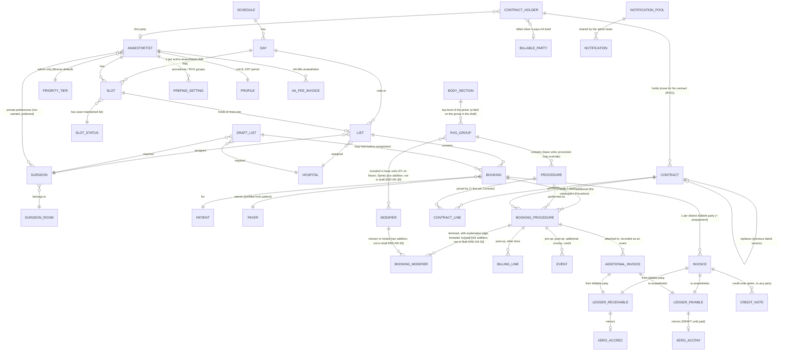

# AA Future-State Domain Model

Companion to the requirements catalogue in this folder. This is the narrative and structural reading of the future state
as understood on 2026-09-24, updated 2026-10-02 and 2026-10-07, built from the RFP, the six future-state diagrams, the meeting notes
with AA's lead administrator, the Q&A of 2026-09-24, the meeting with Greg (RFP author) and the Requirements Board
answers of 2026-10-01, the AA meeting with Greg of 2026-10-02 and its question answers (OQ-62 to OQ-75), the afternoon AA requirements review with Greg of 2026-10-02 (Notes 2026-10-02 · AA requirements review with Greg), the directors' answers of 2026-10-06 (Notes 2026-10-06 · AA directors meeting), the AA meeting with Greg and the AA client meeting of 2026-10-07 (Notes 2026-10-07 · AA meeting with Greg; Notes 2026-10-07 · AA client meeting), the pricing guide *How procedures are priced and who pays* ([AR-28](artifacts/AR-28.md)), which Donald asks to be taken as true now (Notes 2026-10-07 · Pricing model documents #3), and the real fee schedules in `../../docs/discovery-reference/Data files/`. Where this document and the RFP disagree, this document wins.

The Contract structure here (RVG groups, procedures, contract holders, Contracts, contract lines and booking procedures, and how a price resolves) follows the draft technical design v4 and its ERD ([AR-29](artifacts/AR-29.md), [AR-30](artifacts/AR-30.md)). That design is a draft for Greg's review and may change before the catch-up build (Notes 2026-10-07 · Pricing model documents #4); where it shapes a relationship below, this document says so. The requirements themselves stay in plain words: the design's field names are given for orientation, not as requirements.

## 1. What changed since the RFP

| RFP said | Future state says | Why |
| --- | --- | --- |
| Card | **Booking**. "Card" now only means the physical hospital or surgeon card. | Notes; Q&A #11 |
| Billing Engine | **Billing/Invoice Engine** | Q&A #11 |
| List states DRAFT → SUBMITTED → AUTHORISED, DRAFT being an assigned List still being worked | **DRAFT → ACTIVE → SUBMITTED → AUTHORISED**: DRAFT is a Draft List with no anaesthetist; ACTIVE is a List with all five of its pairing (anaesthetist, surgeon, hospital, day, session), where the anaesthetist completes Bookings and submits | Notes 2026-10-07 · List lifecycle states #1 to #3 |
| Each Procedure has a *billing route* (Hospital / Billable Party / Insurer), set explicitly, plus a separately looked-up *governing Contract* of type 1, 2 or 3 | Each Procedure selects exactly **one Contract**. The Contract defines rules and pricing, and through its contract holder decides who is invoiced: the holder's own billable party, or the payer named on the Booking (OQ-67). There is no separate route step. | Diagrams 3 and 7; Q&A #2, #3; Notes 2026-09-29 #24; Notes 2026-10-02 #8; Notes 2026-10-07 · AA meeting with Greg #51; Notes 2026-10-07 · Pricing model documents #11, #22 |
| Counterparty resolved by the engine when the List is AUTHORISED | Contract applied at **booking setup** by admin, and mandatory there (anaesthetist may change; office approves at review). Engine reads the locked Contract. | Diagram 7; Q&A #4; Notes 2026-10-07 · AA meeting with Greg #55 |
| Secondary procedures in a split-billing episode charge **time units only** | Base units only on the **primary**; time on **every** procedure; modifiers on the primary **unless total modifier units exceed 4**, then split equally across all procedures with the remainder to the primary. | Notes; Q&A #1 |
| `priceOverride` on the Procedure | **Anaesthetist adjustment** (a typed price or a percentage discount, with a reason), only on adjustable Contracts: No contract (RVG) and the anaesthetist's own first-party Contracts. Third-party prices are locked: shown, not editable, no discount. Applied after BTM is recorded in full. The office can override any price at review, the only way to change a third-party price without changing the Contract. | Diagram 7; Q&A #3, #6; Notes 2026-10-07 · Pricing model documents #9, #13, #14, #26 |
| Xero as accounts receivable with the engine's database as a mirror for the app | The engine's **internal ledger is the system of record**. Xero is an AR and banking service mirroring ledger pairs. Patient history survives Xero contact archiving. | Q&A #9 |
| Payment to anaesthetist implied a fee deducted | **AA's fee is a separate invoice from AA to the anaesthetist**, managed by the system, distinct from any procedure's receivable and payable. A monthly fee invoice run raises one per anaesthetist: fixed charges (possibly several items) plus a charge per BCTI issued to them, set on a settings page; not a percentage cut of the payable. The fixed schedule, whether only paid invoices count and whether the fee nets against payables are open (OQ-60); Greg's view, to confirm with AA's accountant, is that only paid invoices count and the fee is always a separate invoice paid into a separate bank account, never netted. | Q&A #8; Notes 2026-10-01 #1; Notes 2026-10-02 #1 |
| "Self-funded, pre-payment required" as a patient category | **Prepayment is a first-class flow**: triggered by the anaesthetist's prepaid setting (procedures or whole RVG groups) when the payer is a person paying for the patient, never an organisation (OQ-73); prepayment invoice at setup, tracking, alerts. The prepaid amount is the fixed price on the anaesthetist's own first-party Contract, the full amount, never a deposit or a part (OQ-04, OQ-76). The invoice is generated automatically at setup and held for an admin to approve before it is sent with the letter. There is no settlement against a final BTM amount: nothing more is invoiced or credited automatically (see §3). | Diagram 7; Notes; Q&A #5; Notes 2026-10-01 #32, #50; Notes 2026-10-02 #14, #17; Notes 2026-10-06 · AA directors meeting #1, #4, #9; Notes 2026-10-07 · Pricing model documents #1, #15, #35 |
| Hospital HL7 integrations exist but are unreliable | **St George's and Southern Cross are integrated with the current system; everything else is manual.** The first release keeps a manual matching review and adds an automatic sync (on a schedule, when the matching screen opens, and by a sync button, with a last-synced time) for those two hospitals only. More hospital feeds, automatic matching and HL7/FHIR are Future Work. NHI lookup is in scope. | Q&A #4; Notes 2026-09-29 #14 |
| Patient master implied | **Patient record keyed on NHI**. Who is billed is set through the Contract: its holder's billable party, or the **payer named on the Booking**, prefilled from the patient and changeable to a parent or guardian. Proposed instead: the system's own patient ID, with the NHI as a second unique index added when known (OQ-49). Admins see patient outstanding bills and are alerted to patients with outstanding balances: a mild alert under the threshold (90 days from the invoice date, may move), a strong one above it, a mild one for a credit balance, and staff can always wave it through (OQ-41, OQ-74). NHI is required. A missing NHI is a visible exception on a problem list to resolve, the office emails the surgeon's rooms, and the anaesthetist sees the NHI for Health Connect lookup. Whether a Booking may exist provisionally or is blocked is open (OQ-49); the lean is to let it proceed flagged and block authorising the List until the NHI is added. | Notes; Q&A #9, #13; Notes 2026-09-29 #10, #26, #35; Notes 2026-10-01 #17, #23, #62; Notes 2026-10-02 #15; Notes 2026-10-07 · Pricing model documents #11 |
| Office monitoring of the billing flow | Retained, plus **ledger balance tools** (whole ledger, per anaesthetist, per patient) in the Admin App. | Q&A #12 |
| Two Lists per active anaesthetist per day, unassigned until a surgeon and hospital are set | Three distinct things: a **Slot** (a box for the AM or PM session, created and stored per active anaesthetist per day across a rolling schedule, four months ahead in current practice, its length a rarely changed setting; defaults to free and has a status from a user-maintained list until a List is put in it, and the List then shows in place of the status), an **active List** (assigned to an anaesthetist, put into a Slot, holds Bookings, follows the one-surgeon, one-hospital rule) and a **Draft List** (a List created with no anaesthetist: its surgeon, hospital, day and session are required; it also arises when an anaesthetist moves a List to the office (including marking its Slot unavailable), and when a recurring booking lands on an unavailable Slot; shown prominently in the Admin App, a major feature for AA staff; only ever assigned by an admin, never offered to anaesthetists to claim, OQ-86). Slots and Lists are both children of the day. This is the logical model; how it is stored is for the developers, and the word "slot" never appears in the UI (OQ-64). | Notes 2026-09-29 #17, #36; Notes 2026-10-01 #9, #13, #15, #20, #42; Notes 2026-10-02 #5, #23, #29, #30; Notes 2026-10-02 · AA requirements review with Greg #1, #20, #61; Notes 2026-10-07 · AA client meeting #12 |
| Permanent Lists and List templates | **Recurring bookings**: the standing intersection of a hospital, an anaesthetist and a surgeon (day of week, AM or PM), painted onto Lists. The term replaces "template", "permanent booking" and "Permanent List". | Notes 2026-10-01 #44 |
| An anaesthetist hands a List to a colleague by a swap request the office confirms | An anaesthetist **moves their own List** without office confirmation: to the AA office, where it becomes a Draft List, or pushed into a colleague's free Slot, with no acceptance needed (a high-trust system). The office is told through a **shared notification pool** in the Admin App and offered the cover-change update email; the colleague sees the List appear with a notice (OQ-65). An anaesthetist can also move a **single Booking** to a colleague; a receiver marked unavailable sets themselves available first (experience OQ-85, the vacated Slot's status OQ-84). | Notes 2026-10-01 #15; Notes 2026-10-02 #6, #18; Notes 2026-10-02 · AA requirements review with Greg #3 |
| Who did a List's procedures not stated | **Whoever submits a List did its procedures.** If another anaesthetist does a Booking, it is moved to a List of theirs, even a one-Booking List; the payable follows the Booking. A prepaid Booking keeps its prepaid amount on an honour system: nothing detects the move or recalculates anything. | Notes 2026-10-01 #16, #38; Notes 2026-10-06 · AA directors meeting #10 |
| A List leaves the anaesthetist's view once the office approves it for invoicing | Once the office has finalised a List and sent it to invoicing, it leaves the anaesthetist's main view (Lists not yet invoiced, and upcoming work) and is found through a search or archive, so an old Booking can be checked when an invoice is queried (OQ-31). | Notes 2026-10-07 · AA client meeting #2, #16 |
| No surgeon master data beyond a name | Surgeons' rooms and surgeons are master data; surgeons belong to rooms; each surgeon has a profile (NZ medical registration number and one HPI CPN identifier). **Private two-way preferences** (formerly the blacklist; a better name is still to choose) are kept by admin staff on surgeon and anaesthetist profiles: pairings someone does not want and pairings someone prefers. They are never shown to anaesthetists, and neither side learns of the other's. When admin assign or move a List, available anaesthetists with a conflict are shown separately from those without: information for the decision, never a block. There is no warning when an anaesthetist hands their own List to a colleague (OQ-43). Each anaesthetist also carries an admin-only **priority tier** (four tiers, Bronze the default; names provisional, OQ-102) that orders assignment suggestions, shuffled within a tier. The anaesthetist profile also holds the HPI CPN. | Notes 2026-09-29 #15, #16; Notes 2026-10-01 #19, #26; Notes 2026-10-07 · AA client meeting #4, #19 to #23 |
| No cancellation fee mentioned | AA charges no cancellation fees; a cancelled Booking's loss is taken. | Notes 2026-09-29 #1 |
| Prepaid amount worked out by the office from a local table, six or seven time units chosen by the anaesthetist's rate | The prepaid amount is the **fixed price on the anaesthetist's own first-party Contract**: in effect a price list of their prepaid amounts, one line per procedure. Nothing is estimated from units (OQ-04, OQ-38). The anaesthetist sees the prepaid amount on the Booking. The office creates and maintains these Contracts, from the price list each anaesthetist supplies; anaesthetists do not create or edit Contracts in the app (OQ-91). Letters come from standard templates (OQ-50). | Notes 2026-09-29 #2; Notes 2026-10-06 · AA directors meeting #4, #5, #9; Notes 2026-10-07 · AA client meeting #3, #8, #17, #18; Notes 2026-10-07 · AA meeting with Greg #34, #36; Notes 2026-10-07 · Pricing model documents #15, #35; Typed decision 2026-10-08 · Donald (product owner) |
| Availability conflicts undecided (hard block or warning) | Soft warning: the Booking stays, a conflict is flagged and coloured (a hospital closure, or a Booking landing on a Slot already marked unavailable). A recurring booking landing on an unavailable Slot becomes a Draft List instead. An anaesthetist who marks a Slot unavailable while it holds a List is not left with a conflict: they return the List to the office (it becomes a Draft List) or assign it to a colleague (OQ-64). Generation paints the anaesthetist's calendar first, then recurring bookings; only short-notice sickness is open (OQ-81). | Notes 2026-09-29 #3; Notes 2026-10-02 #5, #27, #45; Notes 2026-10-02 · AA requirements review with Greg #1 |
| Anaesthetist bank details location open | Held in the system, on the anaesthetist's profile. | Notes 2026-09-29 #4 |
| Office price override gated by the Contract | The office can always override, including a fixed fee (authorised, not hard-coded). | Notes 2026-09-29 #5 |
| Prepayment refund handled ad hoc between anaesthetists | Prepaid money is held in the trust account and not paid to the anaesthetist until the procedure is done. A cancelled prepayment is refunded to the patient in full from the trust account. A Booking moved to another anaesthetist keeps the agreed prepaid amount and the anaesthetist who does it is paid, wearing or benefiting from any difference: an honour system, where the new anaesthetist claims no more than was prepaid and the system has no logic that detects the move or re-triggers any calculation. Only the payable half of the prepayment's draft pair is updated to the new anaesthetist (OQ-70); how that update sits with "no logic to detect these flows" is not said. When in the lifecycle the pair is created and amended is open. | Notes 2026-09-29 #6; Notes 2026-10-01 #2, #16, #57; Notes 2026-10-02 #11; Notes 2026-10-06 · AA directors meeting #10 |
| Unpaid-patient alert on any unpaid invoice | Alert on patients with outstanding balances: mild under a threshold, strong above it (90 days to start, may move); the threshold applies only to amounts owing. The days count from the invoice date, and a credit balance raises a mild warning (OQ-74). | Notes 2026-09-29 #10; Notes 2026-10-01 #17; Notes 2026-10-02 #15 |
| Late billing lines added by the anaesthetist as supplementary invoices; adhoc billing after invoicing was open (OQ-24) | **Additional invoices** are a free-form function (description, quantity, amount; no pricing rules), created by admin staff (and, where a prepaid or fixed-price procedure's work differed, by the anaesthetist) to any billable party, recorded as an **event** on a Procedure and traceable to the original; no Contract or pricing rules; used for supplementary charges and for splitting a combined fixed-price Procedure. Like every event they go through the one standard review step (OQ-63). The function has a **credit note option**: the original is credited to any party, the original billable party included, then new additional invoices are raised (OQ-72). The rebilled invoices must equal the credited one, and the credit reverses the linked payable to the anaesthetist (OQ-77 parts 1 and 2); a split asked for before the combined invoice is sent is still open (OQ-77 part 3). Nothing is invoiced or credited automatically after a prepaid procedure or on any fixed-price Contract: where the work differed, the anaesthetist (or the office) raises an additional invoice or credit note by hand. Each has its own ledger pair, Xero pair and anaesthetist payable. | Notes 2026-09-29 #8, #18, #23, #29; Notes 2026-10-01 #21; Notes 2026-10-02 #4, #13, #32, #33; Notes 2026-10-06 · AA directors meeting #1, #2, #10; Notes 2026-10-07 · AA client meeting #9 |
| No self-service for late lines (today the anaesthetist rings or emails the office) | **Events**: everything recorded against a Procedure after it is set up (pre-op, post-op, additional invoices, credits) is an event, its own element attached to the original Procedure and visible on it in both apps. The anaesthetist mostly adds pre-op and post-op events themselves (self-service), and the admin team can too; each is a time recording or a fixed fee with its own date and time, no other modifiers, and a tick box for whether it will be invoiced. A billable event is its own line item: on the Procedure's invoice if that is not yet approved, otherwise a separate invoice in the next run, all through the one standard review step (OQ-63). Covers pain management after the procedure and ACC pre-op assessments. The name "events" is kept for now. | Notes 2026-10-01 #6, #34, #61; Notes 2026-10-02 #4, #24, #25, #44 |
| Correction after invoicing by credit note and re-issue, policy open (OQ-28) | A wrong invoice is **credited in full, then rebilled**; never retracted, edited or partly adjusted. Additional invoice is reserved for supplementary charges and splits. A refund after the anaesthetist has been paid is a credit note to the billable party and a **negative invoice** to the anaesthetist, netted in their next payment run and shown on the remittance advice (OQ-42). With no later payment to net against, it is handled outside the system (OQ-71). A credit note is not a refund: a refund of a resulting credit happens outside the system. Whether a prepayment invoice can be credited in part, when only part of the prepaid work was done, is open (OQ-97). | Notes 2026-09-29 #9, #12, #34; Notes 2026-10-01 #18; Notes 2026-10-02 #12, #33; Notes 2026-10-06 · AA directors meeting #10 |
| No path for telling hospitals about Booking changes | An on-demand button on any Booking in the Admin App lets the admin **draft an update email** via a mailto link (plain text, about 2,000 characters), prefilled with a subject, boilerplate, the changes the admin picks (one or many) from the Booking's change history and, where known, the To address (OQ-69). Contact emails are held for hospitals and surgeons' rooms. The system sends nothing. It is addressed to the hospital contact for a cover change and to the surgeon's room for a Booking change (OQ-46). Proposed: user-configurable templates, one per kind of change. Manual in the MVP; sending change emails automatically is later work (OQ-82). | Notes 2026-09-29 #19; Notes 2026-10-01 #22; Notes 2026-10-02 #10, #31; Notes 2026-10-07 · AA client meeting #11, #13, #25 |
| The Contract decides who is invoiced | The Contract decides who is billed, through its **contract holder**, with as many Contracts as AA needs (OQ-67). A holder that pays AA itself (an insurer that accepts direct claims, a hospital) is billed through its own billable party record; a holder that only sets the price (a surgeon's fixed-fee arrangement, an anaesthetist's own price list) leaves the **payer on the Booking** to be billed, as No contract (RVG) does. The only per-Booking choices are the Contract and the payer named on the Booking; splitting one Procedure's fee between two payers is an action on the Booking, not a Contract setting (US-08.2.3). Billable parties are held as reference records (hospitals, surgeons, insurers, patients or guardians), and no invoice email sits on the Contract. First-party Contracts are offered only on their own anaesthetist's Bookings. No contract (RVG) bills the payer on the Booking (OQ-78). | Notes 2026-09-29 #24; Notes 2026-10-01 #29; Notes 2026-10-02 #4, #8, #41; Notes 2026-10-07 · AA meeting with Greg #7, #26, #29; Notes 2026-10-07 · Pricing model documents #11, #22, #34; Typed decision 2026-10-05 · Donald (product owner) |
| Contracts filtered by the patient's insurer or funding source | The Booking may carry the patient's **insurance indication** (for example SXAP, from the surgeon's booking and often confirmed by the hospital). It guides which Contract is chosen; the Contract decides who is billed. A Booking that says an insurer will pay with no insurer Contract chosen is a warning at office review, not a block, because pre-approval regularly falls through on the day. Whether and where the indication is stored is open (OQ-93; Greg says the Booking holds the funding source, against OQ-55's answer). The user picks the procedure first, then a Contract from those that apply, No contract (RVG) first. A **combination** of procedures is a Contract set against each of its parent procedures, not a procedure (OQ-53). Holder codes are kept as searchable references, and every Contract carries a short structured AA code (format still to be designed); the picker is filtered by procedure and the Booking's context, with code search (OQ-66). | Notes 2026-10-01 #10, #27, #29; Notes 2026-10-02 #7; Notes 2026-10-07 · AA meeting with Greg #2, #6, #27; Notes 2026-10-07 · Pricing model documents #11, #34 |
| The default Contract | **No contract (RVG)** is the one default: standard RVG pricing at the anaesthetist's own unit rate, available for every procedure and offered first (by rule, not by contract lines). Behind the scenes it is stored as a Contract like any other, so every Booking is priced the same way: exactly one, with no holder and no lines, and it never expires. There are no hospital, insurer or per-procedure default Contracts. Greg calls it a default RVG relationship rather than a Contract; the outcome is the same. It bills the payer on the Booking (OQ-78). A named variant such as "Face-lift complex" (10 base units against RVG H4) is modelled as a procedure with its own base units, though a Contract's line can also override base units for that Contract. | Notes 2026-09-29 #24; Notes 2026-10-07 · AA meeting with Greg #7, #54, #59, #60, #61; Notes 2026-10-07 · Pricing model documents #2, #10, #37 |
| Contract prices have one Contract-level effective date | Each **Contract is a dated version**: a start date and, if needed, an end date, shared by all its lines. A price review creates a new version linked to the one it replaces, its lines copied and then changed; Bookings priced under the old version keep the old price. The version in force on the procedure date prices it (OQ-48). One procedure can have different prices under different arrangements, each its own Contract. | Notes 2026-09-29 #25; Notes 2026-10-07 · AA meeting with Greg #39, #40; Notes 2026-10-07 · AA client meeting #6; Notes 2026-10-07 · Pricing model documents #18, #23, #36 |
| Base units come from the RVG code | Base units sit on the **RVG group** (as published, plus AA's own); a **procedure** may set its own figure, and a **contract line** may override it for that Contract (OQ-62); position loadings are modifiers (OQ-06). The **procedure list** is a curated list of named procedures between the source wording and the RVG (about 400 to start), each worded for the invoice and in exactly one RVG group, picked on a Procedures tab (body area, subgroup, procedure) or an RVG codes tab (body area, RVG code), with a general procedure per RVG group; no prices. RVG groups and procedures are seeded once from spreadsheets, then maintained by hand, so a rare RVG change is applied by hand. A base unit overridden consistently means AA changes its own data. | Notes 2026-09-29 #30; Notes 2026-10-01 #4, #59; Notes 2026-10-07 · AA meeting with Greg #14, #15, #16, #62; Notes 2026-10-07 · Pricing model documents #7, #8, #20, #21, #28; Notes 2026-10-08 · Procedure picker and source text #3, #5 |
| Billable party defaults to the patient | Every Booking names a **payer**, prefilled from the patient and changeable by the office or the anaesthetist to a parent or guardian; the payer is billed whenever the Contract does not bill its holder. A patient under 18 as the payer is a **mild warning** to AA staff, clearable from the dashboard, not a block (no warning when the billable party is, say, a hospital); the office checks the guardian's contact details (OQ-54). A guardian's details are held as the Booking's payer, kept for the life of the debt and then archived. | Notes 2026-09-29 #20; Notes 2026-10-01 #28; Notes 2026-10-07 · AA meeting with Greg #25; Notes 2026-10-07 · Pricing model documents #11, #25, #34 |
| Billing failure scope open (OQ-05) | Failure is **per Booking**: other Bookings on the List still invoice. If any Procedure's billable party fails, the whole Booking is held back for AA admin staff to fix manually. | Notes 2026-10-01 #3 |
| No common warning model | **One warning routine** checks conditions and raises warnings, several per Booking if need be, of a before-procedure or after-procedure kind, mild or strong. They show on the admin dashboard as a to-do list, where they can be cleared, and as a small warning flag on the Booking in both apps, visually clear when the anaesthetist opens the Booking, much like the prototype; no confirm step on submit. Warnings are soft, never blocks. A settings page for thresholds, active warnings and switching off check steps is built only when AA asks. | Notes 2026-10-01 #28, #30, #31, #32, #47, #65; Notes 2026-10-02 · AA requirements review with Greg #15, #16 |
| No shared notices for the office | A **shared notification pool** in the Admin App: one pool for the whole admin team, separate from the to-do list, for things that happened and need no action, newest first. The first source is an anaesthetist moving their own List. What else posts to it, and expiry, are open (OQ-79). | Notes 2026-10-02 #6, #18, #43 |
| No GST schedule mentioned | A **GST schedule** for each anaesthetist's GST return: AA's sales on their behalf, the GST component and a check against payments, on a cash basis (the payables actually paid in the period). Wanted early; release slot unconfirmed. | Notes 2026-10-01 #40 |
| Fee schedules quoted GST inclusive, exclusive or both | Every price is held **GST exclusive**; GST is calculated when needed and goes at the foot of the invoice. | Notes 2026-10-07 · AA meeting with Greg #32 |
| Payment day and cycle not settled | Proposed: a **weekly payment cycle** identified by ISO week number (Friday close and ledger snapshot, Monday for the office to resolve issues, payment on Tuesday, anomalies rolled into the next cycle). The prototype and requirements build to it; it stays a question for AA's accountant (OQ-47). | Notes 2026-10-07 · AA client meeting #5, #15 |
| RFP response: master and reference data migrated at cutover | Clean cut. Reference data loaded once from controlled spreadsheets (a one-off seed), then maintained by hand; Solutions Plus used for operation names only (its unit values are not canonical and it holds junk entries). Separately, a mechanism to **upload a Contract's schedule** is a requirement, for Contracts only, its details to be filled in later. | Notes 2026-09-29 #27, #28; Notes 2026-10-07 · AA meeting with Greg #48, #62 |

Everything else in the RFP (List lifecycle, Xero pairing, NHI change, archiving, time tiers,
per-anaesthetist unit value, roles, audit) carries forward unchanged, except that the audit trail
covers invoices and credit notes but not disbursements, payments or receipts (Greg: those are done
in Xero), with its depth
for the developers to settle, and sign-in is an account login for the anaesthetist PWA (Auth0 is
Stratos' default; platform, biometrics, MFA, single sign-on and identity provider are open, as is the
experience, OQ-83) (Notes 2026-10-02 · AA requirements review with Greg #2, #12, #42, #78, #84).

## 2. Entities



**Hierarchy:** Day → Slot → List → Booking → Procedure (a booking procedure) → priced under exactly one Contract, with events on the Procedure. Slots and Lists are both children of the day: a List is put into a Slot. This is the logical model; how it is stored is for the developers. A Draft List sits outside the Slots until assigned (Notes 2026-10-01 #27, #42; Notes 2026-10-02 #4, #5, #23, #29).

**Procedures and Contracts (draft).** The master-data side runs body section → RVG group → procedure, and contract holder → Contract (a dated version) → contract line. Each RVG group is as published plus AA's own, with base units (required, above 0) and modifier units (default 0). Each procedure sits in exactly one RVG group, with its invoice wording and, optionally, its own base and modifier units; procedures do not nest. A contract holder is a third party (an insurer, a hospital, a surgeon or rooms) or a first party (an anaesthetist) and holds many Contracts. A Contract is a dated version (start, optional end, and a link to the version it replaces) holding contract lines, one per procedure. The structure also allows a line for a whole RVG group, but none exist, since no Contract sets a group price. Each Procedure on a Booking is performed as one procedure and priced under exactly one Contract. This shape is the draft technical design v4 and its ERD ([AR-29](artifacts/AR-29.md), [AR-30](artifacts/AR-30.md)), a draft for Greg's review that may change before the catch-up build. The design's ERD has no entity for modifiers; the locked modifiers (below) imply a modifier record per Procedure, as drawn above: BOOKING_MODIFIER, MODIFIER and the RVG group's "included" link are our addition, labelled so in the diagram, not part of the draft ERD (AR-30) (Notes 2026-10-06 · AA directors meeting #7; Notes 2026-10-07 · Pricing model documents #19 to #25, #40, #41; Notes 2026-10-07 · AA meeting with Greg #14, #30, #31).

**Terms.** A Procedure on a Booking is what the draft design calls a *booking procedure*. The catalogue keeps "Procedure" for it, and "procedure" alone (lower case) means an entry on the procedure list. *Time entry* is the design's name for the anaesthetist filling in the Booking (the business says "filling in the card"). The naming is still to settle (Notes 2026-10-07 · Pricing model documents #19; Notes 2026-10-07 · AA client meeting #32).

### Slot, List and Draft List

- Fixed canvas: two **Slots** per active anaesthetist per day across a rolling schedule, four months
  ahead in current practice (its length a setting changed rarely), whether or not a List or Booking
  is attached. A Slot is a box (container) that has a status, and a List is put into it. Every Slot
  is created and stored across the horizon, empty ones included:
  "the foundation on which everything else is painted" (OQ-64). The generation run writes an AM and
  a PM Slot as free for every active anaesthetist, then paints the anaesthetist's own calendar
  (holidays and other unavailability) first, then surgeons' recurring bookings; a recurring booking
  that lands on an unavailable Slot becomes a Draft List (Notes 2026-10-02 · AA requirements review with Greg #1, #20). A new anaesthetist gets Slots from their start date, and Slots can then be edited freely.
  The word "slot" never appears in the UI: users see Lists, and free or unavailable Slots are shown
  much as in the prototype today.
- **Availability status** belongs to the Slot, not the List, and is set by the anaesthetist per Slot
  (half-day), independent of bookings. The anaesthetist keeps it up from a calendar in their app
  (mark days off ahead, create a series, edit or delete one instance). The Slot status and that
  calendar are one mechanism; once a List is put in the Slot, the List shows in place of the status
  (OQ-27, OQ-64). The status values are **master data**, a user-maintained list rather than a fixed
  set: each has a fixed internal ID, an editable label and an editable colour, and rules read the ID,
  not the label. For now they start from the values in use (free by default, on holiday,
  unavailable) with colours chosen for now; the final values are to be defined with AA's users, who
  have redundant statuses (to verify). Theatre is not recorded.
- Marking a Slot unavailable while it holds a List asks the anaesthetist to return the List to the
  office, where it becomes a Draft List with its hospital, surgeon and Bookings, or to assign it to
  an available colleague, as when they move their own List. A Booking that lands on a Slot already
  marked unavailable is accepted and flagged as a conflict, as is a booked List whose hospital
  closes; a recurring booking that lands on one becomes a Draft List (Notes 2026-10-02 #5, #27, #45;
  Notes 2026-10-02 · AA requirements review with Greg #1).
- **List**: assigned to an anaesthetist, sits in one Slot, exactly one surgeon and one hospital,
  one day, one session; AM and PM may differ. A Slot with no List has no surgeon and no hospital.
  A List's status is its anaesthetist's. Lists are projected from **recurring bookings** (a hospital,
  an anaesthetist and a surgeon on a day of week and session) or made ad hoc: an admin puts an ad hoc
  List into a free Slot. A recurring booking creates its List at the far end of the rolling schedule, before any Bookings
  exist, so a List can hold no Bookings (Notes 2026-10-02 #28; Notes 2026-10-02 · AA requirements review with Greg #20).
- **Draft List**: a List created with no anaesthetist. Its surgeon, hospital, day and session are
  always known when it is created and all four are required. Bookings can be added before an
  anaesthetist is assigned. It arises when a surgeon's room needs an anaesthetist and none is
  assigned, when an anaesthetist moves a List to the office (including marking its Slot
  unavailable), and when a recurring booking lands on an unavailable Slot (Notes 2026-10-02 · AA requirements review with Greg #1, #61). It shows prominently
  in the Admin App (a major feature for AA staff), is never offered to anaesthetists to browse or
  claim (OQ-86; Notes 2026-10-07 · AA client meeting #12), and only an
  admin assigns it, when it becomes an active List in a Slot. A cancelled or unfilled one is removed or
  re-dated. The name Draft List is kept.
- **List state** (DRAFT → ACTIVE → SUBMITTED → AUTHORISED) is separate from availability status.
  DRAFT is a Draft List (no anaesthetist yet). A List is ACTIVE once it has all five of its pairing
  (anaesthetist, surgeon, hospital, day, session), whether an admin assigned it from a Draft List or
  it was set up assigned; an ACTIVE List that goes back to the office (moved or withdrawn by its
  anaesthetist, or caught by a reschedule clash) is DRAFT again. The anaesthetist
  completes Bookings and submits while it is ACTIVE (Notes 2026-10-07 · List lifecycle states #1 to #3).
- Lists move between anaesthetists with their Bookings intact. An anaesthetist moves their own
  List without office confirmation: to the office (it becomes a Draft List) or into a colleague's
  free Slot, with no acceptance needed. The office is told through the shared notification pool
  and offered the cover-change update email; the colleague sees the List appear in their app with
  a notice (OQ-65). An anaesthetist can also move a single Booking to a colleague; a receiver
  marked unavailable sets themselves available first, which is their acceptance of the work. The
  experience is open (OQ-85), as is the status of a Slot vacated by a moved List (OQ-84)
  (Notes 2026-10-02 · AA requirements review with Greg #3).
- **Whoever submits a List did its procedures.** A Booking done by another anaesthetist is moved
  to a List of theirs, even a one-Booking List; its payable follows it. A prepaid Booking keeps its
  prepaid amount on an honour system: the system detects nothing and recalculates nothing (Notes
  2026-10-06 · AA directors meeting #10). Say a completed or submitted Booking, not a "timesheet"
  (Notes 2026-10-01 #38, #39).
- Once the office has finalised a List and sent it to invoicing, it leaves the anaesthetist's main
  view, which shows Lists not yet invoiced and upcoming work. Older Lists and Bookings are found
  through a search or archive, so an anaesthetist can check what they entered when an invoice is
  queried (OQ-31) (Notes 2026-10-07 · AA client meeting #2, #16).
- Settled (OQ-64): the day is the parent of both Slots and Lists; an unavailable half-day is a Slot
  status, not a List; a newly unavailable anaesthetist's List leaves them by their choice (office
  or colleague) rather than keeping a conflict flag. Settled (OQ-81 parts 1 and 2): the
  anaesthetist's calendar is painted before recurring bookings, and a recurring booking on an
  unavailable Slot becomes a Draft List. Open: whether a short-notice sickness follows the
  unavailable flow or is recorded by the office as a conflict (OQ-81) (Notes 2026-10-02 · AA requirements review with Greg #1).

### Booking

- Replaces Card. Belongs to one List. References a Patient (NHI).
- Has exactly **one primary Procedure** and zero or more additional Procedures in the same
  anaesthetic episode. Anyone with edit rights can set which is primary.
- Names a **payer**, prefilled from the patient and editable by the office or the anaesthetist to a
  parent or guardian. Each Procedure's Contract decides who is billed: its holder's billable party
  when the holder pays AA itself, otherwise this payer (OQ-54, OQ-67) (Notes 2026-10-07 · Pricing
  model documents #11, #25, #34).
- May carry the patient's **insurance indication** (for example SXAP), which guides which Contract
  is chosen but never decides who is billed. A Booking that says an insurer will pay with no
  insurer Contract chosen raises a warning at office review, not a block. Whether and where the
  indication is stored is open (OQ-93): OQ-55's answer said neither the Patient nor the Booking
  holds it, and Greg says the Booking does (Notes 2026-10-07 · AA meeting with Greg #6, #27; Notes
  2026-10-07 · Pricing model documents #11, #34).
- Each of its Procedures keeps the **source wording** from the surgeon's rooms or the hospital, shown
  above the Procedure's procedure and Contract (see Procedure) (Notes 2026-10-07 · AA client meeting
  #29; Notes 2026-10-08 · Procedure picker and source text #7).
- Carries prepayment state: required, the prepaid amount (shown to the anaesthetist), prepayment
  invoice. The draft design puts the link to the prepayment on the booking procedure (Notes
  2026-10-06 · AA directors meeting #5; Notes 2026-10-07 · Pricing model documents #35).
- Carries any open **warnings** (shown as a small flag in both apps; see Warnings below).
- Mutable from all sources until the List is SUBMITTED; office-only until AUTHORISED; then
  immutable. Append-only change history, from which the admin picks the changes an on-demand
  update email reports (OQ-69).
- Sources: hospital download via matching screen, surgeon PDF (the RFP says this is currently the
  main pathway by volume; confirm, OQ-34), admin entry, anaesthetist ad hoc (optionally from a
  photo of the physical card), copy of another Booking. The hospital download is matched on the
  matching screen, with an automatic sync from St George's and Southern Cross.
- Billing lines dated after the List is invoiced are recorded as events on the Procedure: pre-op
  and post-op events (mostly added by the anaesthetist) or additional invoices created by admin
  staff, or by the anaesthetist where a prepaid or fixed-price procedure's work differed (OQ-24,
  OQ-63); a wrong invoice is credited in full, then rebilled (OQ-28).
- Billing fails per Booking, not per List: if any Procedure's billable party fails, the whole
  Booking is held back for AA admin staff to fix manually (OQ-05).

### Procedure

- One procedure performed on one Booking (the draft design's *booking procedure*). Holds the billing
  context: the procedure picked from the procedure list, base and modifier units (starting values
  from the resolver in §3: the Contract's line, then the procedure, then its RVG group, OQ-62; with
  range override), start and handover times, itemised modifiers (the ASA grade is one of the optional modifiers, not a separate field, FT-03.3), other billing lines, the
  selected **Contract**, and any anaesthetist adjustment.
- Every booked procedure is assigned to a procedure, even on a fixed price; whether the office can
  leave it blank at setup for the anaesthetist to fill in is open (OQ-99) (Notes 2026-10-07 · AA
  meeting with Greg #18; Notes 2026-10-07 · AA client meeting #28).
- **Source wording**: the procedure text exactly as each originating system sent it (hospital
  download or feed, surgeon's PDF, email), or typed "as given" on manual entry. Never edited or
  overwritten; a later update with different wording is added beside it, with its source system and
  time, so a Procedure holds one or more source texts. Shown above the procedure and RVG code, then
  the Contract (name and holder, who is invoiced, pricing basis with figure), on every booking
  screen; not printed on the invoice (to confirm with AA, US-03.1.9). Our addition: neither draft ERD (AR-30) nor the diagram
  above has the field yet (US-02.5.7, US-03.1.9; Notes 2026-10-08 · Procedure picker and source text
  #6 to #8).
- Exactly one Contract, the version in force on the procedure date (OQ-48). Snapshot of the Contract
  version taken at AUTHORISED.
- **Modifiers.** The system applies only modifiers that cannot be removed: the **age modifier** (A1,
  A2), from the patient's age (bands and stacking, OQ-95), and a modifier already included in a
  code's base units (P1, non-supine positioning, on every Neurosurgery code H7A to H9b, supine
  'a' and prone 'b' alike, and every Spine code S1 to S10, OQ-94), shown selected at 0 units and
  locked so it cannot be added again. All others are optional: the anaesthetist chooses them from the RVG modifier
  table plus AA's own, and each claimed modifier needs a short explanation, because insurers ask for
  one. Nothing is pre-filled from defaults on the procedure, nor (implied by the directors' answer,
  which does not name ASA; to confirm, OQ-95) from the ASA grade. Locked modifiers
  imply a modifier record per Procedure, not only a free-text note (Notes 2026-10-06 · AA directors
  meeting #3, #8; Notes 2026-10-07 · Pricing model documents #16, #40, #43, #44, #45; Typed decision
  2026-10-08 · Donald (product owner)).
- `isPrimary` flag drives the multi-procedure rule.
- Holds **events**, each its own element attached to the Procedure (not a Procedure added to the
  Booking): pre-op and post-op events (an ACC pre-op assessment, pain management after the
  procedure), additional invoices and credits, all listed on the Procedure in both apps. The anaesthetist or an
  admin adds a pre-op or post-op event; it has its own date and time, records either a time or a
  fixed fee, and takes no other modifiers. A tick box says whether it will be invoiced, so an event
  can be recorded without being billed. Its billable party is set by a "same as" tick (our
  reading: the Procedure's billable party; the default is not stated), otherwise entered. A billable event is its own line item: recorded before the Procedure's invoice
  is approved, it is a line on that invoice; recorded after, it is a separate invoice in the next
  run, traceable to the Procedure. Every event goes through the same standard review step (OQ-63).
  The Contract can replace a recorded time with a fixed fee.

### Contract (draft structure)

In plain words, a **Contract** is a structure in the system that sets how a procedure is paid for
and who pays; it is not necessarily a legal contract. AA is the party in the centre, and everyone
else with an arrangement is a **contract holder**. The procedure says what was done; the Contract
says how it is paid for. One procedure can be paid for under many Contracts, and changing the
Contract never changes the procedure (Notes 2026-10-07 · AA meeting with Greg #8, #22; Notes
2026-10-07 · Pricing model documents #9, #10).

The Contract answers: *how is this priced, what rules apply, who gets the invoice, and what extra
information do we need to collect?* The reusable Contract (master data) stays separate from the
per-Booking **billing context** captured on the Procedure: the Contract *declares* what it needs,
and the Booking *holds* the values (the payer, recorded units, any adjustment).

The tables below follow the draft technical design v4 and its ERD ([AR-29](artifacts/AR-29.md),
[AR-30](artifacts/AR-30.md)), a draft for Greg's review that may change before the
catch-up build. The field names are the draft's, for orientation; the requirements stay in plain
words (Notes 2026-10-07 · Pricing model documents #4, #19 to #25).

**Contract holder (master data, draft)**

| Field | Notes |
| --- | --- |
| name | For example Southern Cross, Merivale Plastics, Dr B. Smith prepaid list. |
| third or first party | **Third party**: an insurer, a hospital, or a surgeon or rooms; prices locked. **First party**: an anaesthetist's own pricing (for example their prepaid price list); adjustable, and offered only on that anaesthetist's Bookings. The office creates and maintains first-party Contracts from the price list the anaesthetist supplies (OQ-91). |
| bills holder | Yes when the holder pays AA itself (an insurer that accepts direct claims, a hospital): its billable party record is billed. No when it only sets the price (a surgeon's fixed-fee arrangement, an anaesthetist's own list): the payer on the Booking is billed. |
| billable party | A reference to a billable party record (hospitals, surgeons, insurers, patients or guardians), required when the holder is billed. No invoice email sits on the Contract (OQ-67). |

Sources: Notes 2026-10-07 · AA meeting with Greg #22, #29; Notes 2026-10-07 · Pricing model
documents #9, #11, #22, #34.

**Contract (master data)**

| Field | Notes |
| --- | --- |
| id, aaCode, name | Every Contract carries AA's own unique identifier (`aaCode`), a short structured code; holder codes are kept as references and do not replace it. The code format is part of designing the Contract (OQ-66). The draft design has no code beyond the name. |
| holder | The contract holder. None only for No contract (RVG). |
| version: start, end, replaces | Each Contract is a **dated version**. A price review creates a new version linked to the one it replaces, its lines copied from the old and then changed; the old version's end date is set to the day before. All lines share the Contract's dates. The version in force on the procedure date prices it (OQ-48); old invoices reproduce. Fee schedules change on fixed dates (1 April, 1 June, 1 October). |
| default | Exactly one Contract is **No contract (RVG)**: no holder, no lines, never expires, offered first for every procedure by rule, found by this flag and never by its name. It bills the payer on the Booking (OQ-78). |
| kind | Holders, not categories, shape the list: third party or first party. Whether Contracts also carry categories as headings in the picker is not settled; for now it is one long list, No contract (RVG) first. ACC is a holder with ACC pricing. Most insurer and hospital Contracts are plain RVG Contracts billed to their holder; how one with no prices is offered for every procedure is open (OQ-98). |
| context | A Contract is offered when it is valid on the procedure date, has a line for the procedure, and its holder fits the Booking's context: the List's hospital, the surgeon or rooms, the insurer (pending OQ-93, whether and where the Booking's insurance indication is stored), and for first-party Contracts the Booking's anaesthetist. The exact rules are open in the draft. A combination Contract is set against each of its parent procedures (OQ-53). |
| pricing terms | There is no pricing-basis field: the price follows from what the Contract's line for the procedure sets (§3). **RVG pricing** (nothing set): BTM × the anaesthetist's own unit value. **Fixed price**: the line's price, with BTM recorded for reference. **Fixed-rate Contract**: BTM × the Contract's rate instead of the anaesthetist's. **Fixed-discount Contract**: BTM × the anaesthetist's rate less a pre-applied discount, shown locked where the price override is shown. Fixed rate and fixed discount are new, not dormant. No Contract prices a whole RVG group. |
| adjustable | No contract (RVG) and first-party Contracts are adjustable: the anaesthetist may type a price or a percentage discount, with a reason. Third-party prices are locked: shown, not editable, no discount. Where the setting lives (holder, Contract or line) is open in the draft. |
| requiredBookingInputs | No separate field: the configurable required booking inputs (US-04.2.7) are retired. What remains is the references a Contract's holder needs on its invoices, such as an insurer member number or claim reference, which the Contract names and the Booking then asks for (US-04.2.2). No invoice email sits here, only a billable party (Notes 2026-10-07 · AA meeting with Greg #10, #25, #33). |
| prepayment | Prepayment is triggered by the anaesthetist's prepaid setting (procedures or whole RVG groups), and the amount is the fixed price on the anaesthetist's own first-party Contract. Greg floated a pre-payable flag on the Contract; not adopted (FT-06.1, US-06.2.1). Never a part or a deposit. |
| invoiceLayout | Contract holder layout vs patient layout. |
| deliveryMethod | Email · portal upload (NIB) · none. |
| gstTreatment | Every price held GST exclusive; GST is calculated when needed and goes at the foot of the invoice. |

Sources: Notes 2026-10-06 · AA directors meeting #6, #7, #11; Notes 2026-10-07 · AA meeting with
Greg #23, #24, #32, #35, #38, #39, #40, #53; Notes 2026-10-07 · Pricing model documents #2, #18,
#23, #26, #27, #37, #38.

**Contract line** (children of a Contract, draft: one per procedure; blank inherits, 0 is a value)

| Field | Notes and real examples from `Data files/` |
| --- | --- |
| procedure | Exactly one procedure; at most one line per Contract per procedure. The structure allows a line for a whole RVG group, but none exist. |
| holder code, description | Optional, kept for reference and searchable when picking a Contract (type `8942` to filter to it): SXAP `AP0126 Blepharoplasty unilateral LA`; CES `HNZCATall`; ACC `OPT101`; Merivale `Abdominoplasty simple`. |
| fixed price | Ex GST. The whole price for the procedure; BTM becomes informational. |
| rate | A unit rate in place of the anaesthetist's (a fixed-rate Contract). |
| discount | A pre-applied percentage discount (a fixed-discount Contract), locked for the anaesthetist. |
| base units, modifier units | Override the procedure's and the RVG group's for this Contract. A blank cell inherits; 0 is a value (some Contracts zero modifiers). |
| timeBand (from, to), open | CES vitrectomy: up to 60 / 61-90 / 90-120 min, then $100 per extra 15 min. Whether it stays is open (OQ-89). |

Removed from the line: an RVG mapping (every procedure belongs to an RVG group), the add-on flag,
the quantity rule, the price tier and a line-level effective date (all lines share the Contract's
dates). Our reading: a holder's alternative price columns, such as CES HNZ "commitment" and "panel",
become Contracts of their own (Notes 2026-10-07 · AA meeting with Greg #5, #30, #31; Notes
2026-10-07 · Pricing model documents #24, #29).

**Procedure billing context** (instance values, on the Procedure / Booking)

| Field | Notes |
| --- | --- |
| procedure, source wording | The procedure from the procedure list, with the room's or hospital's own wording kept as received and shown above it. |
| contractId | The Contract version in force on the procedure date; locked at AUTHORISED. |
| payer | On the Booking: prefilled from the patient, editable by the office or the anaesthetist to a parent or guardian; billed when the Contract does not bill its holder. |
| prepaymentRequired, prepaidAmount, prepaymentInvoiceId | On the Booking (the draft design links it from the booking procedure). prepaidAmount is the fixed price on the anaesthetist's own first-party Contract, shown to the anaesthetist. |
| recorded BTM, modifiers with explanation | Base and modifier units start from the resolver; time is entered. Each claimed modifier needs a short explanation. |
| anaesthetistAdjustment { typed price or PERCENT discount, reason } | Adjustable Contracts only; cleared if the Contract changes to one that is not adjustable. |
| officeOverride { type: PERCENT, AMOUNT or FIXED_FINAL, value, reason } | The office can override any price at review, including a fixed fee, with a reason (OQ-16): the only way to change a third-party price without changing the Contract. |
| insurerMemberNumber, claimReference, purchaseOrder | As required by the Contract. |
| pricing snapshot | Set at authorisation (§3). |

**Selection.** At booking setup the office picks the procedure first, on the picker's Procedures
tab (body area, then subgroup, then procedure) or its RVG codes tab (body area, then RVG code), then
selects or confirms a Contract; setting it is mandatory. From an RVG code the list offers the
Contract lines for every procedure in its group, and the line picked sets the procedure (No contract
(RVG) sets the group's general procedure) (Notes 2026-10-08 · Procedure picker and source text #3,
#4). **No contract (RVG)** always appears, first, for every procedure. It is followed by every
Contract valid on the procedure date with a line for the procedure whose holder fits the Booking's
context (the List's hospital, the surgeon or rooms, the insurer, and the Booking's anaesthetist for
first-party Contracts, so an anaesthetist sees only their own). The list can be filtered to active
or all Contracts and by contract holder, and a holder's own code can be typed to find its Contract
(OQ-66). The insurance indication on the Booking guides the choice; it does not filter by rule
(OQ-93). The anaesthetist may change the procedure or the Contract until the List is submitted, with
no reason needed; the change is audited and flagged at office review, the starting units and fixed
price refresh, and a typed price or discount is cleared if the new Contract is not adjustable. When
pre-approval falls through on the day, the anaesthetist changes to No contract (RVG) and the payer is
billed. A **combination** is a fixed-fee Contract under the procedure (for example the Merivale
"Facelift plus 1 add on" at $3,910 under Face Lift); one spanning several procedures (for example an
abdominoplasty, breast lift and liposuction) is set against each of its parent procedures, so
picking any of them offers it; once it is chosen, history shows only the Contract (OQ-53). Each
Procedure on a Booking is priced on its own Contract, and many insurance jobs are plain RVG paid by
the insurer (Notes 2026-10-01 #29, #64; Notes 2026-10-02 #7; Notes 2026-10-07 · AA meeting with
Greg #2, #16, #24, #52, #53, #55; Notes 2026-10-07 · AA client meeting #27; Notes 2026-10-07 ·
Pricing model documents #11, #12, #27).

### RVG groups, procedure list and modifier master

- **RVG groups** (draft: RVG_GROUP): the NZSA RVG 2021 as published, each with its code, name, body
  section (the top level of the picker) and base units (required, above 0; how a printed range such as 10 to 12 is held is open, OQ-101),
  plus modifier units (default 0). AA may add its own groups if it ever needs to, and marks them
  AA-sourced. RVG codes are not unique enough to be keys. Groups are used for search and for
  the anaesthetist's prepaid selection (Notes 2026-10-07 · Pricing model documents #7, #20).
- **Base units** sit on the RVG group; a procedure may set its own figure, and a contract line may
  override it for that Contract (OQ-62). The RVG guide is only a guide (the same code appears with
  different base units), and AA can set any base units regardless of it; a base unit overridden
  consistently means AA changes its own data. An anaesthetist may enter base units outside a code's
  range, which raises an after-procedure warning for the office (OQ-56) (Notes 2026-10-07 · Pricing
  model documents #8, #21, #28).
- **Procedure list** (formerly the master procedure list, or Procedure master; draft: PROCEDURE):
  curated, named procedures between the source wording and the RVG, each worded as it should appear
  on the invoice and in exactly one RVG group, with no nesting and no prices. A procedure uses its
  group's base units unless AA sets its own; a custom variant such as "Face-lift complex" (10 base
  units against RVG H4) is modelled as a procedure with its own base units (a Contract's line can
  also override base units for that Contract). A procedure need only be defined
  when AA needs it. Today no procedure list exists and invoices print the rooms' text; the working
  list starts at about 400 rows pared down from Solutions Plus, and Vanessa and Ben are filling in
  RVG codes and base units. Every RVG group has a general procedure. The picker has two tabs, each
  a list under body-area headings: Procedures (body area, subgroup, procedure) and RVG codes (body
  area, RVG code). From an RVG code the Contract list offers the Contract lines for every procedure
  in the group, so picking a line sets the procedure, and No contract (RVG) sets the group's general
  procedure (Notes 2026-10-08 · Procedure picker and source text #2 to #5). Each Procedure keeps
  its source wording, shown above it. Whether procedures sit under RVG codes or in
  a flat list is OQ-88; the draft makes each a child of one group (Notes 2026-10-07 · AA meeting
  with Greg #13 to #16, #18, #61; Notes 2026-10-07 · AA client meeting #26 to #29, #31).
- RVG groups and procedures are seeded once from spreadsheets, then maintained by hand by the
  office, and every change is recorded; because procedures inherit from their group, a change made
  on the group reaches every procedure that does not set its own figure (Notes 2026-10-07 · AA
  meeting with Greg #62; Notes 2026-10-07 · Pricing model documents #18, #36).
- **Modifier master**: the RVG modifier table (pages 12 to 13): PA1-PA5, A1-A2, AS1/AS3/AS4, ASE,
  OB1-OB4, AI1, P1, VM1, TTE1-2, PACU1, EAA1, POC1-POC3, NC1-NC2, with unit values (some are not a
  plain number), plus AA's own modifiers (Vanessa's list), each with a short explanation when
  claimed. ACC pre-op: CS250, CS260, CS70 (TBC). Transcribed in `artifacts/files/NZSA RVG 2021
  modifiers.md`; the codes whose base units already include P1 (20 Neurosurgery and Spine codes)
  are in `artifacts/files/NZSA RVG 2021 included modifiers.csv`. The RVG gives one flat value per
  modifier, not typical or maximum values by body area; its only body-area notes are the
  Neurosurgery and Spine inclusions and an Upper Limb sitting-position addition. Only the age modifier and included modifiers are applied by
  the system (see Procedure) (Notes 2026-10-06 · AA directors meeting #3, #8; Notes 2026-10-07 ·
  Pricing model documents #42 to #45).

### Patient, payer and billable party

- Patient: one record per NHI (both formats validated, modulus 24 and 23), demographics,
  ethnicity (NZHIS Level 4), contact. Supplied by hospital, surgeon or AA. NHI is the clinical
  identifier and dedupe key; billing and ledger records key on a hidden internal patient ID with
  NHI as a cross-reference (RFP Appendix 1 policy). Proposed: the system's own patient ID is the
  key, with the NHI attached later under a second unique index, against "keyed on NHI"; how
  duplicates found later are resolved is part of OQ-49. NHI and other PII never go to Xero, which
  holds only a unique ID linking back to the system's invoices (OQ-30).
- Billable party: whoever receives the invoice for a Procedure, decided by its Contract (OQ-67). A
  Contract whose holder pays AA itself bills the holder's billable party record; otherwise the
  payer on the Booking is billed. Billable parties are reference records (hospitals, surgeons,
  insurers, patients or guardians). The invoice email belongs to the billable party or the payer,
  never to the Contract (Notes 2026-10-07 · AA meeting with Greg #29; Notes 2026-10-07 · Pricing
  model documents #11, #22, #34).
- Payer: every Booking names one, prefilled from the patient and editable by the office or the
  anaesthetist to a parent or guardian; it is used whenever the Contract does not bill its holder.
- NHI is required; a Booking without one appears on a problem list until it is added. Lean (OQ-49):
  the Booking, Procedures and Contracts proceed flagged, and authorising the List is blocked until
  the NHI is added. The NHI can be refreshed from the central register.
- A patient under 18 as the payer raises a mild warning, clearable, not a block; no warning when
  the billable party is not the patient (OQ-54). A guardian's details are held as the Booking's
  payer, kept for the life of the debt and then archived, not a master record.
- Admin can see a patient's outstanding invoices across all anaesthetists and is alerted to
  patients with outstanding balances: a mild alert under the threshold (90 days, may move), a
  strong one above it, and staff can always wave it through. The threshold applies only to amounts
  owing (OQ-41). The days count from the invoice date, and a credit balance raises a mild alert
  (OQ-74).

### Surgeon, surgeons' room, preferences and priority tiers

- Surgeons belong to rooms; a room holds a contact email.
- A surgeon profile holds the NZ medical registration number and the **HPI CPN** (Common Person
  Number): for an individual practitioner the CPN and the HPI practitioner number are one
  identifier, the surgeon's unique index. HPI (Health Provider Index) identifies practitioners and
  facilities and is not the patient's NHI (OQ-52).
- **Preferences** (formerly the blacklist; a better name is still to choose) are private and
  two-way: held by admin staff on surgeon and anaesthetist profiles, they record pairings someone
  does not want to work with (in either direction) and pairings someone prefers. They are never
  shown to anaesthetists, and neither side learns of the other's. When admin assign or move a List
  or Draft List, available anaesthetists with a conflict are shown separately from those without:
  information for the decision, never a block. There is no warning when an anaesthetist hands their
  own List to a colleague; the system reveals nothing (OQ-43) (Notes 2026-10-07 · AA client meeting
  #4, #19, #20).
- **Priority tier**: each anaesthetist carries an admin-only tier, set administratively, that orders
  the suggestions when admin look for someone to assign. Four tiers, Bronze the default
  (names provisional: Gold Elite for the directors, Gold for particularly helpful shareholders,
  Silver for other shareholders, Bronze for non-shareholders); within a tier the
  order is shuffled, to avoid favouritism. Not a numeric rank (Notes 2026-10-07 · AA client meeting
  #21 to #23).

### Internal ledger

- For every invoice: a **receivable** from the billable party and a linked **payable** to the
  anaesthetist. Prepayment invoices create the same pair. When a prepaid Booking moves to another
  anaesthetist, only one half of its draft pair is updated to the new anaesthetist (which half was not
  named; the payable is our reading), so the trust account in Xero stays balanced (OQ-70); when in the lifecycle the pair is created and
  amended is open (OQ-80). The prepaid amount itself is not recalculated on a move (an honour
  system), and how this update sits with the directors' "no logic to detect any of these flows" is
  not said (Notes 2026-10-06 · AA directors meeting #10).
- Tracks $ in (receipts) and $ out (disbursements) so the whole ledger, each anaesthetist and each
  patient can be shown in or out of balance.
- Mirrored to Xero as ACCREC + DRAFT ACCPAY. Full receipt authorises the payable; partial receipt
  authorises a payable for exactly the amount received. Payment of the ACCPAY in Xero's payables
  run is detected the same way and recorded as the disbursement.
- Invoices are issued in the anaesthetist's name with AA as agent; the ACCPAY is a buyer-created
  tax invoice (BCTI), one per procedure, which IRD has since renamed (new name to confirm). Exact
  GST presentation to be confirmed with AA's accountant (OQ-29). Once generated for a period, the
  BCTIs are approved for payment before they are paid.
- A refund after the anaesthetist has been paid is a credit note to the billable party offset by a
  **negative invoice** to the anaesthetist, netted in their next payment run and shown on the
  remittance advice (OQ-42). With no later payment to net against, it is handled outside the
  system; AA settles it with the anaesthetist (OQ-71).
- The additional invoice function has a **credit note option**: the original invoice is credited
  to any party (the original billable party included), then new additional invoices are raised;
  the credit and the new invoices are events on the Procedure (OQ-72). A credit note is not a
  refund: refunding a resulting credit happens outside the system. When a combined invoice is
  split, the amounts are allocated by hand (not the old individual prices) and the rebilled
  invoices must equal the credited one; the credit reverses the linked payable to the anaesthetist
  (OQ-77 parts 1 and 2). Still open: a split asked for before the combined invoice is sent (OQ-77
  part 3; Greg: override the fixed price and split it). Proposed: the rebill starts from a draft
  copy of the original's lines (Notes 2026-10-07 · AA client meeting #9; Notes 2026-10-07 · AA
  meeting with Greg #3).
- No invoice or credit is raised automatically after a prepaid procedure or on a fixed-price
  Contract; the anaesthetist or the office raises one by hand where the work differed (Notes
  2026-10-06 · AA directors meeting #1, #2, #10).
- **Payment cycle** (proposed, OQ-47): weekly, identified by ISO week number: Friday close and
  ledger snapshot, Monday for the office to resolve issues, payment on Tuesday, anomalies rolled
  into the next cycle. Still to confirm with AA's accountant (Notes 2026-10-07 · AA client meeting
  #5, #15).
- **AA fee invoices** from AA to each anaesthetist are separate ledger items, raised by a monthly
  fee invoice run: fixed charges (several items may make it up) plus a charge per BCTI issued to
  the anaesthetist, set on a settings page (OQ-02). The fixed schedule, whether only paid invoices
  count and whether the fee nets against payables are OQ-60. Greg's view, to confirm with AA's
  accountant: only paid invoices count, and the fee is always a separate invoice paid into a
  separate bank account, never netted.
- A **GST schedule** for each anaesthetist, on a cash basis: AA's sales on their behalf, the GST
  component and a check against payments, listing the payables actually paid in the period;
  anything outstanding falls into a later period (Notes 2026-10-01 #40).
- Xero contacts use a hidden internal ID and are archived after inactivity; the ledger keeps the
  history.

### Warnings

- One routine checks conditions and raises warnings, possibly several per Booking, of a
  before-procedure or after-procedure kind, mild or strong (for example out-of-range base units,
  an unpaid prepayment, a child as payer, a patient's outstanding balance, a Booking that says an
  insurer will pay with no insurer Contract chosen).
- Warnings are soft: they never block. They show on the admin dashboard as a to-do list, where an
  admin clears them, and as a small warning flag on the Booking in both apps, visually clear
  when the anaesthetist opens the Booking, much like the prototype; there is no confirm step on
  submit.
- A settings page for thresholds, which warnings are active and switching off check steps (such as
  approving a prepayment invoice) is built only when AA asks (Notes 2026-10-01 #28, #31, #32, #47,
  #65; Notes 2026-10-02 · AA requirements review with Greg #15, #16).
- Notices that need no action are not warnings: they go to the **shared notification pool** in the
  Admin App, one pool for the whole admin team, separate from the to-do list, newest first. Every
  logged-on admin sees the same pool. The first source is an anaesthetist moving their own List (to
  the office or a colleague), saying which List moved and to whom. What else
  posts to it, expiry and whether a notice can be marked actioned are open (Notes 2026-10-02 #6,
  #18, #43).

### Reference data and go-live

- Clean cut, not a full migration: decide what is useful rather than migrating everything.
- Reference data is loaded once from controlled spreadsheets: hospitals, surgeons and
  rooms, anaesthetists, RVG groups with their base units, procedures (each in one RVG group, with any
  base units of its own, OQ-62), modifiers, contract holders, Contracts and their lines (Notes 2026-10-02 · AA requirements review with Greg #10, #77).
  This one-off seed is loaded directly (the draft design suggests a developer-run import, repeatable
  so test environments can be wiped and reloaded), then maintained by hand in the office's screens
  (Notes 2026-10-07 · AA meeting with Greg #62; Notes 2026-10-07 · Pricing model documents #36).
- Separate from the seed, a mechanism to **upload a Contract's schedule** is a requirement, for
  Contracts only, its details to be filled in later. Greg wants one pre-approved format, checked by
  a second person in the office, and floated a full overwrite rather than a delta; whether it is
  needed on day one is not settled (OQ-100) (Notes 2026-10-07 · AA meeting with Greg #41, #43, #47, #48).
- The Solutions Plus operation list is used for names only. Its unit values are not canonical and
  it holds junk entries (for example a "10% discount" saved as an operation).

## 3. Calculation rules

The resolver and the price precedence follow the draft technical design v4 ([AR-29](artifacts/AR-29.md)),
with the directors' fixed-rate and fixed-discount Contracts added; a draft that may change before
the catch-up build (Notes 2026-10-07 · Pricing model documents #28, #29, #31, #32, #33; Notes
2026-10-06 · AA directors meeting #6, #11).

```
starting values (the resolver), for the Procedure's procedure and its Contract
(the version in force on the procedure date):
  base units, modifier units: the Contract's line for the procedure → the procedure → its RVG group
                              (always resolve; a blank inherits, 0 is a value)
  fixed price, rate, discount: the Contract's line for the procedure only (or none)
  the value found and the layer it came from both go into the pricing snapshot

price(procedure) =
  0. the office's override at review, if any                              OFFICE_OVERRIDE
  1. else the anaesthetist's typed price (adjustable Contracts only)        ANAESTHETIST_PRICE
  2. else the Contract's fixed price, if one resolves (BTM for reference)   CONTRACT_FIXED_PRICE
  3. else (B + T + M) x unit value, less discount                           CALCULATED
       unit value = the Contract's rate (fixed-rate Contract), else the anaesthetist's own $ per unit
       discount   = the Contract's fixed discount (fixed-discount Contract, locked)
                    and/or the anaesthetist's % discount (adjustable Contracts only)
                    -- open (OQ-89): whether an anaesthetist may add their own discount on top
                       of a fixed-discount Contract's, and if so how the two combine; not decided
  a price of 0 gives a no-charge invoice; BTM is still recorded
```

- Each Procedure is priced on its own Contract when the List is authorised. The engine rejects the
  Booking, rather than ignoring an input, when a typed price or discount sits on a Contract that is
  not adjustable, when BTM is missing and no fixed price resolves, or when the Contract is not valid
  on the procedure date.
- The **pricing snapshot** stores the procedure, the Contract version, the resolved values and their
  layers, the recorded BTM, the rate and discount used, the price, the price source, and the
  billable party or payer. Later changes to the RVG, procedures or Contracts never alter an invoice
  already issued.
- Not said: whether an anaesthetist's own discount can stack on a fixed discount (OQ-89). Whether the RVG
  multi-procedure rule below still applies is being confirmed (OQ-90); if it does, it adjusts the
  units of CALCULATED procedures before step 3.

**Units within a Booking** (RVG default multi-procedure rule):

| Component | Primary procedure | Additional procedures |
| --- | --- | --- |
| Base units | Yes (one base code per anaesthetic) | Never. Field not editable. |
| Time units | From its own times: 1 per 15 min for the first 2 h, then 1 per 10 min; a part interval is always rounded up (OQ-75) | Same, from its own times |
| Modifier units | All of them if total ≤ 4. If total > 4: equal share + remainder | Equal share when total > 4 |

Worked example: three Procedures, modifiers AS3 (2) + OB3 (2) + ASE (2) + A1 (1) = 7 units.
7 > 4, so 7 ÷ 3 = 2 each with remainder 1 → primary 3, second 2, third 2. Base units on the
primary only. Each Procedure's time units from its own times. Each Procedure is then priced by
its own Contract, so a cosmetic add-on on a patient-direct Contract and a primary on a hospital
Contract each carry their correct share.

Some fixed-price schedules replace this rule (the SXAP and CES schedules price a second code at 50%,
or an add-on as its own fee); with the add-on flag gone from contract lines, how such a Contract
expresses it is open with OQ-89 and OQ-90.

**Prepayment.** Required when a Procedure's procedure, or its RVG group, is in the anaesthetist's
prepaid set and the payer is a person paying for the patient, never an organisation (OQ-73) (the
RFP's typical case is an additional elective cosmetic procedure). The amount is the **fixed price on
the anaesthetist's own first-party Contract**: the full amount, never a deposit or a part (OQ-04,
OQ-76), and nothing is estimated from units (OQ-38). The anaesthetist sees it on the Booking. By
default it is the final price; the BTM recorded on the day is for reference. What applies when the
anaesthetist's Contract has no price for a prepaid procedure is open (OQ-92), as is whether the
price on a prepaid procedure can be changed at all (OQ-96). The office creates and maintains first-party
Contracts, from the price list each anaesthetist supplies (OQ-91). The prepayment invoice is generated automatically at
setup and held for an admin to approve before it is sent with the letter (OQ-58). The money is held
in the trust account and not paid to the anaesthetist until the procedure is done. A prepaid
Booking that is cancelled is refunded in full from the trust account.

**No automatic invoice or credit** follows a prepaid procedure or any fixed-price Contract: the
system calculates nothing further, in either direction and with no threshold (OQ-61, OQ-03). Where
the work turned out very different (only half done, or far longer), the anaesthetist, or the
office, raises an additional invoice or credit note by hand (whether a credit can be for part of
the prepayment is OQ-97). A prepaid Booking moved to another anaesthetist keeps the agreed amount on
an honour system: the anaesthetist who does it is paid, wearing or benefiting from any difference,
claims no more than was prepaid, and the system has no logic that detects the move or re-triggers
any calculation. Only the payable half of the draft pair moves to them (OQ-40, OQ-70) (Notes
2026-10-06 · AA directors meeting #1, #2, #4, #5, #9, #10; Notes 2026-10-07 · AA client meeting #3,
#8, #17, #18; Notes 2026-10-07 · Pricing model documents #1, #15, #35).

## 4. Glossary

| Term | Meaning |
| --- | --- |
| Booking | An appointment within a List for one patient. Formerly Card. |
| Card | The physical hospital or surgeon booking card only. |
| List | A pairing of anaesthetist, surgeon, hospital, day and session, sitting in a Slot and holding Bookings. One surgeon, one hospital. DRAFT (a Draft List) until it has an anaesthetist, then ACTIVE, SUBMITTED and AUTHORISED. |
| Active List | A List with all five of its pairing: anaesthetist, surgeon, hospital, day and session. The ACTIVE state, in which the anaesthetist completes its Bookings and submits it. |
| Primary Procedure | The one Procedure in a Booking that carries base units and anchors modifiers. |
| Contract | A structure in the system that sets how a procedure is paid for and who pays; not necessarily a legal contract. AA is the party in the centre, and everyone else with an arrangement is a contract holder. A Contract is a dated version holding one contract line per procedure. |
| Contract holder | The party a Contract belongs to: a third party (an insurer, a hospital, a surgeon or rooms) or a first party (an anaesthetist). Either it pays AA itself, and its own billable party record is billed, or it only sets the price, and the payer on the Booking is billed. |
| First party / third party | A third-party Contract is an agreement with someone else (an insurer, a hospital, a surgeon or rooms); its prices are locked. A first-party Contract is an anaesthetist's own pricing, for example their prepaid price list; adjustable, and offered only on their own Bookings. |
| No contract (RVG) | The one default: standard RVG pricing at the anaesthetist's own unit rate, offered first for every procedure. Stored as a Contract like any other (exactly one, with no holder and no lines, never expiring); adjustable. Bills the payer on the Booking (OQ-78). Greg calls it a default RVG relationship. Replaces "Default Contract" and "Default RVG Contract". |
| Contract line | A Contract's terms for one procedure: an optional holder code and description, and any of a fixed price (ex GST), a rate, a discount, and base or modifier units. A blank inherits; 0 is a value. |
| Contract version | A Contract's dated version: a start date, an optional end date and a link to the version it replaces. A price review creates a new version; the version in force on the procedure date prices it. |
| Fixed-rate Contract | A Contract whose price is BTM × the Contract's rate instead of the anaesthetist's own unit value. New. |
| Fixed-discount Contract | A Contract whose price is BTM × the anaesthetist's rate less a pre-applied discount, shown locked where the price override is shown. New. |
| Payer | The person named on the Booking to be billed whenever the Contract does not bill its holder: prefilled from the patient, editable by the office or the anaesthetist to a parent or guardian. |
| Billable party | Whoever receives the invoice for a Procedure, decided by its Contract: the holder's billable party record, or the payer on the Booking. Billable parties are reference records (hospitals, surgeons, insurers, patients or guardians). |
| RVG group | An RVG code as published in the NZSA guide (or one AA adds), under a body section, holding the base units and modifier units its procedures inherit. |
| Procedure (on the procedure list) | A named procedure, worded as it should appear on the invoice, in exactly one RVG group, with its own base units only where AA sets them. Written "procedure"; the list replaces the "Procedure master" and "master procedure list". |
| Source wording | The procedure text exactly as the rooms, hospital or other originating system sent it (or typed "as given"), kept unedited on the Procedure and shown above its procedure and Contract; not printed on the invoice (to confirm with AA). |
| Procedure (on a Booking) | One procedure performed on one Booking, with its Contract, recorded units and price. The draft design calls it a *booking procedure*; the catalogue keeps "Procedure". Naming still to settle. |
| Time entry | The draft design's name for the anaesthetist filling in the Booking (business wording: "filling in the card"). |
| Included modifier | A modifier the RVG says a code's base units already include (P1 on every Neurosurgery code, 'a' and 'b' variants alike, and every Spine code): shown selected at 0 units and locked, so it cannot be added again. |
| Age modifier | A1 or A2, applied from the patient's age and locked. |
| Invoice email | Where the invoice is sent; belongs to the billable party, not necessarily the patient. |
| BTM / BTT | Base, Time, Modifier units (RVG). |
| RVG / RVU | NZSA Relative Value Guide / Relative Value Units. Units, not dollars. |
| Internal ledger | The Billing/Invoice Engine's own receivable and payable records; system of record. |
| ACCREC / ACCPAY | Xero receivable / payable invoice types mirroring ledger pairs. |
| Prepayment | The fixed price on the anaesthetist's own first-party Contract, invoiced in full before the procedure when the procedure or its RVG group is in their prepaid set and a person pays; never a deposit. By default the final price: nothing more is invoiced or credited automatically. |
| AA fee | AA's charge to an anaesthetist, invoiced separately in a monthly run: fixed charges plus a charge per BCTI. |
| Matching screen | Admin screen where hospital bookings, downloaded or synced (St George's, Southern Cross), are matched to Lists and Bookings. |
| Slot | The box for an AM or PM session the Scheduling Engine creates and stores per anaesthetist per day (four months ahead in current practice). Defaults to free and has a status until a List is put in it. An implementation word, never shown in the UI. |
| Slot status | A Slot's availability (for example free, on holiday, unavailable), held as a user-maintained list with a fixed ID, editable label and colour. |
| Draft List | The DRAFT state: a List created with no anaesthetist; its surgeon, hospital, day and session are known. Shown prominently in the Admin App and only ever assigned by an admin. Name kept ("unassigned list" also heard). |
| Recurring booking | The standing intersection of a hospital, an anaesthetist and a surgeon on a day of week and session, painted onto Lists. Replaces "template", "permanent booking" and "Permanent List". Not a Booking for one patient. |
| Surgeons' room | Master record of a room, with contact email and the surgeons who belong to it. |
| Preferences | Private, two-way pairings of anaesthetists and surgeons, not wanted or preferred, kept by admin staff on both profiles and never shown to anaesthetists. Admin see conflicts separated when assigning or moving a List; no warning on an anaesthetist's own hand-over. Formerly "blacklist"; name still to choose. |
| Priority tier | An admin-only tier on each anaesthetist (four, Bronze the default) that orders assignment suggestions, shuffled within a tier. |
| HPI | Health Provider Index: identifies a practitioner or facility. Not the patient's NHI. |
| HPI CPN | HPI CPN (Common Person Number): the one identifier for an individual practitioner, used for surgeons and anaesthetists. |
| Trust account | AA's account holding prepayment money until the procedure is done, and from which a refund is made; refunds and trust payments are made from the system. |
| Additional invoice | A free-form invoice (description, quantity, amount; no pricing rules) created by admin staff (or by the anaesthetist, where a prepaid or fixed-price procedure's work differed) to any billable party, recorded as an event on a Procedure, traceable to the original; no Contract or pricing rules; for supplementary charges or a split. Not a correction. |
| Credit note option | Part of the additional invoice function: credits the original invoice to any party, then new additional invoices are raised. Not a refund. |
| Event | Anything recorded against a Procedure after it is set up: pre-op, post-op, additional invoices, credits. Its own element on the Procedure, with a tick box for whether it is invoiced and one review step. A pre-op or post-op event is a time recording or fixed fee with its own date and time. Name kept for now. |
| Negative invoice | The anaesthetist-side offset of a credit note issued after they have been paid; netted in their next payment run. |
| Remittance advice | What the anaesthetist receives with a payment run, showing the invoices paid and any negative invoices netted against them. |
| Warning | A soft flag raised by the warning routine on a Booking, before or after the procedure, mild or strong; listed on the admin dashboard to-do list and cleared there. Never a block. |
| Shared notification pool | The Admin App's one pool of notices for the whole admin team, for things that happened and need no action (for example a List an anaesthetist moved). Separate from the to-do list. |
| Update email | A mailto draft the admin starts on demand from a Booking, reporting the changes they pick from its change history. The system sends nothing. |
| Timesheet | Not used. Say a completed or submitted Booking. |
